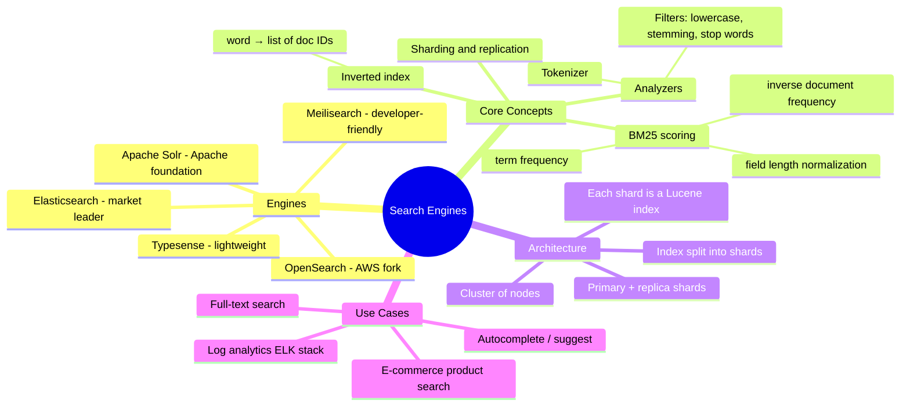

# Search Engines — Concept Overview & Deep Internals

> Inverted indexes, BM25 ranking, and how Elasticsearch/OpenSearch power full-text search at scale.

---

## Why This Exists

RDBMS `LIKE '%keyword%'` is a full table scan — O(n). Search engines build an **inverted index** mapping each word to the list of documents containing it — O(1) lookup. This is the difference between a 30-second query and a 5ms query on 1B documents.

## Mindmap



## Inverted Index Example

```
Documents:
  doc1: "The quick brown fox"
  doc2: "The quick blue car"
  doc3: "A brown fox jumps"

Inverted Index:
  "the"   → [doc1, doc2]
  "quick" → [doc1, doc2]
  "brown" → [doc1, doc3]
  "fox"   → [doc1, doc3]
  "blue"  → [doc2]
  "car"   → [doc2]
  "jumps" → [doc3]

Query: "brown fox" → intersection of [doc1, doc3] ∩ [doc1, doc3] = [doc1, doc3]
Scored by BM25: doc1 ranks higher (both terms in shorter doc)
```

## War Story: Wikipedia — Elasticsearch for 60M+ Articles

Wikipedia's search across 60M+ articles in 300+ languages uses Elasticsearch. The inverted index is ~500GB compressed. Queries return in <100ms across all languages. The key optimization: language-specific analyzers (stemming, tokenization) per index, with cross-language queries routed to language-specific shards.

## Pitfalls

| Pitfall | Fix |
|---|---|
| Using Elasticsearch as primary database | ES is a search index, not a system of record. Source of truth stays in PostgreSQL |
| Not choosing the right analyzer | Japanese needs kuromoji tokenizer, English needs stemming. Wrong analyzer = poor relevance |
| Too many shards for small indexes | Each shard has overhead (file handles, memory). Start with 1 shard per 50GB |

## References

| Resource | Link |
|---|---|
| [Elasticsearch Guide](https://www.elastic.co/guide/en/elasticsearch/reference/current/index.html) | Official docs |
| *Relevant Search* | Doug Turnbull & John Berryman (Manning) |
