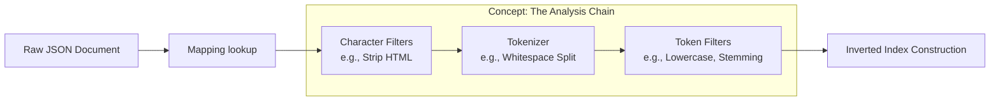
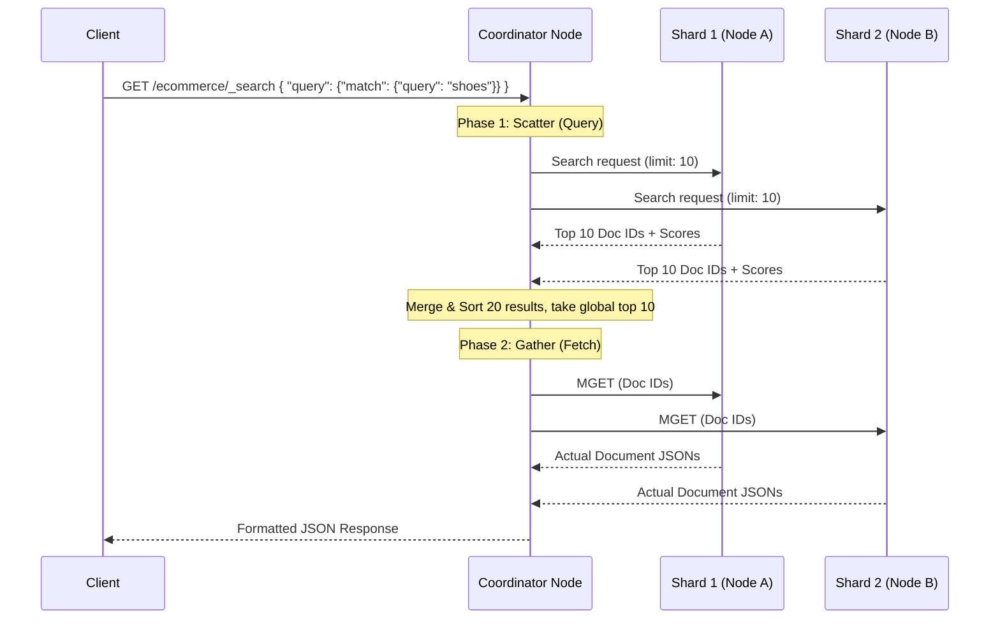
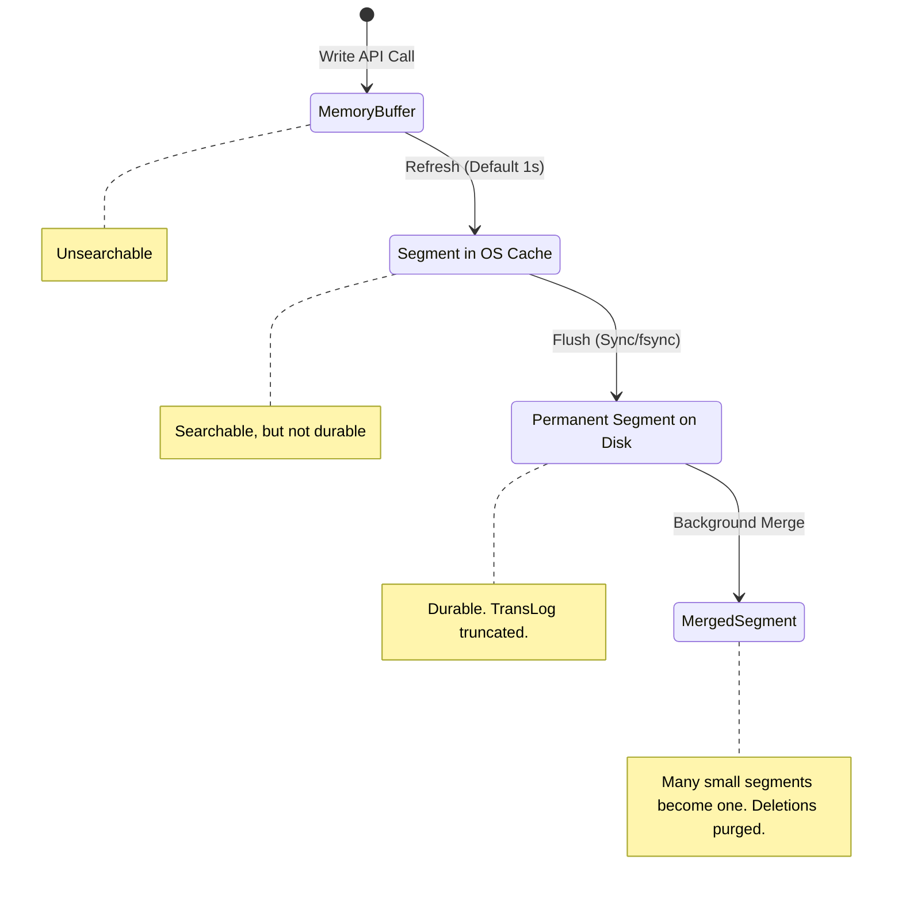

# How It Works: Search Engine Internals

## Architecture: The Lucene Core

Distributed search engines (Elasticsearch, Solr) are clustered wrappers around Apache Lucene. To understand them, you must understand Lucene.

Lucene does not update data in place. It writes data in **Segments**. A segment is a fully functional, immutable, standalone inverted index. When you search, the engine queries all segments and merges the results. When you delete, the document is marked as deleted in a bitmap (it is not physically removed until a merge occurs).

### The Dual Structure
1. **Inverted Index**: For searching (filtering and matching terms). "Which documents contain the word 'apple'?"
2. **DocValues (Columnar Store)**: For sorting and aggregations. "What is the average price of all matched documents?"

## High-Level Design (HLD)

```mermaid
graph TD
    Client(Client)
    Coord[Coordinator Node]
    
    subgraph "Distributed Cluster"
        NodeA[Data Node A]
        NodeB[Data Node B]
        NodeC[Data Node C]
    end
    
    subgraph "Data Node Internals (Node A)"
        Index1[Shard 1 (Index)]
        MemBuffer[In-Memory Buffer]
        TransLog[TransLog / WAL]
        Seg1[(Segment 1)]
        Seg2[(Segment 2)]
    end

    Client -- Write/Search --> Coord
    Coord -- Route --> NodeA
    NodeA --> Index1
    Index1 --> MemBuffer
    Index1 --> TransLog
    MemBuffer -. Flush (1 sec) .-> Seg1
```

## Data Flow Diagram: The Indexing Pipeline

When a JSON document arrives, it must be analyzed before it hits the inverted index.



**Example:**
Input: `The QUICK brown foxes jumped.`
Token Filter Output: `[quick, brown, fox, jump]`

## Sequence Diagram: Distributed Search (Scatter-Gather)

Search is typically executed in two phases: **Query then Fetch**.



## Internal Storage Structures

An Inverted Index is simple in theory, complex in execution.

### Forward vs. Inverted Index

**Forward Index (System of Record)**
| Doc ID | Text |
|--------|------|
| 1 | "Data Architecture" |
| 2 | "Database Architecture" |

**Inverted Index (Search Engine)**
| Term | Doc IDs | Postings (Position) |
|------|---------|---------------------|
| architecture | 1, 2 | 1:[2], 2:[2] |
| data | 1 | 1:[1] |
| database | 2 | 2:[1] |

*Note: In reality, terms are stored in finite state transducers (FST) or prefix tries in memory to allow ultra-fast lookup, pointing to the postings lists on disk.*

## State Machine Diagram: Index Refresh and Flush

The difference between memory buffers, flushes, and merges.


