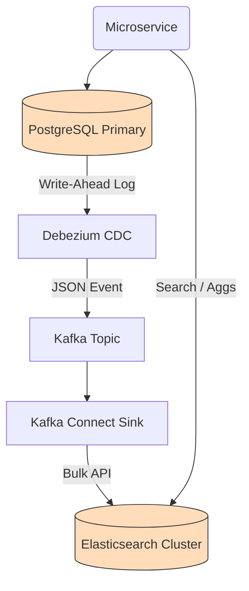

# Hands-On Examples: Search Engines

## 1. Index Configuration & Mapping (Schema)

Default dynamic mapping is dangerous. This is how you correctly define an explicit mapping in Elasticsearch.

```json
// PUT /ecommerce_catalog
{
  "settings": {
    "number_of_shards": 3,
    "number_of_replicas": 1,
    "refresh_interval": "10s", // Optimize for bulk loads over immediate searchability
    "analysis": {
      "analyzer": {
        "custom_product_analyzer": {
          "type": "custom",
          "tokenizer": "standard",
          "filter": ["lowercase", "asciifolding", "english_stemmer"]
        }
      },
      "filter": {
        "english_stemmer": {
          "type": "stemmer",
          "language": "english"
        }
      }
    }
  },
  "mappings": {
    "dynamic": "strict", // PREVENTS mapping explosion. Throws error on unmapped fields.
    "properties": {
      "product_id": {
        "type": "keyword" // Keyword type bypasses analysis. Used for exact match.
      },
      "title": {
        "type": "text",   // Analyzed for full-text search
        "analyzer": "custom_product_analyzer"
      },
      "price": {
        "type": "scaled_float", // Stores float as integer behind the scenes for compression
        "scaling_factor": 100
      },
      "tags": {
        "type": "keyword",
        "doc_values": true  // Explicitly require columnar storage for aggregations
      },
      "created_at": {
        "type": "date",
        "format": "strict_date_optional_time||epoch_millis"
      }
    }
  }
}
```

## 2. The Multi-Match Query (Relevance Tuning)

This query searches across multiple fields, boosting the `title` field relevance over the `description` field.

```json
// GET /ecommerce_catalog/_search
{
  "query": {
    "bool": {
      "must": {
        "multi_match": {
          "query": "running shoes",
          "fields": [
            "title^3",     // Boost title matches by 3x
            "description"
          ],
          "type": "best_fields",
          "fuzziness": "AUTO" // Handles typos like "runing shos"
        }
      },
      "filter": [ // Filters do NOT affect scoring and are highly cacheable
        {
          "range": { "price": { "lte": 150.00 } }
        },
        {
          "term": { "status": "active" }
        }
      ]
    }
  },
  "aggs": {
    "brands": {
      "terms": { "field": "brand_name.keyword", "size": 10 }
    }
  }
}
```

## 3. Creating a Sink from Kafka to Elasticsearch (CDC)

In production, you do not write to search directly from your App. You write to the RDBMS, use Debezium to read the WAL, and flush to Search.

```yaml
# Kafka Connect Elasticsearch Sink Configuration
apiVersion: kafka.strimzi.io/v1beta2
kind: KafkaConnector
metadata:
  name: elasticsearch-sink-connector
spec:
  class: io.confluent.connect.elasticsearch.ElasticsearchSinkConnector
  tasksMax: 3
  config:
    topics: postgres.public.products
    connection.url: "http://elasticsearch:9200"
    type.name: "_doc"
    key.ignore: "false" # Use Kafka key as ES generic Document ID (ensures idempotency)
    schema.ignore: "true"
    transforms: "extractKey"
    transforms.extractKey.type: "org.apache.kafka.connect.transforms.ExtractField$Key"
    transforms.extractKey.field: "id"
    behavior.on.null.values: "delete" # Tombstone messages in Kafka delete the ES document
```

## Integration Diagram: The Production Data Path



## Before vs. After: Pagination

**Bad Approach: Deep Paging (`from` / `size`)**
```json
{
  "from": 100000, 
  "size": 10
}
```
*Why it fails:* To get records 100,000 to 100,010 across 5 shards, the coordinating node must load 500,050 records into memory, sort them all, and discard 500,040. This kills the cluster.

**Correct Approach: `search_after`**
```json
// Initial query specifies sort
// Subsequent queries pass the sort values of the LAST result
{
  "size": 10,
  "search_after": [1609459200000, "doc_93847"], 
  "sort": [
    {"created_at": "desc"},
    {"_id": "asc"} // Tie-breaker is critical
  ]
}
```
