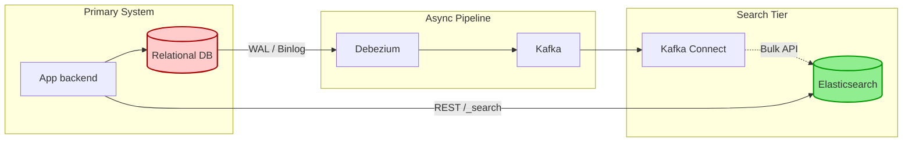

# Interview Angle: Search Engines

## How This Appears

In Senior to Principal level interviews, search primarily appears as a **System Design** component ("Design YouTube Search", "Design E-Commerce Search", or "Design a Centralized Logging System"). Occasionally, in deep infrastructure interviews, you will be asked how an Inverted Index works internally or how TF-IDF/BM25 scores documents.

## Sample Questions & Answer Frameworks

### Q1: "Design a logging system to ingest and search 5 TB of logs per day."

*   **Weak Answer (Senior):** "I will deploy Elasticsearch and Logstash. We'll send application logs directly to Logstash, which writes to an ES index. We will partition by day so we can drop old indices."
*   **Strong Answer (Principal):** "5 TB/day requires defense in depth. I'd use FluentBit on the edge sending logs to an Apache Kafka buffer. This absorbs traffic spikes and prevents ES backpressure from taking down applications. For the ES cluster, I'll use a Hot-Warm-Cold tiering architecture. Hot nodes use NVMe SSDs for the last 3 days of heavy read/write. ILM will roll indices based on size (50GB per shard), not strictly time, preventing oversharding. We must strictly enforce mappings; dynamic mappings must be disabled to prevent cluster state explosion."
*   **What They're Testing:** Understanding of backpressure (Kafka), resource tiering (Hot/Warm/Cold), and ES reliability anti-patterns (oversharding, mapping explosions).

### Q2: "We need to search users by typing a prefix (e.g., typing 'Jo' matches 'John'). How would you implement this?"

*   **Weak Answer (Senior):** "I will use a SQL database and `LIKE 'Jo%'`, passing the keystrokes directly to the DB."
*   **Strong Answer (Principal):** "A SQL `LIKE` query will scan the index and scale poorly under high concurrency. I would use an Edge N-Gram tokenizer in Elasticsearch. It processes 'John' into `[J, Jo, Joh, John]` at ingest time, storing them in the inverted index. At query time, looking up 'Jo' is an instant O(1) exact match lookup against the inverted index, granting sub-millisecond response times even at petabyte scale."
*   **What They're Testing:** Knowing the difference between query-time regex/scanning and ingest-time analysis (shifting compute from read to write).

### Q3: "How do you handle updates to documents in a search engine?"

*   **Weak Answer:** "You just run an update query via the API."
*   **Strong Answer:** "Under the hood, Lucene segments are immutable. An update is actually a delete and a rewrite. It marks the old document as deleted in a bitmap and writes the new document into a totally new segment. Heavy update workloads create high I/O fragmentation and constant heavy background merging operations. For high-mutation workloads, search is wrong. E.g., for inventory numbers, store the core doc in ES, but fetch live inventory from Redis at the UI layer."
*   **What They're Testing:** Understanding of Lucene immutability and segment merging.

## Whiteboard Exercise

**The Search Ecosystem Architecture**

Be prepared to draw how a system of record syncs with a search engine.

*Narrative to practice:* "We separate write and read concerns. State is mutated in Postgres. We trail the Write-Ahead Log via Debezium to ensure atomic, ordered propagation of events through Kafka. Kafka Connect buffers and executes Bulk REST calls to Elasticsearch, making the data search-ready with highly-tailored N-Gram, text, and keyword tokenizers."
