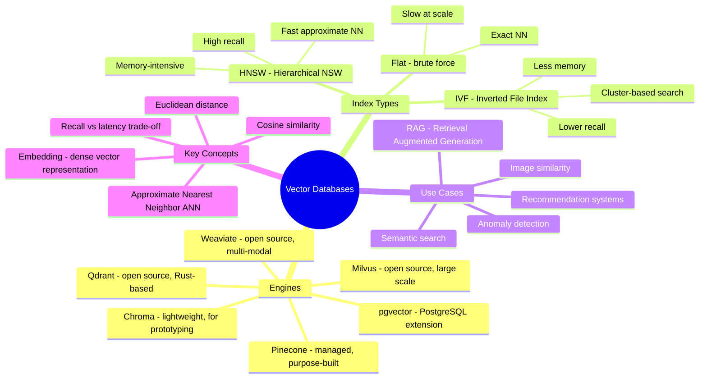
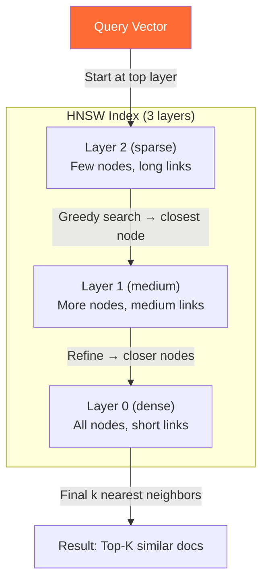

# Vector Databases — Concept Overview & Deep Internals

> The new essential: databases purpose-built for semantic similarity search powering AI/ML applications.

---

## Why This Exists

Traditional databases search by exact match or range (`WHERE name = 'Alice'`). AI applications need **semantic similarity**: "find documents SIMILAR to this query." Vector databases store high-dimensional embeddings (1536-dim vectors from OpenAI, 768-dim from BERT) and find nearest neighbors in millisecond latency.

## Mindmap

## HNSW — How ANN Search Works

**How it works**: Like a skip list for high-dimensional space. Top layers have few nodes connected by long-distance links (fast traversal). Bottom layers have all nodes connected by short-distance links (precise search). Average query: O(log n) distance calculations instead of O(n).

## Comparison

| Feature | Pinecone | pgvector | Milvus | Weaviate |
|---|---|---|---|---|
| **Deployment** | Managed | PostgreSQL extension | Self-hosted/cloud | Self-hosted/cloud |
| **Index Types** | Proprietary | HNSW, IVFFlat | HNSW, IVF, DiskANN | HNSW |
| **Scale** | Billions of vectors | Millions | Billions | Millions |
| **Hybrid Search** | ✅ Vector + metadata | ✅ SQL + vector | ✅ Scalar + vector | ✅ BM25 + vector |
| **Best For** | Production RAG | Existing PostgreSQL | Large-scale ML | Multi-modal search |

## War Story: Notion — pgvector for AI Search

Notion embedded their entire knowledge base (billions of blocks) using OpenAI embeddings and stored them in pgvector (PostgreSQL extension). Benefit: no new infrastructure — same PostgreSQL cluster handles relational data AND vector search. They achieved 50ms p95 latency for semantic search across 100M+ vectors using HNSW indexes with IVFFlat for initial filtering.

## Interview — Q: "How would you add semantic search to an existing PostgreSQL application?"

**Strong Answer**: "pgvector extension. Add a `vector(1536)` column for OpenAI embeddings, create an HNSW index, and use cosine similarity `<=>` operator. Benefits: no new infrastructure, same ACID guarantees, and you can combine vector search with SQL filters (`WHERE category = 'tech' ORDER BY embedding <=> query_vector LIMIT 10`). For >100M vectors, consider Pinecone or Milvus for dedicated infrastructure."

## References

| Resource | Link |
|---|---|
| [pgvector](https://github.com/pgvector/pgvector) | PostgreSQL vector extension |
| [HNSW Paper](https://arxiv.org/abs/1603.09320) | Malkov & Yashunin (2016) |
| [Pinecone Docs](https://docs.pinecone.io/) | Managed vector DB |
