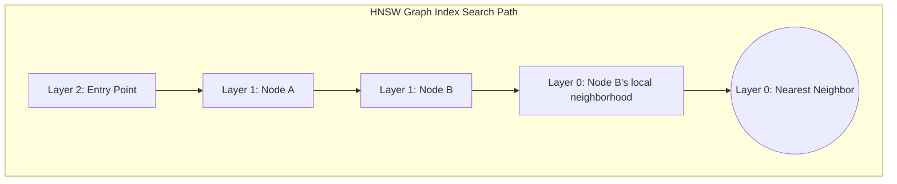
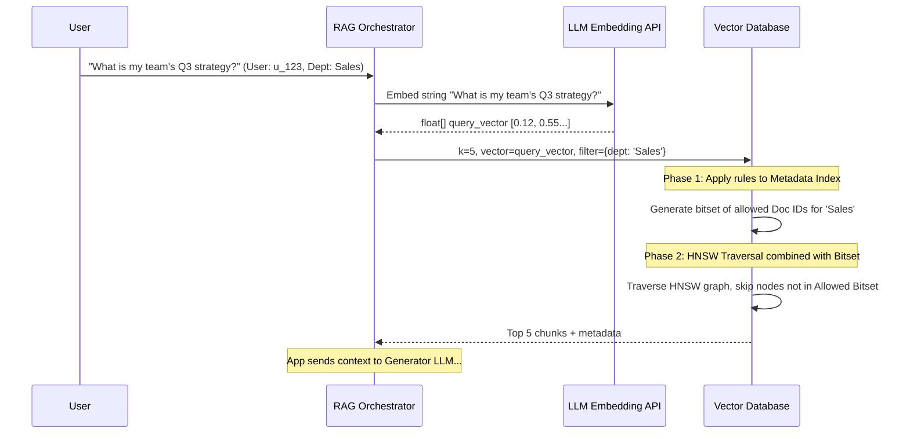

# How It Works: Vector Database Internals

## Architecture

A vector database typically comprises two distinct internal systems that must work in tandem:
1.  **The Metadata Store:** Traditional B-trees or inverted indices for filtering attributes (e.g., `tenant_id`, `category`, `timestamp`).
2.  **The Vector Index:** Specialized structures (graphs or inverted files) executing mathematical similarity searches across embeddings.

The hardest problem in vector databases is the **Filtered Vector Search**: How do you efficiently execute "Find the 5 most semantically similar documents, *but only where the author is Bob*"?

## High-Level Design (HLD)

Modern standalone Vector DBs (like Milvus, Qdrant, Pinecone) decouple compute from storage to scale independently.

```mermaid
graph TD
    Client(Client)
    Coord[Coordinator / API Layer]
    
    subgraph Compute Layer
        QueryNode1[Query Node 1 <br/> (Loads HNSW to RAM)]
        QueryNode2[Query Node 2 <br/> (Loads HNSW to RAM)]
        IndexNode[Index Building Node <br/> (CPU intensive)]
    end
    
    subgraph Storage Layer
        WAL[Write-Ahead Log / Pulsar / Kafka]
        ObjectStore[(S3 / GCS <br/> Segments & Graphs)]
    end

    Client -- Write / Query --> Coord
    Coord -- Route Writes --> WAL
    WAL -- Consume --> IndexNode
    IndexNode -- Persist Indices --> ObjectStore
    Coord -- Route Queries --> QueryNode1
    QueryNode1 -. Lazy Load .-> ObjectStore
```

## The Heart of the Engine: HNSW (Hierarchical Navigable Small World)

HNSW is currently the default industry-standard index. It is a multi-layer graph based on skip-lists. 

1.  **Bottom Layer (Layer 0):** Contains *all* vectors connected to their nearest neighbors.
2.  **Higher Layers:** Exponentially fewer vectors. Acting as "highways" to skip across the vector space.
3.  **Search Process:** Starts at the top layer, finding the closest node. Drops down to the next layer using that node as an entry point. Repeats until Layer 0.



## Secondary Feature: Quantization (PQ/SQ)

1536-dimensional vectors of `float32` require massive amounts of RAM (1 billion vectors = ~6TB of RAM natively). Vector DBs use **Product Quantization (PQ)** or **Scalar Quantization (SQ)** to compress vectors.
*   **Scalar Quantization:** Converts `float32` to `int8` (4x memory reduction), sacrificing minor precision.
*   **Product Quantization:** Splits the vector into sub-vectors and clusters them into centroids, storing just the centroid IDs. (Up to 64x memory reduction).

## Sequence Diagram: RAG Query Flow with Pre-filtering

This is the golden path for a secure Enterprise RAG pipeline (Single-Stage Filtered Search).



## Data Flow Diagram: Ingestion and Chunking

Raw text cannot just be embedded. It must be chunked carefully to fit within the Embedding Model's contextual capabilities.

```mermaid
flowchart LR
    Source[PDF / Confluence] --> Extractor[Text Extractor]
    Extractor --> Chunker[Semantic Chunker <br/> 512 tokens + 50 overlap]
    Chunker --> Embedder[Embedding API <br/> (Batch of 100)]
    
    subgraph Vector DB Ingestion
        Embedder --> API[Bulk Insert API]
        API --> WAL[Append to WAL]
        WAL --> MemTable[In Memory <br/> Mutable Graph]
        MemTable -. Flush .-> Disk[(Immutable Segment <br/> HNSW + Metadata)]
    end
```
