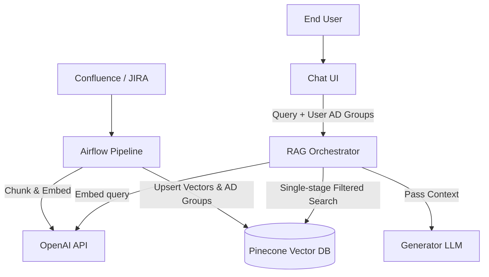

# Real-World Scenarios: Vector Databases

## Case Study 1: Spotify Discover Weekly (Annoy / approximate nearest neighbors)

**The Problem:**
Spotify needed to generate playlists for hundreds of millions of users by comparing user listening profile vectors to tens of millions of song vectors to find the most similar tracks. A k-NN brute-force search required an astronomical matrix multiplication (`Users × Songs`).

**The Architecture:**
Before HNSW became the standard, Spotify created and open-sourced **Annoy** (Approximate Nearest Neighbors Oh Yeah).

*   **Mechanics:** Annoy creates a forest of random projection trees. It draws hyperplanes randomly across the vector space, splitting vectors into left/right buckets. By traversing trees, it quickly isolates a bucket containing geometrically similar songs.
*   **Production Numbers:** Evaluates millions of embeddings.
*   **The Trade-off:** Annoy was specifically designed so the vector indices could be mapped directly into memory via `mmap`. This allowed multiple processes (e.g., Python workers) to share the same memory index without consuming duplicate RAM, vastly reducing infrastructure costs at Spotify scale.

## Case Study 2: Enterprise Chatbot RAG using Pinecone

**The Problem:**
A Fortune 500 company wants a custom ChatGPT that answers questions based on 50 million internal Confluence pages, JIRA tickets, and PDFs securely mapped to specific Active Directory groups.

**The Architecture:**
*   **Data Size:** 50,000,000 chunks × 1536 dimensions (float32) = ~300GB of raw vector data.
*   **Topology:** A serverless/SaaS vector database managed service (Pinecone) decoupled from the primary systems.
*   **Ingestion Pipeline:** Airflow DAGs run nightly to pull delta changes from Confluence/JIRA, generate chunks via LlamaIndex, embed via Azure OpenAI, and upsert to Pinecone matching AD Group IDs as metadata.

**Deployment Topology**

**What Went Wrong: The "Lost in the Middle" RAG Problem**
*   *Incident:* Users reported the LLM hallucinating heavily, even though vector search returned the right documents.
*   *Root Cause:* The vector DB was queried with `k=30` (Top 30 chunks). While the DB executed flawlessly, returning 30 chunks, stuffing 30 chunks into an LLM prompt degrades the LLM's attention mechanism (it forgets the context in the middle of the prompt).
*   *The Fix:* Use the Vector DB to recall `k=50` documents, but then introduce an intermediate **Re-ranking layer** (e.g., Cohere Rerank) to sort those 50 documents using a heavier transformer cross-encoder, ultimately passing only the absolute top `k=5` chunks into the final LLM prompt.

## Case Study 3: The HNSW Memory Exhaustion Incident (Self-Hosted)

**The Problem:**
A startup began indexing a massive e-commerce catalog image database using self-hosted Milvus/Qdrant. 

**What Went Wrong:**
They calculated disk space successfully (500 million vectors of 512 dimensions ≈ 1TB). However, HNSW indices *must* reside in RAM to perform their rapid graph traversals. The HNSW graph structure itself adds 30-50% overhead on top of the raw vector data. The database nodes crashed repeatedly with OOMKill.

**The Fix:**
1.  **Switch to Scalar Quantization (SQ8):** Compress the `float32` vectors down to `int8` (1 byte per dimension). This reduced memory consumption by 4x at a ~1-2% hit to recall accuracy.
2.  **Tiered Storage:** Modernized the cluster config to use memory-mapped files (mmap) prioritizing disk I/O with NVMe rather than pure RAM, accepting a slight latency increase per query for a massive cost reduction.
