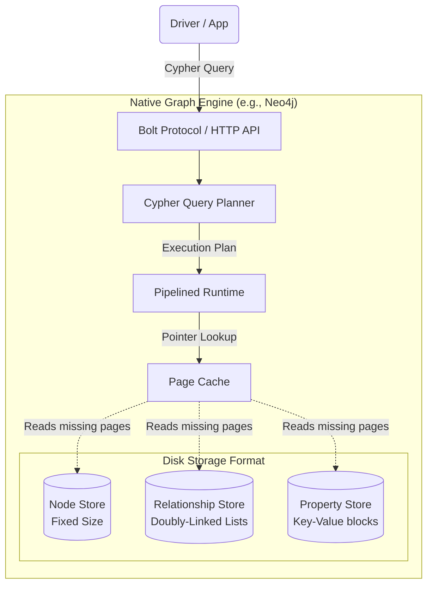
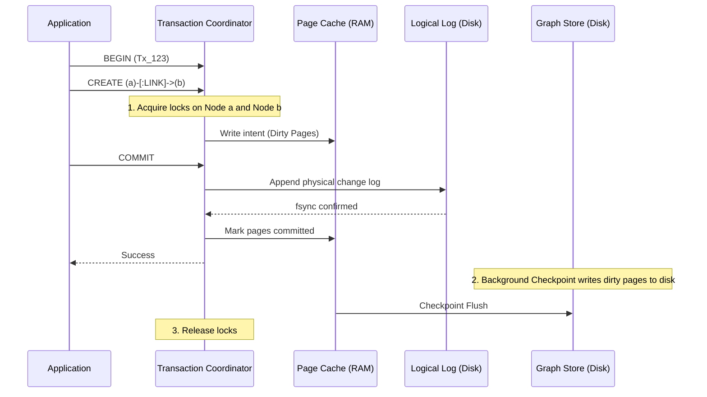
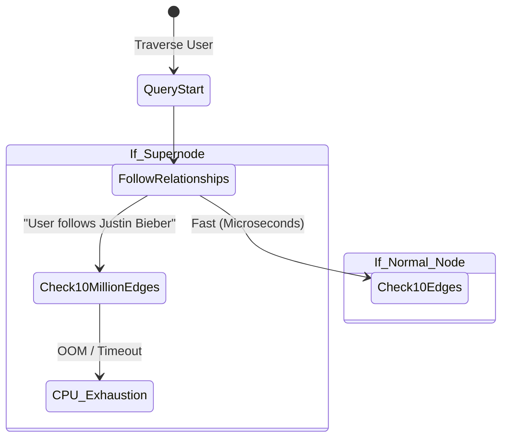

# How It Works: Graph Database Internals

## Architecture: Native vs. Non-Native

Not all graph databases are built the same under the hood. 

1.  **Native Graph Storage:** Built specifically to store nodes and relationships with physical pointers on disk (e.g., Neo4j, Memgraph). O(1) performance per hop. Memory-intensive.
2.  **Non-Native Graph Storage:** An abstraction layer that translates graph queries into standard columnar/relational queries behind the scenes (e.g., AWS Neptune on storage, JanusGraph over Cassandra/HBase). Scales easier horizontally but introduces latency during deep traversal.

## Internal Storage Structures (Index-Free Adjacency)

In a true native graph like Neo4j, records are fixed-size on disk. 
*   A **Node Record** contains a pointer to its first Relationship and a pointer to its first Property.
*   A **Relationship Record** is a doubly-linked list. It contains pointers to the Start Node, End Node, the *previous* relationship for the start/end nodes, and the *next* relationship for the start/end nodes.

This design allows the engine to jump directly from a Node memory address to the precise memory address of its connecting Edge without scanning a B-Tree.

## High-Level Design (HLD)

## Data Flow Diagram: The Traversal Pipeline

How a query like `(u:User {name: 'Alice'})-[:KNOWS]->(f:User)` executes.

```mermaid
flowchart LR
    Start[1. Index Lookup] --> |"B-Tree scan for <br/> name: Alice"| NodeA[2. Anchor Node Located]
    NodeA --> |"Read Node Record Pointer"| RelChain[3. Relationship Chain Traversal]
    RelChain --> |"Follow :KNOWS pointers <br/> O(1) memory hops"| TargetNodes[4. Find Adjacent Nodes]
    TargetNodes --> |"Filter matching criteria"| Filter[5. Apply predicates]
    Filter --> Format[6. Return Result]
    
    style Start fill:#f9f,stroke:#333
    style RelChain fill:#bbf,stroke:#333
```

## Sequence Diagram: Transaction Lifecycle

To guarantee ACID properties, graph mutations often use standard Write-Ahead Logs (WAL), but tracking locking across a network is computationally complex due to the interconnectedness.

## The Supernode Problem (State Diagram)

A classic architectural bottleneck in graph traversing.

