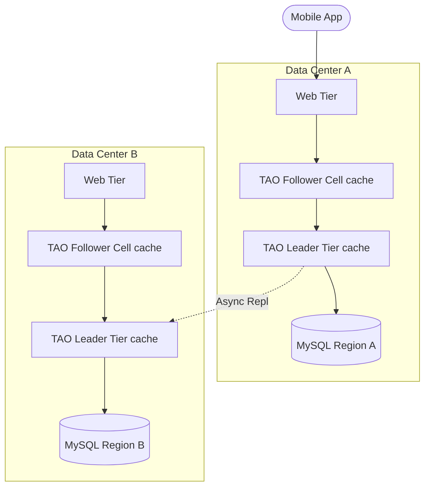

# Real-World Scenarios: Graph Databases

## Case Study 1: The Social Graph & Deep Recommendations (LinkedIn)

**The Problem:**
LinkedIn needs to compute "Degrees of connection" (1st, 2nd, 3rd) and query recommendations ("People you may know") at read-time across a billion users. Attempting this on an RDBMS with self-joins would crash the database on a single query.

**The Architecture & Fix:**
LinkedIn built their own distributed graph system, initially named *Leo*, which evolved into *Liquid*.
*   **Scale Numbers:** Billions of vertices (members, jobs, skills), trillions of edges. Millions of QPS.
*   **Implementation:** They rely heavily on a scattered, distributed approach. Unlike Neo4j that relies on single-server index-free adjacency, LinkedIn partitioned the graph to scale out, accepting that edge traversals would require network hops.
*   **Caching:** To make this survive production load, they aggressively cache 2nd-degree network spheres per user in distributed memory (Redis/Memcached clusters). True deep graph traversal is only executed when the cache misses or for deeper administrative queries.

## Case Study 2: TAO - The Read-Optimized Social Graph (Facebook)

**The Problem:**
In Facebook's early days, viewing a timeline required fetching a User, their Posts, the Likes on the Posts, the Comments, the Users who made the Comments, and the Avatars of those users. Traditional Memcached in front of MySQL resulted in "cache stampedes" and incoherent data updates.

**The Architecture:**
Facebook developed TAO (The Associations and Objects).
*   **Deployment Topology (TAO Distributed Cache):**

*   **Post-Mortem Scenario: The Supernode Meltdown**
    *   *Incident:* When a celebrity (e.g., Cristiano Ronaldo) posted an image, 10 million users instantly "Liked" it. In a graph, this translates to one Node (the Post) receiving 10 million incoming Edges. Attempting to traverse or update that local node cluster caused extreme hot-spotting and node failure.
    *   *The Fix:* TAO had to implement edge-limits and asynchronous fan-out architectures. Graph queries involving supernodes are truncated, and aggregations (e.g., "10M Likes") are structurally detached from the raw edge relationships so the UI doesn't require traversing 10 million pointers to render the heart icon.

## Case Study 3: Logistics and Supply Chain Mapping (Walmart)

**The Problem:**
Calculating the optimal route for package delivery, identifying single points of failure in supplier networks, or tracking origin-of-goods for recall compliance. In an RDBMS, standard `WHERE` clauses cannot traverse an arbitrary-depth supply chain.

**The Fix:**
*   **Architecture:** Operational data flows from mainframe and Cassandra systems into a centralized Neo4j Causal Cluster.
*   **Scale Numbers:** ~1B nodes (Warehouses, Trucks, Stores, Items), ~5B edges. Latency requirement: < 50ms.
*   **What Went Wrong:** Analysts wrote open-ended queries (e.g., `MATCH (item)-[*]->(warehouse)`), accidentally triggering a full graph scan because there was no directional bound or edge limit. This filled up the Java Heap space and triggered massive Garbage Collection pauses.
*   **Prevention:** Forced strict query limits via configuration (`dbms.cypher.planner` limits), required users to specify edge direction (e.g., `->`), and implemented strict max-depths on variable length paths (`*1..4` max).
