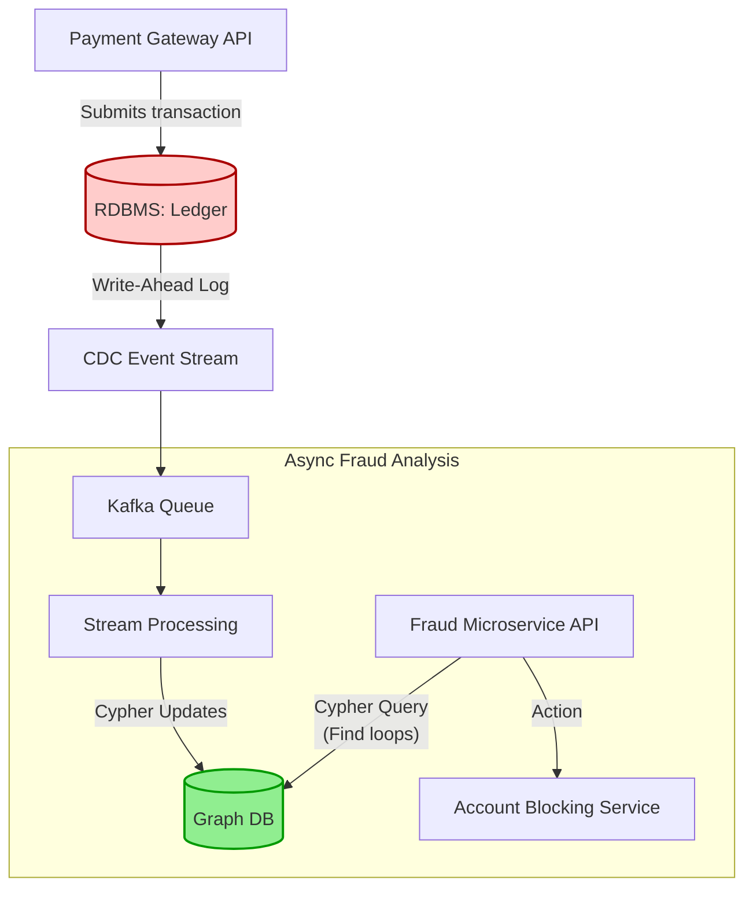

# Interview Angle: Graph Databases

## How This Appears

In system design interviews, graph architecture almost exclusively appears in specific problem domains: 
1. Social networks ("Design Facebook's Social Graph / News Feed")
2. Recommendation systems ("Design Netflix/Amazon Collaborative Filtering")
3. Security/Fraud ("Design an anomaly detection system for credit card transactions").

## Sample Questions & Answer Frameworks

### Q1: "We are building a social network. Should we use PostgreSQL or Neo4j to store the connections?"

*   **Weak Answer (Senior):** "We should use Neo4j because it is a graph database and a social network is a graph. Postgres is bad at relations because JOINs are slow."
*   **Strong Answer (Principal):** "It depends strictly on our query pattern. If we only need 1st-degree connections (fetching my direct friends), a Postgres junction table (`user_id_1, user_id_2`) indexed on both columns will provide sub-millisecond lookups and vastly superior write throughput. However, if our core feature requires 3rd-degree connection analysis (e.g., pathfinding algorithms, 'how are you connected to Bill Gates'), Postgres will suffer Cartesian explosion through recursive CTEs. I would recommend Postgres as the system of record for the users, pushing asynchronous edge updates to a Graph Database specifically for the friend-of-a-friend recommendation microservice."
*   **What They're Testing:** Pragmatism over hype. Recognizing that a native graph DB trades horizontal write scalability and OLAP performance for index-free adjacency read traversal. 

### Q2: "How would you handle the 'Justin Bieber' problem (a supernode with 100 million followers) in your graph?"

*   **Weak Answer:** "I will add more RAM to the database cluster to ensure his node fits in memory."
*   **Strong Answer:** "A supernode creates massive lock contention on writes and OOM kills on read traversals. We must decouple the aggregate data from the physical relationships. First, we stop writing literal edges to his node; we cache followers in a distributed cache (Memcached/Redis). Second, for queries traversing through him, we apply degree-cutoff limits in the query planner. If a pathbuilder hits a node with >10,000 edges, it stops expanding that trajectory. It's statistically useless for meaningful path discovery anyway."
*   **What They're Testing:** Deep knowledge of graph bottlenecks. Understanding that graph mathematics break down at extreme density, and requiring architectural cutoffs.

### Q3: "What is index-free adjacency and why does it matter?"

*   **Weak Answer:** "It means the database doesn't use indexes, making it faster to search."
*   **Strong Answer:** "In a relational DB, resolving a JOIN requires O(log N) B-Tree index lookups for every hop. Index-free adjacency means that the physical structure strictly stores memory pointers to connecting edges. Moving from Node A to Node B is an O(1) memory dereference. This matters because traversing a million paths in an RDBMS means a million O(log N) tree scans, while in a native graph DB, it's just following a million memory pointers directly on disk/RAM."
*   **What They're Testing:** Understanding the physical storage mechanics separating a native graph (Neo4j) from a non-native graph (JanusGraph/Gremlin over Cassandra).

## Whiteboard Exercise

**The Fraud Ring Detection Architecture (Real-Time)**

Draw how to decouple the high-throughput payment system from the heavy-compute graph traversal.

*Narrative to practice:* "We cannot put graph traversal in the inline critical path of authorization due to variable query latencies. The Ledger commits the payment. CDC puts it on Kafka. Our fast workers materialize the nodes/edges into the Graph DB. Separately, complex pattern-matching queries run against the Graph to detect circular 5-hop rings. If detected, async signals are sent to lock the compromised accounts."
