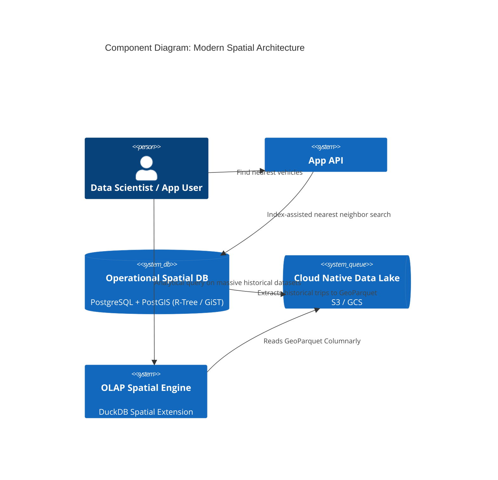

# Concept Overview: Spatial Databases

## Why This Exists

Traditional database indexes (B-Trees) are one-dimensional. They are exceptionally good at finding a number `X` where `A < X < B` on a single axis. However, location data exists in two or three dimensions (Latitude, Longitude, Elevation). Trying to query "Find all coffee shops within a 5-mile radius of my location" using a standard B-Tree requires a full table scan, calculating the Haversine distance formula for every single row in the database.

Spatial Databases (like PostGIS, SpatiaLite, or cloud-native geospatial engines) extend traditional DBMS capabilities by providing **multi-dimensional indexing** and **computational geometry functions** operating directly within the database engine.

## What Value It Provides

1.  **Multi-Dimensional Indexing:** Rapidly filtering millions of points, lines, or polygons in milliseconds using spatial indexing structures (R-Trees, Quad-Trees, Geohash, H3) instead of sequential scans.
2.  **Topological Operators:** Built-in functions to test spatial relationships (`ST_Intersects`, `ST_Contains`, `ST_Touches`) without bringing raw coordinate data into application memory.
3.  **Complex Geometry Math:** Calculating areas, lengths, buffers (inflated boundaries), and nearest neighbors directly in the database.
4.  **Spatial Reference System (SRS) Translation:** Instant reproduction of coordinates across different projection planes (e.g., projecting a 3D spherical coordinate onto a 2D flat map for rendering).

## Core Concepts & Terminology

| Concept | Deep Definition |
| :--- | :--- |
| **Geometry vs. Geography** | `Geometry` assumes spatial data lives on a flat, Cartesian plane (best for localized data like a city map). `Geography` calculates exact shapes on a spherical Earth modeling the curvature (best for global calculations e.g., flight paths), but is computationally heavier. |
| **SRID (Spatial Reference Identifier)** | The EPSG code identifying the coordinate system. `4326` (WGS 84) is standard GPS (Lat/Lon). `3857` (Web Mercator) is what Google Maps uses to draw flat tiles. Ignoring SRIDs guarantees misaligned data. |
| **Bounding Box (MBR)** | The Minimum Bounding Rectangle. The smallest generic rectangle that can completely encapsulate a complex polygon. Used heavily in index filtering. |
| **Vector vs. Raster** | **Vector:** Points, Lines, Polygons. **Raster:** A grid of pixels where each cell contains a value (e.g., Satellite imagery, elevation heatmaps). Modern spatial engines handle both. |

## The Indexing Revolution: Geohash & Discrete Global Grids

While R-Trees revolutionized localized spatial queries, planet-scale aggregations (e.g., ride-sharing) demanded global discrete grids. 

*   **Geohash:** Encodes a 2D location into a 1D alphanumeric string using recursive quad-tree logic (Z-order curves). Characters matching at the prefix mean locations are close together. Often fails at the poles or across certain meridian boundaries.
*   **Uber H3:** A hierarchical, hexagonal spatial index. Hexagons, unlike squares (Geohash/Quadtree), ensure that the distance from the center of a cell to all exactly neighboring cells is uniform. Excellent for moving objects clustering and deep ML analysis.
*   **S2 (Google):** A hierarchical projection utilizing space-filling Hilbert curves on the 6 faces of a cube enclosing a sphere. Supremely fast for nearest neighbor coverage.

## Cloud-Native Geospatial Movement

Historically, processing geospatial data meant installing heavy GIS software. The modern era defines spatial data as "just data."

*   **Cloud Optimized GeoTIFF (COG):** Allows reading just a specific bounded box of a massive satellite image over HTTP range requests, without downloading the multi-gigabyte file.
*   **GeoParquet:** Adds geospatial indexing and metadata directly to Apache Parquet files, allowing analytic engines (Snowflake, BigQuery, DuckDB) to perform spatial queries on petabytes of vector data via columnar scans.

