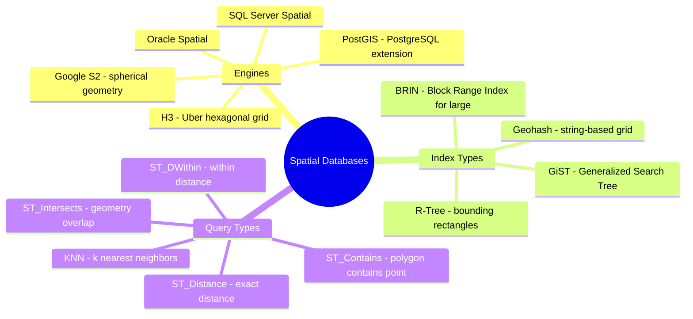

# Spatial Databases — Concept Overview & Deep Internals

> R-Trees, PostGIS, and geospatial queries: finding everything within 5km of a point in milliseconds.

---

## Why This Exists

Standard B-Tree indexes work for 1-dimensional data (sorted numbers, strings). Geospatial data is 2D+ (latitude, longitude, elevation). An R-Tree index organizes data by bounding rectangles, enabling efficient spatial queries: "find all restaurants within 2km" or "does this polygon contain this point?"

## Mindmap



## PostGIS Example

```sql
CREATE EXTENSION postgis;

CREATE TABLE restaurants (
    id SERIAL PRIMARY KEY,
    name VARCHAR(200),
    location GEOGRAPHY(POINT, 4326)  -- WGS84 coordinate system
);

-- Spatial index
CREATE INDEX idx_restaurants_geo ON restaurants USING GIST(location);

-- Find restaurants within 2km of a point
SELECT name, ST_Distance(location, ST_MakePoint(-122.4194, 37.7749)::GEOGRAPHY) AS dist_m
FROM restaurants
WHERE ST_DWithin(location, ST_MakePoint(-122.4194, 37.7749)::GEOGRAPHY, 2000)
ORDER BY dist_m;
-- Uses R-Tree index: checks only bounding rectangles overlapping the 2km radius
```

## War Story: Uber — H3 Hexagonal Grid

Uber uses H3 (hexagonal hierarchical spatial index) instead of traditional R-Trees. Hexagons tile the earth uniformly (unlike rectangles which distort at poles). Surge pricing, driver dispatch, and ETA calculations all use H3 cells. Each cell has a unique 64-bit ID, enabling simple integer lookups instead of complex geometric operations.

## Interview — Q: "How would you optimize location-based queries?"

**Strong Answer**: "PostGIS with GIST index on a GEOGRAPHY column. For reads: `ST_DWithin` for radius queries (uses R-Tree), `ST_Contains` for polygon containment. For write-heavy workloads at Uber/Lyft scale: Uber's H3 hexagonal grid — converts spatial queries into integer index lookups, which are orders of magnitude faster than geometric calculations."

## References

| Resource | Link |
|---|---|
| [PostGIS](https://postgis.net/) | PostgreSQL spatial extension |
| [H3](https://h3geo.org/) | Uber's hexagonal spatial index |
| [Google S2](http://s2geometry.io/) | Spherical geometry library |
