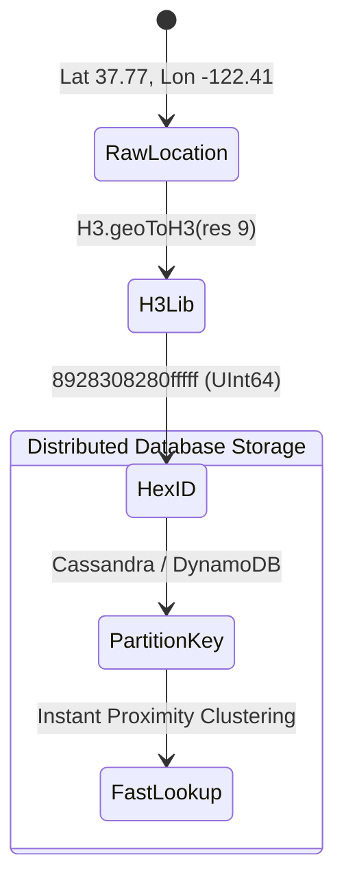

# How It Works: Spatial Database Internals

Understanding how a spatial database operates requires understanding how it breaks down complex 2D or 3D geometry into structures that a database can index and search in `O(log N)` time.

## 1. The Two-Phase Spatial Query

Because checking if two complex polygons intersect (e.g., a 10,000-point country border vs. a 500-point delivery zone) requires heavy CPU math, spatial databases employ a strictly adhered **Two-Phase Commit** for query evaluation:

1.  **The Filter Phase (Index Scan):** The database reads the Minimum Bounding Rectangle (MBR) — basically a simple box surrounding the geometry. It checks if the MBRs intersect using a Spatial Index. This is extremely fast but produces "False Positives" (rectangles that touch, even if the actual organic shapes inside them do not).
2.  **The Refine Phase (Exact Math):** For the candidates surviving Phase 1, the database pulls the exact geometry vertices from disk and performs rigorous point-in-polygon math using library algorithms (like GEOS) to filter out the false positives.

## 2. Spatial Indexing: R-Trees and GiST

The backbone of systems like PostGIS is the **GiST (Generalized Search Tree)** which typically implements an **R-Tree** (Rectangle Tree) for spatial bounding.

*   Unlike a B-Tree which divides data by a scalar value (`< 50` goes left, `> 50` goes right), an R-Tree divides space into nested, overlapping rectangles.
*   **Root Node:** A massive rectangle covering the entire dataset map.
*   **Child Nodes:** Smaller rectangles dividing the parent area.
*   **Leaf Nodes:** The actual Minimum Bounding Rectangles of specific rows on disk.

When querying "Find points in this polygon," the engine traverses the R-Tree, discarding branches (rectangles) that do not intersect with the target polygon.

## 3. The Nearest Neighbor Problem (KNN)

A massive breakthrough in spatial internals was solving the "K-Nearest Neighbors" (KNN) problem via indexing instead of table scans. 

**The Naive approach:**
`SELECT * FROM restaurants ORDER BY ST_Distance(location, my_location) LIMIT 5;`
*Fatal flaw:* Calculates distance against *every* row, sorts the entire result, then returns 5. `O(N log N)`.

**The Index-Assisted approach (PostGIS `<->` operator):**
`SELECT * FROM restaurants ORDER BY location <-> my_location LIMIT 5;`
*Internal advantage:* The engine traverses the GiST R-Tree index, calculating the distance to the bounding boxes of the index nodes themselves. It follows the nearest branch. Once it finds 5 results and proves no other index branch could mathematically contain a closer point, it terminates. `O(log N)`.

## 4. Modern Spatial Grids: Uber H3 Internal Mechanics

For extreme scale tracking (ride-hailing, mobility), managing complex polygon updates in R-Trees involves too much locking and re-balancing. The industry shifted to Discrete Global Grid Systems like **Uber H3**.

*   **Projection:** H3 projects the Earth onto an icosahedron (20-sided polygon). 
*   **Tessellation:** The faces are covered with hexagons. Hexagons are geometrically superior because the distance from a hexagon's center to all neighbors is identical. (Squares share edges and infinitely small points/corners, corrupting uniform proximity).
*   **Indexing to Int64:** H3 turns a GPS coordinate into a 64-bit integer.
    *   Bits 0-3: Reserved/Mode.
    *   Bits 4-7: Resolution (0 to 15).
    *   Bits 8-14: Base cell (0-121).
    *   Bits 15-63: Hierarchical child cell encoding.

By turning 2D geometry into a 1D Int64, you completely eliminate the need for an R-Tree. You can store billions of location states in Cassandra, ScyllaDB, or Redis, grouping and querying them locally via standard B-Tree indexing or hash partitioning.

