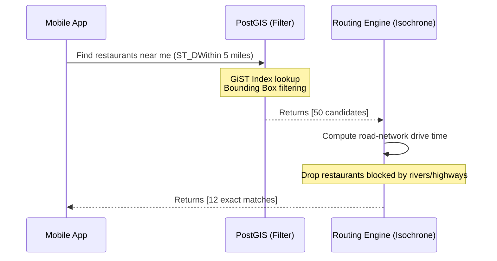

# Real-World Scenarios: Spatial Databases

## Case Study 1: Ride-Hailing Hexagonal Dispatch (Uber)

**The Problem:**
Uber needed to continuously compute the density of ride requests, dynamic surge pricing, and driver ETAs in real-time across the world. Performing traditional `ST_Contains(polygon, point)` math inside PostGIS for every driver ping (every 4 seconds for millions of drivers) is computationally impossible. Furthermore, drawing artificial "city boundaries" with complex polygons resulted in edge-case anomalies.

**The Architecture & Fix:**
Uber abandoned localized polygon geometries in their hot path and developed **H3**, an open-source hierarchical hexagonal grid.
*   The world is broken into billions of hexagons via complex sphere tessellation logic.
*   Every driver's phone continually reports their GPS coordinates. The ingestion pipeline (Kafka) calls a library function `geoToH3()` translating `lat/lon` into a 64-bit integer Hex ID.
*   Database systems (like Cassandra) simply store rows as: `(HexID, DriverID, Timestamp)`.
*   Surge pricing systems merely run `SELECT COUNT(*) WHERE HexID = X`. Because hexagons are perfectly mathematically equidistant, Uber can calculate the density of the *neighboring* 6 hexagons with simple bitwise arithmetic, without touching a database index.

## Case Study 2: Spatial Joins at Analytics Scale (Telecom / 5G)

**The Problem:**
A Telecom relies on Big Data mapping. They have a table of 500 million cell phone pings (Lat/Loc) and a table of 100,000 neighborhood polygons. They need to analyze signal strength per neighborhood globally. Traditional PostGIS excels at small-scale operations but struggles under OLAP loads of 500 million spatial joins on a single VM.

**The Solution:**
The shift to **Cloud-Native Geospatial Analytics (GeoParquet + Snowflake/BigQuery).**
*   The massive point dataset is stored in S3 as a partitioned GeoParquet file.
*   The data warehouse imports the polygons as native `GEOGRAPHY` objects.
*   Instead of standard GiST indexing, cloud warehouses utilize parallelized bounding-box pruning, distributing the spatial join completely across massively parallel clusters (MPP).
*   By executing `ST_INTERSECTS(pings.geom, neighborhoods.geom)`, the cloud engine dynamically allocates 500 compute nodes, partitions the spatial map into physical grids (often S2 or H3 under the hood), and evaluates collisions in massively distributed memory.

## Case Study 3: O2O Delivery Radius Filtering (DoorDash/Swiggy)

**The Problem:**
When a user opens a food delivery app, the app must instantly query all available restaurants within a 5-mile radius, but the map boundaries aren't perfect circles—they are dictated by road networks and delivery polygons. 

**The Execution Lifecycle:**
1.  **Fast Pruning (The Bounding Box):** First, the backend uses an index-optimized `ST_DWithin` query to do an aggressive bounding-box filter around the user location against restaurant coordinates. This reduces 10,000 restaurants nationwide to just 50 local candidates in 5 milliseconds.
2.  **Isochrone Validation (The Refinement):** Linear Distance does not equal Routing Distance (due to rivers, highways, traffic). The remaining 50 candidates are fed into a routing engine (like OSRM or a Graph DB engine mapping the road network) which computes isochrones (shapes of equal travel time).
3.  **Result Retrieval:** The 12 remaining restaurants strictly inside the 15-minute drive-time isochrone are returned to the user.

## Case Study 4: Entity Resolution & Data Dirtying

**The Reality of Spatial Master Data:**
Governments and real-estate agencies merge spatial data from drones, satellite imagery, and manual surveying. 
*   **The Error:** Due to floating-point imprecision or misaligned SRIDs (Spatial Reference Systems), two data vendors' borders for the same country or property will slightly overlap.
*   **The Fix:** Production pipelines run `ST_MakeValid()` aggressively. Advanced Data Architects use PostGIS topology engines to force vertices that lie within microscopic snapping tolerances (e.g., 0.00001 mm) to snap together into a shared topological edge, preventing analytical chaos later in the pipeline.
