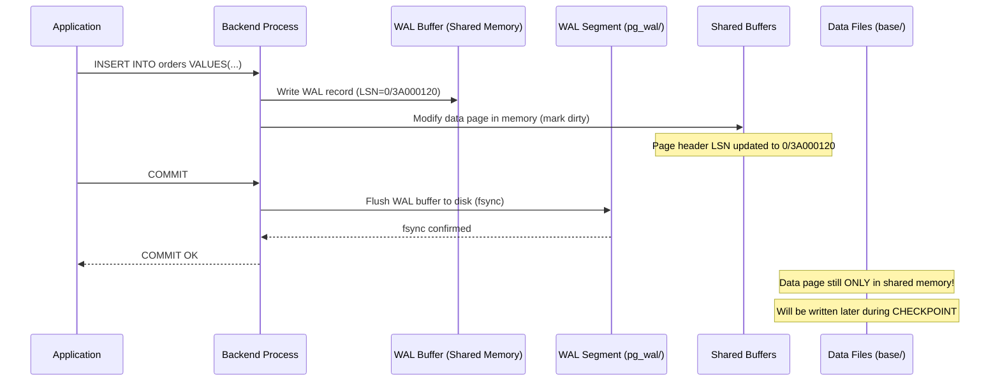

# Concept Overview: Write-Ahead Logging (WAL) and Durability

## Why This Exists

Databases must guarantee that a committed transaction survives a power outage, OS crash, or hardware failure. Without a Write-Ahead Log, the database would need to flush every dirty page to disk on every commit—an approach so slow it would reduce throughput by 100x or more.

WAL decouples the **moment of commit** from the **moment data pages reach disk**. By writing a compact, sequential record of intent *before* modifying data pages, the database achieves durability without the catastrophic I/O penalty of synchronous page flushes.

## Core Concepts & Terminology

| Concept | Deep Definition |
| :--- | :--- |
| **WAL Record** | A binary log entry describing a single atomic change (e.g., "insert tuple X at page Y, offset Z"). Contains the LSN, transaction ID, resource manager ID, and the before/after image of the changed data. |
| **LSN (Log Sequence Number)** | A 64-bit monotonically increasing pointer into the WAL stream. Every WAL record gets a unique LSN. Every data page stores the LSN of the last WAL record that modified it. This is the bridge between the log and the heap. |
| **WAL Buffer** | A shared-memory ring buffer where WAL records are staged before being flushed to disk. The buffer is sized by `wal_buffers` (default: 1/32 of `shared_buffers`, typically 16 MB). |
| **WAL Segment** | A physical file on disk (default 16 MB in PostgreSQL, stored in `pg_wal/`). Segments are filled sequentially and recycled after checkpointing. |
| **Checkpoint** | A background process that flushes all dirty pages from shared buffers to the data files, writes a checkpoint WAL record, and updates `pg_control`. After a checkpoint, all WAL segments *prior* to the checkpoint's redo LSN can be recycled. |
| **Full-Page Write (FPW)** | After each checkpoint, the first modification to a data page writes the *entire* 8 KB page into the WAL (not just the delta). This protects against torn pages—partial writes caused by a crash mid-flush where the OS wrote only 4 KB of an 8 KB page. |
| **fsync** | A POSIX system call that forces the OS to flush its file-system cache to the physical storage medium. PostgreSQL calls `fsync` on WAL files at commit time (by default) to guarantee durability. |
| **synchronous_commit** | A PostgreSQL GUC controlling how aggressively commits wait for WAL to hit stable storage. Setting it to `off` returns instantly after writing to the WAL buffer (risking loss of the last ~600ms of transactions on crash), while `on` waits for `fsync` confirmation. |

## The Write Path (Step by Step)

**Critical insight:** At `COMMIT OK`, the data page has NOT been written to disk. Only the WAL record has. If the server crashes now, PostgreSQL replays the WAL from the last checkpoint to reconstruct the missing data pages. This is the "write-ahead" guarantee.

## The Durability Spectrum

Not all workloads demand identical durability. PostgreSQL provides a spectrum:

| Setting | Latency | Risk Window | Use Case |
| :--- | :--- | :--- | :--- |
| `synchronous_commit = on` + `fsync = on` | Highest | Zero (committed = durable) | Financial transactions, healthcare |
| `synchronous_commit = off` + `fsync = on` | Lower | ~600ms of recent commits may be lost | High-throughput logging, analytics ingestion |
| `fsync = off` | Lowest | Entire database may corrupt on crash | **Never in production.** Only for disposable data loading. |

## Cross-Database Comparison

| Engine | WAL Equivalent | Key Difference |
| :--- | :--- | :--- |
| **PostgreSQL** | WAL (`pg_wal/`) | Full-page writes after checkpoint; WAL used for both crash recovery AND replication |
| **MySQL/InnoDB** | Redo Log + Doublewrite Buffer | Uses a separate doublewrite buffer instead of full-page writes to protect against torn pages |
| **SQL Server** | Transaction Log (LDF) | Virtual Log Files (VLFs) inside the log; automatic truncation after backup |
| **Oracle** | Redo Log + Archive Log | Circular redo log groups; LGWR process handles writes; archiver copies filled groups |
| **MongoDB (WiredTiger)** | Journal | Journals every 100ms by default; checkpoint every 60 seconds |
