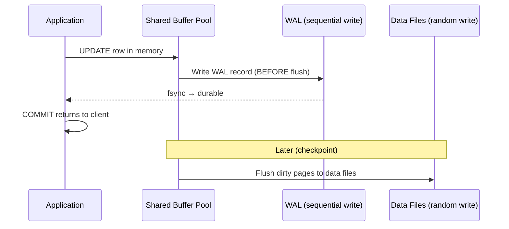

# WAL and Durability — Concept Overview & Deep Internals

> Write-Ahead Logging: the mechanism that guarantees your committed data survives a power outage.

---

## Why This Exists

Without WAL, a crash between "data written to memory" and "data flushed to disk" means data loss. WAL guarantees: **write the intention (log) to disk BEFORE applying the change to data pages**. On crash recovery, replay the log to restore committed transactions.

## How WAL Works



**Key rule**: WAL record hits disk BEFORE the data page. This is why WAL goes on the fastest storage (NVMe) — it's in the critical commit path.

## PostgreSQL WAL Settings

```sql
-- Critical WAL parameters
-- wal_level = 'replica'        -- minimum for replication
-- max_wal_size = '4GB'         -- trigger checkpoint after 4GB of WAL
-- min_wal_size = '1GB'         -- retain at least 1GB
-- wal_compression = 'lz4'     -- compress WAL records (PostgreSQL 15+)
-- synchronous_commit = 'on'    -- wait for WAL fsync before COMMIT returns
--                              -- 'off' = async (faster but risk of data loss on crash)
```

## War Story: GitLab — WAL Archiving Saved the Company

In 2017, a GitLab engineer accidentally deleted a production PostgreSQL database. Their primary backup system had silently failed for months. What saved them: WAL archiving to S3 was still working. They rebuilt the database from the last base backup + WAL replay, recovering to within 6 seconds of the deletion event.

## References

| Resource | Link |
|---|---|
| [PostgreSQL WAL](https://www.postgresql.org/docs/current/wal.html) | Official documentation |
| Cross-ref: Storage Engines | [../../01_Storage_Engines_and_Disk_Layout](../../01_Storage_Engines_and_Disk_Layout/) |
