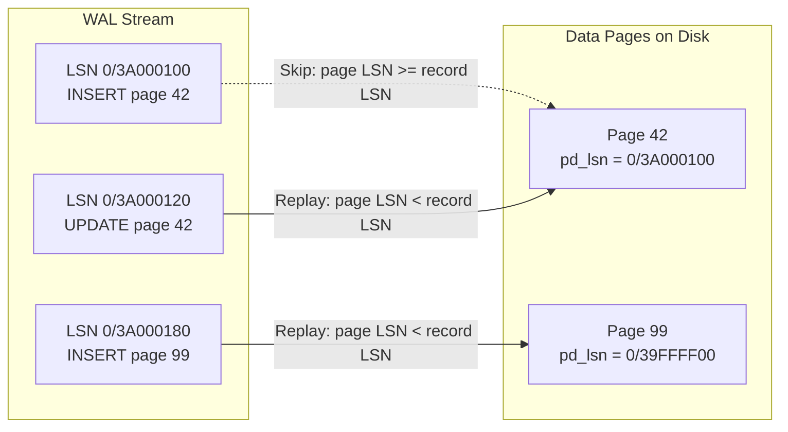

# How It Works: WAL and Durability Internals

## 1. WAL Record Anatomy (PostgreSQL)

Every WAL record is a binary structure containing:

```
┌─────────────────────────────────────────────────────┐
│  xl_tot_len  │ Total length of this WAL record      │
│  xl_xid      │ Transaction ID that generated it      │
│  xl_prev     │ LSN of the previous WAL record        │
│  xl_info     │ Resource Manager specific flags        │
│  xl_rmid     │ Resource Manager ID (Heap, BTree, etc) │
│  xl_crc      │ CRC-32C checksum                      │
│  [data]      │ The actual change payload              │
└─────────────────────────────────────────────────────┘
```

The `xl_rmid` (Resource Manager ID) identifies *which subsystem* the change belongs to. PostgreSQL has ~25 resource managers: Heap, BTree, GiST, Hash, SPGist, Sequence, Transaction, etc. Each resource manager knows how to replay its own WAL records during recovery.

## 2. The LSN Mechanism

The LSN is a 64-bit value represented as two 32-bit hex numbers separated by a slash: `0/3A000120`.

- **Upper 32 bits:** Identifies the WAL segment timeline position.
- **Lower 32 bits:** Byte offset within that segment.

**Page-Level LSN Tracking:** Every 8 KB data page has an `pd_lsn` field in its header. When the background writer or checkpointer flushes a page to disk, it reads `pd_lsn`. During crash recovery, PostgreSQL scans WAL forward from the checkpoint's redo LSN and skips any WAL record whose target page already has a `pd_lsn >= record's LSN`—meaning the page was already written to disk before the crash.



## 3. Checkpointing Deep Dive

Checkpoints are the mechanism that reconciles the WAL with the data files.

**Trigger conditions:**
1. `checkpoint_timeout` elapsed (default: 5 minutes).
2. WAL volume since last checkpoint approaches `max_wal_size` (default: 1 GB).
3. Manual `CHECKPOINT` command or server shutdown.

**The checkpoint lifecycle:**
1. **Record the redo LSN:** The checkpoint notes the current WAL insertion point. This becomes the "redo point"—recovery will start replaying from here.
2. **Flush dirty pages:** The checkpointer iterates through the shared buffer pool, writing all pages marked dirty to their respective data files. I/O is spread over time using `checkpoint_completion_target` (default: 0.9 = uses 90% of the checkpoint interval for flushing, avoiding I/O spikes).
3. **Write checkpoint WAL record:** A special XLOG_CHECKPOINT_SHUTDOWN or XLOG_CHECKPOINT_ONLINE record is written to the WAL.
4. **Update `pg_control`:** The control file is updated with the new checkpoint LSN. This is the single source of truth for crash recovery.
5. **Recycle old WAL segments:** Segments older than the redo LSN are unlinked or renamed for reuse.

## 4. Full-Page Writes (FPW) — The Torn Page Problem

Modern file systems and disks have an atomic write unit of 512 bytes or 4 KB. PostgreSQL data pages are 8 KB. A crash mid-write can leave a page half-old, half-new—a **torn page**. 

WAL replay cannot fix a torn page because the WAL record contains only a delta (e.g., "change bytes 100-200 on page 42"). If the base page is corrupt, applying the delta produces garbage.

**Solution:** After each checkpoint, the first time any page is modified, PostgreSQL writes the **entire 8 KB page** into the WAL (the Full-Page Image / FPI). During recovery, PostgreSQL restores the full page image first, then applies subsequent deltas on top of a known-good base.

**Trade-off:** FPWs inflate WAL volume by 2-3x immediately after a checkpoint. This is why `checkpoint_completion_target = 0.9` exists—to spread the I/O and reduce the "thundering herd" of FPWs.

## 5. The fsync Guarantee Chain

```mermaid
flowchart TD
    A[Application: COMMIT] --> B[Backend: Write WAL to WAL Buffer]
    B --> C[Backend: Issue write() to WAL segment file]
    C --> D{fsync = on?}
    D -->|Yes| E[Backend: fsync() / fdatasync()]
    E --> F[OS: Flush file system cache to disk controller]
    F --> G{Battery-Backed Write Cache?}
    G -->|Yes| H[Controller: ACK immediately, writes from NVRAM later]
    G -->|No| I[Controller: Write to magnetic platter / NAND flash]
    H --> J[Backend: Return COMMIT OK to client]
    I --> J
    D -->|No| K["Backend: Return COMMIT OK immediately<br/>(DATA AT RISK)"]
```

**The hidden danger:** If the disk controller lies about fsync (reports success before data hits stable storage) and lacks a battery-backed cache, data can be lost despite PostgreSQL doing everything correctly. This is why enterprise SSDs with power-loss protection (PLP) are mandatory for production databases.

## 6. InnoDB Comparison: Doublewrite Buffer

MySQL's InnoDB solves the torn-page problem differently from PostgreSQL:

1. Before flushing dirty pages from the buffer pool to their tablespace files, InnoDB first writes them to a **sequential doublewrite buffer** on disk.
2. Only after the doublewrite is fsynced does InnoDB write the pages to their final locations.
3. On crash recovery, InnoDB checks each data page's checksum. If a page is corrupt (torn), it restores it from the doublewrite buffer, then applies redo log entries.

**Key difference:** PostgreSQL uses FPW in the WAL (increasing WAL size). InnoDB uses a separate doublewrite buffer (adding an extra write but keeping the redo log smaller).
