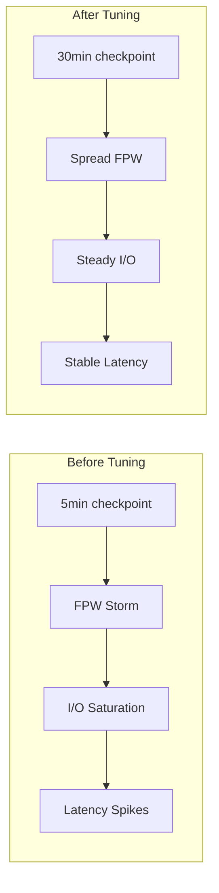

# Real-World Scenarios: WAL and Durability

## Case Study 1: The Silent Data Corruption (fsync Bug, 2018)

**The Incident:**
In 2018, the PostgreSQL community discovered that certain Linux kernel versions (especially with XFS and ext4 in writeback mode) would silently *clear* the error flag on a failed `fsync()`. PostgreSQL would call `fsync()`, the kernel would report success, but the data had never actually reached the disk. On crash, committed transactions were lost permanently.

**The Root Cause:**
The Linux kernel's page cache maintained dirty pages. When `fsync()` was called and the underlying I/O failed (e.g., bad sector), the kernel marked the page as an error but cleared the error after reporting it *once*. If PostgreSQL retried the `fsync()`, or if the checkpoint process called `fsync()` later, the kernel reported success—even though the write had never completed.

**The Fix:**
PostgreSQL 12 introduced `data_sync_retry = off` (the default). If an `fsync()` call fails, PostgreSQL now panics (crashes intentionally) rather than retrying, because the retry result is untrustworthy. The DBA must then restore from backup. This is the only safe behavior given the kernel's contract.

**Principal Lesson:** Durability guarantees are only as strong as the weakest link in the stack: Application → Database → OS kernel → File system → Disk controller → Physical media. A bug at any layer can silently break the entire chain.

## Case Study 2: WAL Bloat from Long-Running Transactions

**The Problem:**
A SaaS company's analytics dashboard ran a 3-hour `SELECT` query against the OLTP database. During those 3 hours, PostgreSQL could not recycle any WAL segments because the long-running transaction held a snapshot that prevented the checkpoint from advancing past the transaction's start LSN. WAL accumulated to 200 GB, filling the disk. New writes failed with "no space left on device," causing a full production outage.

**The Architecture Fix:**
1. **Immediate:** Added `statement_timeout = '30min'` and `idle_in_transaction_session_timeout = '5min'` to prevent unbounded queries.
2. **Structural:** Moved analytical queries to a streaming replica with `hot_standby_feedback = off`. The replica can lag without affecting WAL retention on the primary.
3. **Monitoring:** Added alerts on `pg_ls_waldir()` total size exceeding 5 GB.

## Case Study 3: Optimizing WAL for High-Throughput Ingestion

**The Problem:**
An IoT platform ingesting 50,000 sensor readings per second found that `synchronous_commit = on` (the default) was the bottleneck. Each commit waited for `fsync()`, limiting throughput to ~8,000 commits/second regardless of CPU or memory capacity.

**The Solution (Layered Durability):**

```sql
-- Sensor readings: high volume, re-derivable from edge devices
-- Use async commit for 3x throughput improvement
ALTER DATABASE iot_telemetry SET synchronous_commit = 'off';

-- Billing events derived from sensor data: must not lose
-- Override per-session for the billing service
ALTER ROLE billing_service SET synchronous_commit = 'on';
```

Result: Ingestion throughput increased from 8,000 to 47,000 commits/second. The risk window of ~600ms data loss was acceptable because the edge devices could replay recent sensor data from their local buffers.

## Case Study 4: Checkpoint Storms

**The Problem:**
A data warehouse loading 500 GB nightly experienced severe latency spikes every 5 minutes. Investigation revealed that the default `checkpoint_timeout = 5min` and `max_wal_size = 1GB` caused checkpoints approximately every 5 minutes during the load. Each checkpoint triggered a burst of Full-Page Writes (FPW), temporarily tripling WAL generation and saturating the disk I/O subsystem.

**The Fix:**
```sql
-- Extend checkpoint interval during bulk loads
ALTER SYSTEM SET checkpoint_timeout = '30min';
ALTER SYSTEM SET max_wal_size = '16GB';
ALTER SYSTEM SET checkpoint_completion_target = 0.9;
SELECT pg_reload_conf();
```

**Trade-off accepted:** Crash recovery after the extended checkpoint would take up to 30 minutes of WAL replay instead of 5 minutes. Since the warehouse had a hot standby for failover, this was acceptable.


