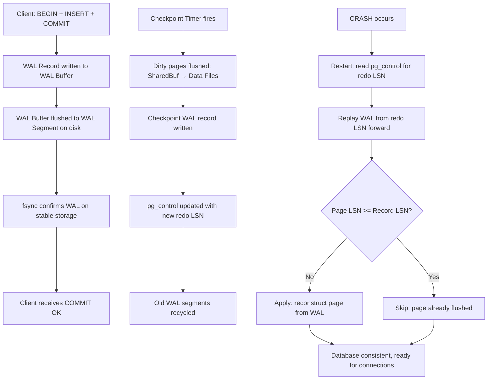

# Interview Angle: WAL and Durability

## How This Appears

WAL and durability are foundational in Senior/Principal database interviews. They surface in:
1. **System Design:** "Design a payment system. How do you ensure a transfer is never lost?"
2. **Deep Dive:** "Explain how a database guarantees durability after COMMIT."
3. **Debugging:** "Your database returned COMMIT OK, but after a power failure the row is missing. What happened?"

## Sample Questions & Answer Frameworks

### Q1: "What is a Write-Ahead Log and why is it necessary?"

**Weak:** "It's a log file that records changes before they happen."

**Strong:** "WAL is an append-only, sequential log where every data modification is recorded *before* it is applied to the actual data pages. The key insight is that sequential writes to a single file are orders of magnitude faster than random writes to scattered data pages. At commit time, the database only needs to `fsync` the WAL—not every modified data page. Data pages are flushed lazily during checkpoints. On crash, the database replays the WAL from the last checkpoint's redo LSN forward, reconstructing any data pages that were dirty in memory but never written to disk."

### Q2: "What is the difference between fsync and synchronous_commit?"

**Strong:** "`fsync` is a system call that forces the OS to write cached data to the physical storage medium. It controls whether WAL records *ever* reach disk. `synchronous_commit` controls whether the database *waits* for the `fsync` to complete before returning COMMIT OK to the client. With `synchronous_commit = off`, the database writes to the WAL buffer and returns immediately—the data will be fsynced eventually (within ~600ms by the walwriter process), but if the server crashes before that happens, those recent commits are lost. Critically, `fsync` must always be `on` in production—turning it off can corrupt the entire database. `synchronous_commit = off` only risks losing the last few hundred milliseconds of transactions, never corruption."

### Q3: "Explain the torn page problem and how PostgreSQL solves it."

**Principal Answer:** "Disk hardware writes in units of 512 bytes or 4 KB, but PostgreSQL data pages are 8 KB. A crash mid-write can leave a page half-old, half-new—a torn page. Normal WAL replay cannot fix this because the WAL record contains only a delta, not the full page. PostgreSQL solves this with Full-Page Writes (FPW): after each checkpoint, the first modification to any data page writes the entire 8 KB page image into the WAL. During recovery, PostgreSQL restores the full-page image from the WAL first, then applies subsequent delta records on top. MySQL/InnoDB solves this differently using a doublewrite buffer—a separate sequential area on disk where pages are written before their final destination. This adds an extra write step but keeps the redo log smaller."

### Q4: "Your replica is lagging behind the primary by 10 GB of WAL. Diagnose and fix."

**Framework:**
1. **Check the replica:** Is it processing WAL at all? (`SELECT pg_last_wal_replay_lsn()` — is it advancing?)
2. **I/O bottleneck:** Is the replica's disk saturated? WAL replay involves random reads/writes to data pages.
3. **Long-running queries on replica:** With `hot_standby_feedback = on`, a long query on the replica can block WAL replay to avoid invalidating the query's snapshot.
4. **Network:** Is WAL streaming at full speed? Check `pg_stat_replication.sent_lsn` vs `write_lsn`.
5. **Fix options:** Increase `max_parallel_recovery_workers` (PG 15+), add faster storage to replica, kill long queries, or consider logical replication for selective tables.

## Whiteboard Exercise

**Draw the complete write-commit-checkpoint-recovery cycle:**

