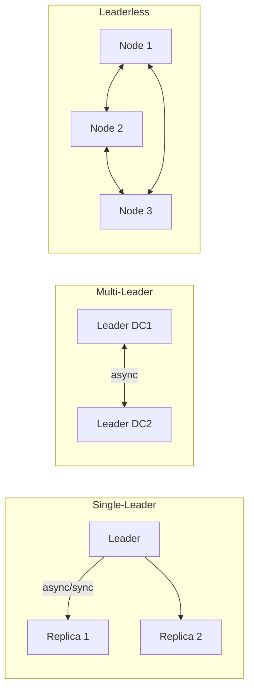

# Replication Topologies — Concept Overview & Deep Internals

> Single-leader, multi-leader, leaderless: how data flows between database replicas.

---

## Comparison

| Topology | Write Scalability | Read Scalability | Consistency | Conflict Handling |
|---|---|---|---|---|
| **Single-Leader** | ❌ One node | ✅ Many replicas | ✅ Strong (sync) or eventual (async) | None (single write point) |
| **Multi-Leader** | ✅ Multiple regions | ✅ Many replicas | ⚠️ Eventual | ❌ Conflict resolution needed |
| **Leaderless** | ✅ Any node | ✅ Any node | ⚠️ Quorum-dependent | ❌ LWW or app-level |

## War Story: GitHub — Single-Leader with Automatic Failover

GitHub runs MySQL with single-leader replication. When the leader fails, Orchestrator (open-source) promotes the most up-to-date replica within seconds. Challenge: during promotion, a few seconds of writes may be lost (async replication lag). GitHub accepts this trade-off because synchronous replication would add 5ms to every write.

## References

| Resource | Link |
|---|---|
| *Designing Data-Intensive Applications* | Ch. 5: Replication |
| [Orchestrator](https://github.com/openark/orchestrator) | MySQL HA tool |
