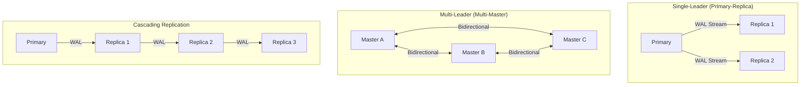

# Concept Overview: Replication Topologies

## Why This Exists

A single-server database is a single point of failure. Replication creates copies of data across multiple servers to achieve: **High Availability** (failover when the primary dies), **Read Scalability** (distribute read queries across replicas), and **Disaster Recovery** (survive data center outages). The choice of replication topology determines the trade-offs between data consistency, write performance, and operational complexity.

## Core Concepts & Terminology

| Concept | Deep Definition |
| :--- | :--- |
| **Physical Replication** | Byte-for-byte copying of the primary's WAL stream to replicas. The replica is an exact binary clone—same data directory layout, same indexes, same bloat. Cannot replicate selectively. |
| **Logical Replication** | Decodes WAL into logical change events (INSERT, UPDATE, DELETE) and replays them on the subscriber. Enables selective replication (specific tables), cross-version replication, and even cross-engine migration. |
| **Synchronous Replication** | The primary waits for at least one replica to confirm that the WAL has been written (or flushed, or applied) before returning COMMIT OK. Guarantees zero data loss (RPO = 0) but increases commit latency proportional to network round-trip time. |
| **Asynchronous Replication** | The primary commits and returns COMMIT OK immediately, then streams WAL to replicas without waiting. Lowest latency, but a crash of the primary before WAL reaches the replica means data loss (RPO > 0). |
| **Semi-Synchronous Replication** | The primary waits for at least one replica to acknowledge *receipt* of the WAL (not necessarily application). Balances between zero-loss and low-latency. MySQL's default "semi-sync" plugin works this way. |
| **Streaming Replication** | Continuous, real-time WAL transfer from primary to standby (PostgreSQL terminology). The standby connects via a replication slot and receives WAL records as they are generated. |
| **Replication Slot** | A PostgreSQL mechanism that ensures the primary retains WAL segments until the subscriber has consumed them. Prevents the primary from recycling WAL that a slow replica still needs, but can cause unbounded WAL accumulation if the replica is disconnected. |
| **Failover** | Promoting a standby to become the new primary when the old primary is unavailable. Can be manual or automated (via tools like Patroni, pg_auto_failover, or cloud-managed services). |
| **Split-Brain** | A catastrophic failure where two nodes both believe they are the primary and accept writes independently. Leads to data divergence that is extremely difficult to reconcile. |

## Topology Catalog

## When to Use What

| Topology | Consistency | Write Scalability | Complexity | Use Case |
| :--- | :--- | :--- | :--- | :--- |
| **Single-Leader, Async** | Eventual | None (single writer) | Low | Read-heavy web apps, analytics replicas |
| **Single-Leader, Sync** | Strong (RPO=0) | None | Medium | Financial systems, healthcare records |
| **Cascading** | Eventual | None | Low | Geo-distributed read replicas (reduce primary's network load) |
| **Multi-Leader** | Eventual (conflict resolution required) | Yes (write to any node) | Very High | Multi-region writes, collaborative editing |
| **Leaderless (Dynamo-style)** | Tunable (quorum) | Yes | Very High | Cassandra, DynamoDB—AP systems |
