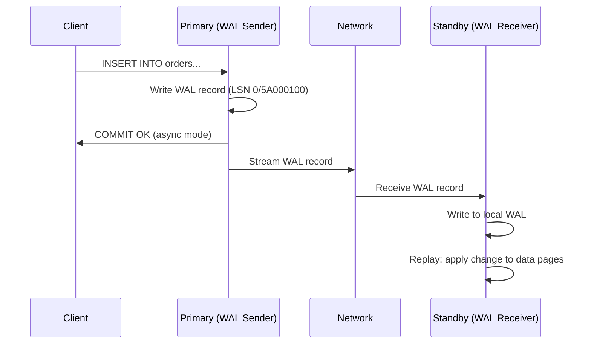
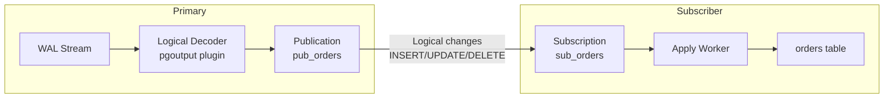

# How It Works: Replication Topologies Internals

## 1. PostgreSQL Physical (Streaming) Replication

### Architecture

### The WAL Sender / WAL Receiver Protocol
1. The standby connects to the primary using a special replication connection (`primary_conninfo`).
2. The standby sends `START_REPLICATION` with its current LSN position.
3. The primary's `walsender` process streams WAL records in real-time.
4. The standby's `walreceiver` writes them to local WAL files.
5. The standby's `startup` process replays WAL records against local data pages.

### Synchronous Commit Levels (PostgreSQL)
PostgreSQL provides granular control over how much the primary waits:

| `synchronous_commit` | What primary waits for | Latency | Safety |
| :--- | :--- | :--- | :--- |
| `remote_write` | Standby OS has received WAL (in OS cache) | Lowest sync | Survives Postgres crash, not OS crash |
| `on` (with sync standby) | Standby has flushed WAL to disk | Medium | Survives standby OS crash |
| `remote_apply` | Standby has replayed WAL | Highest | Read-your-writes consistency on standby |

## 2. PostgreSQL Logical Replication

### How It Differs from Physical
Physical replication ships raw WAL bytes. Logical replication **decodes** WAL into logical change records using the `pgoutput` plugin (or `wal2json`, `test_decoding`).

### Key Differences

| Aspect | Physical | Logical |
| :--- | :--- | :--- |
| **Granularity** | Entire cluster | Per-table |
| **Cross-version** | Must be identical major version | Can differ |
| **DDL replication** | Automatic (byte-for-byte) | NOT automatic—DDL must be applied manually |
| **Indexes** | Identical to primary | Independent—can have different indexes |
| **Write access on replica** | Read-only | Read-write (except replicated tables) |
| **Conflict handling** | N/A | Must handle manually (duplicate keys, etc.) |

## 3. MySQL Replication Architecture

### Binary Log (Binlog) Replication
MySQL uses the binary log (binlog) instead of the redo log for replication. The binlog records logical changes in either statement-based (SBR), row-based (RBR), or mixed format.

**Flow:**
1. Primary writes changes to the binlog.
2. Replica's I/O thread connects and downloads binlog events into the relay log.
3. Replica's SQL thread reads the relay log and applies changes.

### MySQL Group Replication
Group Replication provides virtually synchronous multi-master replication using a consensus protocol (based on Paxos):

1. A transaction starts on any node.
2. Before commit, the node broadcasts the transaction's write set to the group.
3. All nodes certify the transaction (check for conflicts with concurrent transactions).
4. If certification passes (no conflicting writes), all nodes apply the transaction.
5. If conflicts are detected, the conflicting transaction is rolled back on the originating node.

## 4. Conflict Resolution in Multi-Master

When two nodes modify the same row concurrently, a conflict arises. Resolution strategies:

| Strategy | How It Works | Risk |
| :--- | :--- | :--- |
| **Last Write Wins (LWW)** | Compare timestamps; latest timestamp wins | Clock skew can silently discard valid writes |
| **Origin Wins** | The originating node's write always wins | Deterministic but may lose valid remote updates |
| **Custom Resolution** | Application-defined SQL function decides | Complex to implement correctly |
| **Conflict Avoidance** | Partition writes by geography/tenant (e.g., US writes go to US master) | Best approach when feasible—eliminates conflicts entirely |

**The uncomfortable truth:** Multi-master replication with conflict resolution is almost always the wrong choice for OLTP systems. The complexity of conflict detection, resolution, and testing exceeds the benefit for most workloads. Use single-leader with automated failover (Patroni + PostgreSQL, or MySQL Group Replication in single-primary mode).
