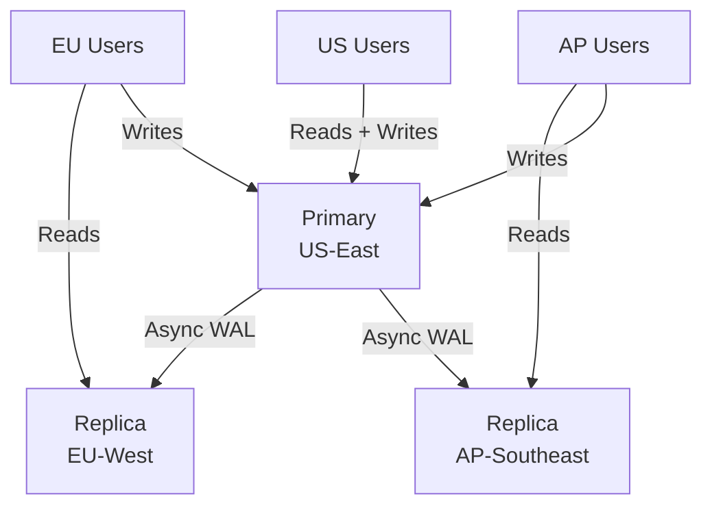

# Real-World Scenarios: Replication Topologies

## Case Study 1: GitHub's MySQL Replication Architecture

**The Scale:**
GitHub operates one of the world's largest MySQL deployments with hundreds of replicas across multiple data centers. Their replication topology evolved through several generations.

**The Architecture:**
- **Single-leader** per cluster with a primary in one data center.
- **Cascading replication** to reduce WAN bandwidth: a "relay" replica in each remote data center receives the binlog, then serves as the source for read replicas in that data center.
- **Semi-synchronous replication** to a local replica ensures at least one copy survives a primary crash.
- **Automated failover** using their custom orchestrator tool (`orchestrator`, later open-sourced) that detects primary failures and promotes the most up-to-date replica.

**Schema migrations** use `gh-ost` (GitHub Online Schema Transmogrifier) to perform non-blocking ALTER TABLE operations on tables with billions of rows, while replication continues uninterrupted.

**The Lesson:** Even at GitHub's scale, they use single-leader replication—not multi-master. The complexity of conflict resolution in multi-master was deemed too high for their transactional consistency requirements.

## Case Study 2: The Split-Brain Disaster

**The Incident:**
A fintech company used a two-node PostgreSQL cluster with Patroni for automated failover. During a network partition between the primary and the etcd consensus store, Patroni on the standby promoted it to primary. Meanwhile, the old primary was still running and accepting writes from applications that hadn't detected the failover.

For 12 minutes, both nodes accepted writes. When the partition healed:
- 2,400 financial transactions existed on the old primary that were missing on the new primary.
- 1,800 transactions existed on the new primary that conflicted with the old primary's data.
- Manual reconciliation took 3 days.

**The Fix:**
1. **Fencing:** Configure the old primary to self-terminate (`watchdog_mode = required` in Patroni) if it loses contact with etcd. A hardware watchdog reboots the node, guaranteeing it cannot accept writes during a partition.
2. **Application-level detection:** The application's connection string uses Patroni's REST API to discover the current leader, with a short TTL.
3. **Quorum:** Use a 3-node etcd cluster across 3 availability zones. Patroni only promotes if it can reach a majority of etcd nodes.

## Case Study 3: Cross-Region Read Replicas for Latency

**The Problem:**
A global e-commerce platform had its primary database in US-East. Users in Europe (150ms RTT) and Asia (280ms RTT) experienced unacceptable query latency for product catalog reads.

**The Solution:**
- **Async streaming replicas** deployed in EU-West and AP-Southeast.
- Application routing logic: Writes always go to US-East primary. Reads are routed to the nearest replica.
- **Acceptable staleness:** Product catalog data can be 2-5 seconds stale. Order status reads are routed to the primary (consistency required).

**Monitoring:** Alert when `replay_lag > 10s` on any regional replica, indicating network or I/O issues that could serve stale data beyond the acceptable window.

## Case Study 4: Logical Replication for Zero-Downtime Major Version Upgrade

**The Problem:**
Upgrading PostgreSQL from 14 to 16 on a 2 TB database. `pg_upgrade` requires downtime (30-60 minutes for a database this size). The SLA requires <= 2 minutes of downtime.

**The Solution:**
1. Set up a PostgreSQL 16 instance.
2. Create the schema on PG 16 (matching PG 14's schema).
3. Establish logical replication from PG 14 (publisher) to PG 16 (subscriber).
4. Wait for the subscriber to catch up (monitor `pg_stat_subscription`).
5. During a brief maintenance window (~30 seconds): stop writes to PG 14, verify lag = 0, switch application connection strings to PG 16.
6. Drop the subscription. PG 16 is now the primary.

**Why logical, not physical?** Physical replication requires identical major versions. Logical replication decodes the WAL into logical changes, which can be applied to any compatible PostgreSQL version.
