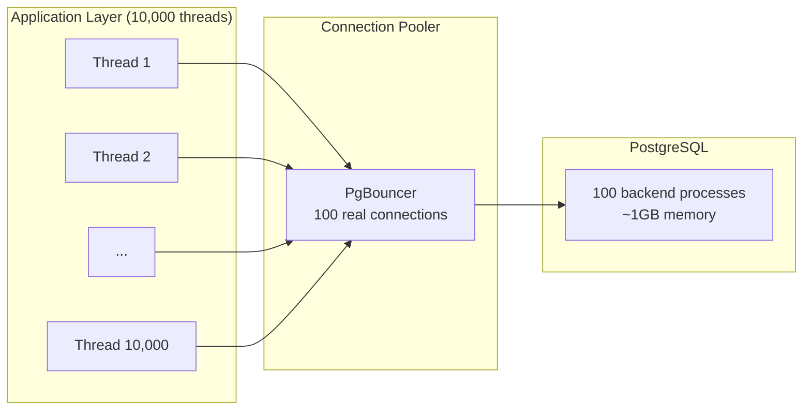

# Connection Pooling — Concept Overview & Deep Internals

> Why 10,000 application threads should NOT open 10,000 database connections.

---

## Why This Exists

Each PostgreSQL connection spawns a new OS process (~10MB memory). 1,000 connections = 10GB just for connection overhead. But applications often need 10,000+ concurrent requests. Connection poolers (PgBouncer, PgCat, RDS Proxy) multiplex thousands of application connections onto a small pool of database connections.

## Architecture

## Pooling Modes (PgBouncer)

| Mode | When Connection Returns to Pool | Best For |
|---|---|---|
| **Session** | When client disconnects | Long-lived sessions, prepared statements |
| **Transaction** | When transaction completes | Most applications (recommended) |
| **Statement** | After each statement | Simple queries, no multi-statement transactions |

## War Story: Heroku — PgBouncer at Scale

Heroku's shared PostgreSQL service uses PgBouncer to multiplex 50,000+ application connections onto 500 PostgreSQL connections per instance. Without PgBouncer, each dyno's connection would consume PostgreSQL process memory, hitting the OS process limit at ~5,000 connections.

## References

| Resource | Link |
|---|---|
| [PgBouncer](https://www.pgbouncer.org/) | Lightweight connection pooler |
| [PgCat](https://github.com/postgresml/pgcat) | Next-gen pooler with load balancing |
