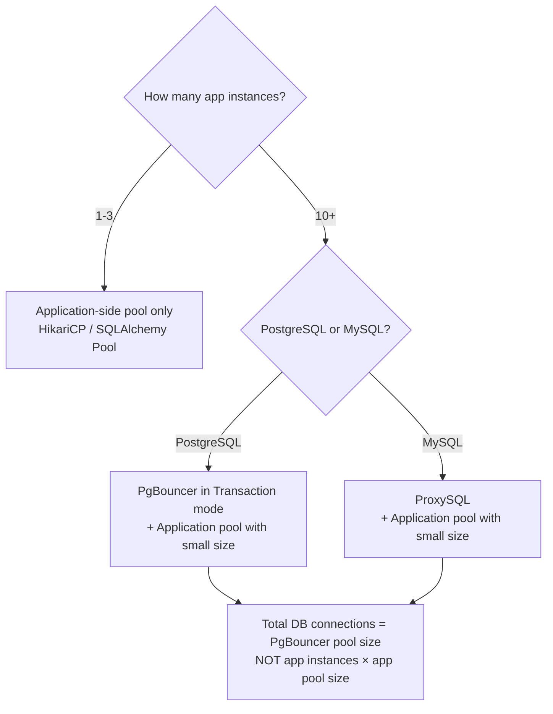

# Concept Overview: Connection Pooling

## Why This Exists

Every database connection is expensive. PostgreSQL forks a new OS process per connection (~5-10 MB RAM each). MySQL creates a thread per connection with its own stack and buffer allocation. At 500 concurrent connections, PostgreSQL consumes 2.5-5 GB of RAM just for process overhead, and the OS scheduler thrashes between processes, destroying throughput through context-switching.

Connection pooling interposes a proxy between applications and the database. It maintains a **small pool of persistent database connections** and multiplexes many application requests across them. The application "borrows" a connection from the pool, uses it, and "returns" it—the expensive setup/teardown (TCP handshake, TLS negotiation, authentication, process fork) is amortized across thousands of requests.

## Core Concepts & Terminology

| Concept | Deep Definition |
| :--- | :--- |
| **Connection Pool** | A cache of pre-established database connections. Instead of opening a new connection per request, the application borrows one from the pool and returns it after use. |
| **Pool Size** | The maximum number of simultaneous connections in the pool. Too small = application threads queue waiting. Too large = overwhelms the database with concurrent connections. The optimal formula is often `(CPU_cores × 2) + effective_spindle_count`. |
| **Session Pooling** | A pool mode where a database connection is assigned to a client for its entire session (connect → disconnect). Provides full compatibility (temp tables, session variables) but minimal pooling benefit. |
| **Transaction Pooling** | A pool mode where a database connection is assigned only for the duration of a single transaction. After COMMIT/ROLLBACK, the connection returns to the pool. Provides maximum connection reuse but breaks session-stateful features. |
| **Statement Pooling** | A pool mode where a connection is assigned for a single SQL statement only. Extremely aggressive, breaks multi-statement transactions. Rarely used. |
| **Connection Multiplexing** | Multiple application-level connections share fewer database-level connections. 1000 app connections can be served by 50 database connections if requests are short-lived and staggered. |
| **Connection Leak** | An application borrows a connection from the pool but never returns it (e.g., an exception path skips `connection.close()`). Over time, the pool is exhausted. |

## The Pooling Ecosystem

| Layer | Tool | Database | Key Feature |
| :--- | :--- | :--- | :--- |
| **Server-Side Proxy** | PgBouncer | PostgreSQL | Lightweight, single-threaded, extremely resource-efficient. Transaction-mode pooling. |
| **Server-Side Proxy** | Pgpool-II | PostgreSQL | Connection pooling + read/write splitting + load balancing. Heavier than PgBouncer. |
| **Server-Side Proxy** | ProxySQL | MySQL | Connection multiplexing + query routing + query caching + query rewriting. |
| **Application-Side** | HikariCP | Java (JDBC) | Ultra-fast JVM connection pool. ~130ns connection acquisition. Used by Spring Boot default. |
| **Application-Side** | c3p0, DBCP2 | Java (JDBC) | Older alternatives to HikariCP; slower, more configurable. |
| **Application-Side** | SQLAlchemy Pool | Python | Built-in pool in SQLAlchemy ORM. QueuePool, NullPool, StaticPool options. |
| **Application-Side** | node-postgres Pool | Node.js | Built-in pool in the `pg` module. |

## When to Use Which

**The critical insight:** In a microservices architecture with 50 application instances, each running HikariCP with `max_pool_size = 20`, the database sees `50 × 20 = 1000` connections—far beyond what PostgreSQL can handle efficiently. A server-side pooler (PgBouncer) sits between all instances and the database, reducing 1000 application connections to 50 actual database connections.
