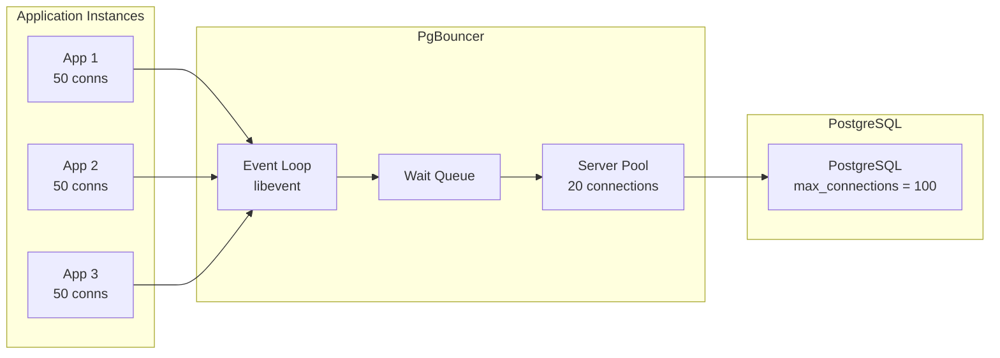
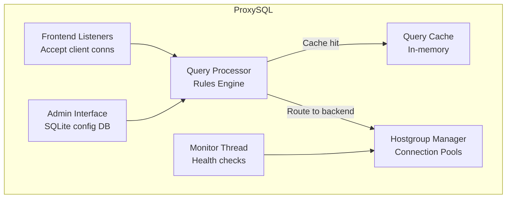

# How It Works: Connection Pooling Internals

## 1. PgBouncer Architecture

PgBouncer is deliberately single-threaded and single-process. It uses `libevent` for asynchronous I/O, handling thousands of connections in a single event loop.



**150 application connections** are multiplexed into **20 database connections**. When all 20 are in use, new requests queue in PgBouncer's wait queue. PostgreSQL sees only 20 processes, keeping memory and CPU overhead minimal.

### Transaction Pooling Mechanics

In transaction pool mode:
1. Client sends `BEGIN`.
2. PgBouncer assigns a server connection from the pool.
3. Client executes queries within the transaction.
4. Client sends `COMMIT` (or `ROLLBACK`).
5. PgBouncer returns the server connection to the pool.
6. The **next query** from the same client may use a **different** server connection.

**What breaks in transaction mode:**
- `SET search_path = ...` — set on connection A, but next query uses connection B.
- `LISTEN / NOTIFY` — requires a persistent session.
- `PREPARE / EXECUTE` — prepared statement exists only on one connection.
- Temporary tables — created on connection A, invisible on connection B.
- Advisory locks — held on connection A, cannot be released from connection B.

### PgBouncer's Prepared Statement Handling (v1.21+)

PgBouncer 1.21 introduced `max_prepared_statements` which tracks prepared statements across server connections. When a client executes a prepared statement on a new server connection, PgBouncer transparently re-prepares it.

## 2. ProxySQL Architecture

ProxySQL is multi-threaded and written in C++. Its architecture is significantly more complex than PgBouncer.



**Key features beyond pooling:**
- **Query Routing:** Rules map SQL patterns to backend hostgroups (e.g., `SELECT` → read replica hostgroup, `INSERT/UPDATE/DELETE` → primary hostgroup).
- **Query Caching:** Configurable per-rule caching. Result sets for read-only queries can be cached in memory.
- **Query Rewriting:** Regex-based rewriting of SQL on the fly (e.g., adding `LIMIT` to dangerous queries).
- **Connection Multiplexing:** Like PgBouncer, multiple frontend connections share fewer backend connections.

## 3. HikariCP Internals (JVM)

HikariCP achieves sub-microsecond connection acquisition through:

### ConcurrentBag Design
Instead of a shared queue (which requires locks), HikariCP uses a `ConcurrentBag` that:
1. First checks if the **current thread** has a previously used connection (thread-local list). This avoids contention entirely.
2. If not, scans the shared list using CAS (Compare-And-Swap) atomic operations. No locks.
3. Only if both fail, the thread waits with a park/unpark mechanism.

### Connection Lifecycle
```
idle → borrowed → active → returned → idle
                    ↓
               (> maxLifetime)
                    ↓
                 evicted → new connection created
```

**Key parameters:**
- `maximumPoolSize`: Hard ceiling. Default 10. Should be `(cores × 2) + 1` for SSD-backed databases.
- `minimumIdle`: Keep this many idle connections ready. Recommended: equal to `maximumPoolSize` for a fixed-size pool.
- `maxLifetime`: Maximum age before a connection is retired. Should be 2-3 minutes less than the database's `wait_timeout` / `idle_in_transaction_session_timeout`.
- `connectionTimeout`: How long to wait for a connection from the pool. Default 30s. Recommended: 2-5s to fail fast.

## 4. The Connection Formula

For a PostgreSQL database on a machine with 8 CPU cores and SSD storage:

```
Optimal max_connections ≈ (cores × 2) + effective_spindle_count
                       ≈ (8 × 2) + 1 = 17
```

This seems surprisingly low. The reasoning: PostgreSQL's query executor is single-threaded per query. With 8 cores, only 8 queries can truly execute in parallel. Additional connections beyond `2 × cores` are purely for I/O overlap (while one query waits for disk, another uses the CPU). Beyond this point, adding connections increases lock contention, buffer contention, and context switching, **reducing** throughput.

In a microservices architecture with N application instances:
```
PgBouncer default_pool_size = 17-20  (matches optimal DB connections)
Each app instance HikariCP maximumPoolSize = 3-5  (small, since PgBouncer handles multiplexing)
Total app-to-PgBouncer connections = N × 5  (PgBouncer handles the rest)
```
