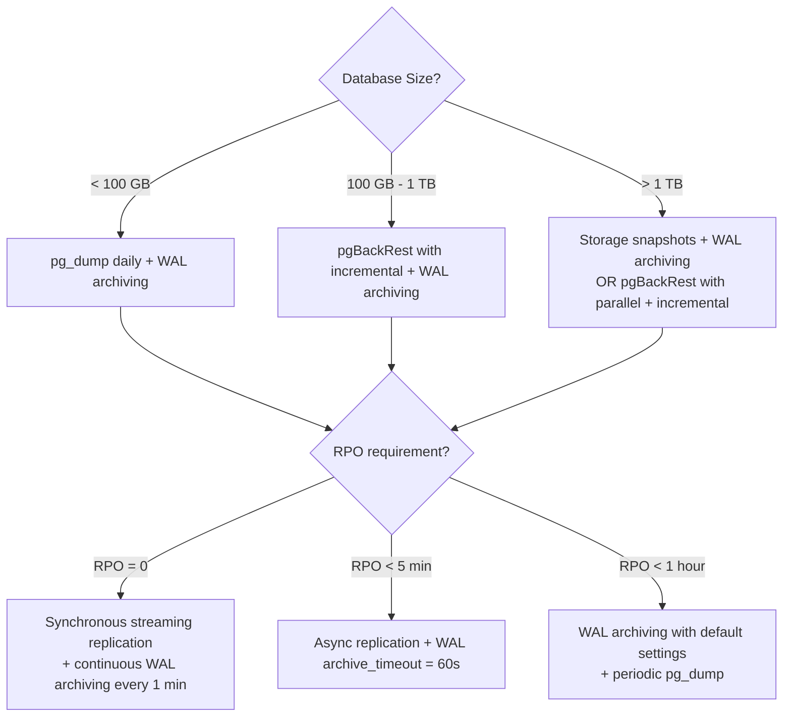

# Concept Overview: Backup & Recovery Strategies

## Why This Exists

Every database will eventually face data loss: hardware failure, human error (`DROP TABLE production`), ransomware, silent corruption, or a botched migration. The only question is whether you can recover—and how much data you lose. Backup and recovery is not a feature you bolt on later; it is a **fundamental architectural decision** that determines your Recovery Point Objective (RPO) and Recovery Time Objective (RTO).

## Core Concepts & Terminology

| Concept | Deep Definition |
| :--- | :--- |
| **RPO (Recovery Point Objective)** | Maximum acceptable data loss measured in time. RPO = 1 hour means you can tolerate losing the last hour of data. RPO = 0 means zero data loss (requires synchronous replication + continuous archiving). |
| **RTO (Recovery Time Objective)** | Maximum acceptable downtime. RTO = 4 hours means the database must be operational within 4 hours of a failure. RTO determines whether you need hot standby (seconds), warm standby (minutes), or cold restore (hours). |
| **Logical Backup** | A dump of SQL statements (or equivalent) that can recreate the data. Tools: `pg_dump`, `mysqldump`, `mongodump`. Human-readable. Portable across versions. Slow for large databases (serialize → transfer → replay). |
| **Physical Backup** | A copy of the raw data files on disk. Tools: `pg_basebackup`, Percona XtraBackup, filesystem snapshots. Not human-readable. Fast for large databases. Version-specific (cannot restore a PG14 physical backup on PG16 directly). |
| **Continuous Archiving (PITR)** | Combines a base physical backup with continuous WAL archiving. Every WAL segment is shipped to storage. To recover, you restore the base backup and replay WAL up to any point in time. Enables RPO measured in seconds (last archived WAL segment). |
| **Snapshot Backup** | A storage-level point-in-time copy (EBS snapshot, ZFS snapshot, LVM snapshot). Near-instant creation using copy-on-write. The database must be in a consistent state (or use crash recovery after restore). |
| **Incremental Backup** | Only backs up data that changed since the last backup. Reduces backup time and storage. Tools: pgBackRest (block-level incremental), Percona XtraBackup (incremental). Requires a base backup to restore from. |
| **Differential Backup** | Backs up all data changed since the last FULL backup (not last incremental). Larger than incremental but simpler to restore (only need full + latest differential). |

## Backup Strategy Comparison

| Strategy | RPO | RTO | Storage | Complexity | Best For |
| :--- | :--- | :--- | :--- | :--- | :--- |
| **Logical (pg_dump)** | Hours | Hours | Low | Low | Dev/staging, small DBs, cross-version migration |
| **Physical (pg_basebackup)** | Minutes-Hours | Minutes | High | Medium | Medium DBs, point-in-time recovery |
| **PITR (base + WAL)** | Seconds | Minutes-Hours | Medium-High | High | Production systems needing near-zero RPO |
| **Snapshot (EBS/ZFS)** | Minutes | Minutes | High | Low | Cloud-native, large DBs where copy speed matters |
| **Incremental (pgBackRest)** | Seconds | Minutes | Low-Medium | High | Large DBs where full backups are too slow |

## The 3-2-1 Rule

Every production database must follow:
- **3** copies of data (production + 2 backups)
- **2** different storage media (local disk + object storage)
- **1** offsite copy (different region/cloud)

## Backup Architecture Decision Tree

