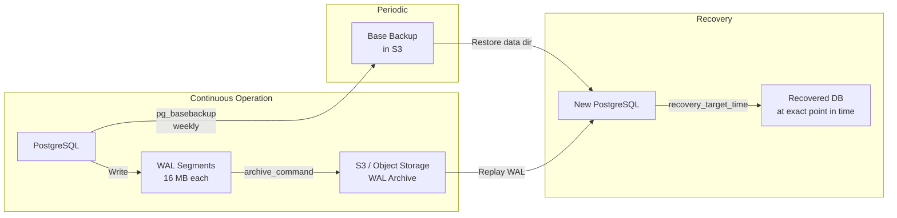

# How It Works: Backup & Recovery Internals

## 1. Logical Backup: pg_dump / pg_dumpall

### How pg_dump Works Internally
1. **Starts a transaction** with `SERIALIZABLE` isolation (or `REPEATABLE READ` in PG 9.1+). This ensures a consistent snapshot: even if data changes during the dump, pg_dump sees the database as it was at the start of the transaction.
2. **Reads the system catalogs** to enumerate all tables, sequences, indexes, constraints, functions, and extensions.
3. **Iterates through each table**, reading rows via a cursor and emitting `COPY` or `INSERT` statements.
4. Outputs DDL (CREATE TABLE, CREATE INDEX) and DML (COPY data) to stdout or a file.

### Key Behaviors
- **Consistent snapshot:** The entire dump reflects a single point in time, even for multi-table databases.
- **No exclusive locks:** pg_dump uses `ACCESS SHARE` locks—it does NOT block writes. However, DDL operations (ALTER TABLE) will block waiting for pg_dump's lock, and vice versa.
- **Single-threaded by default:** For large databases, use `pg_dump -j N` (parallel dump with N workers) with the directory format (`-Fd`).

### Restore: pg_restore
```
pg_restore -d target_db -j 8 --no-owner --no-privileges backup.dump
```
- `-j 8`: 8 parallel workers. Data loading and index creation are parallelized.
- `--no-owner`: Don't try to set object ownership (useful when restoring to a different environment).
- **Index creation** is the bottleneck during restore. pg_restore creates indexes AFTER loading data (correct approach—building indexes during data load is O(N²) vs O(N log N) after).

## 2. Physical Backup: pg_basebackup

### How pg_basebackup Works
1. Calls `pg_backup_start()` (formerly `pg_start_backup()` in PG < 15), which:
   - Forces a checkpoint (writes all dirty buffers to disk).
   - Records the checkpoint's WAL position (the "start LSN").
2. **Copies the entire data directory** (all files: base tables, indexes, TOAST, pg_xact, etc.) over the replication protocol.
3. Calls `pg_backup_stop()`, which:
   - Records the "stop LSN."
   - Forces a WAL switch, ensuring the last WAL segment is available.
   - Writes a `backup_label` file containing start/stop LSNs.

### Why It's Consistent Despite Active Writes
During the copy, PostgreSQL continues accepting writes. The copied files may contain partially-written pages. This is safe because:
- The `backup_label` tells PostgreSQL to start WAL replay from the start LSN when restoring.
- WAL replay will redo any changes that were in-flight during the copy, bringing all pages to a consistent state.
- Full-page writes (FPW) in WAL ensure that even torn pages can be repaired.

## 3. PITR (Point-in-Time Recovery)

### Architecture


### Recovery Steps
1. **Restore the base backup** to the data directory.
2. Create `postgresql.auto.conf` (or `recovery.conf` in PG < 12) with:
   ```
   restore_command = 'aws s3 cp s3://wal-archive/%f %p'
   recovery_target_time = '2024-03-15 14:30:00 UTC'
   recovery_target_action = 'promote'
   ```
3. **Start PostgreSQL.** It enters recovery mode:
   - Reads the `backup_label` to find the start LSN.
   - Fetches WAL segments from S3 using `restore_command`.
   - Replays WAL transactions sequentially.
   - Stops at `recovery_target_time`.
   - Promotes to a normal read-write database.

### WAL Archiving Configuration
```ini
# postgresql.conf
wal_level = replica                    # Minimum for PITR
archive_mode = on
archive_command = 'pgbackrest --stanza=main archive-push %p'
archive_timeout = 60                   # Force archive every 60s even if WAL not full
```

`archive_timeout = 60` is critical: without it, a quiet database might not fill a 16 MB WAL segment for hours, meaning up to 16 MB of data could be lost. With `archive_timeout = 60`, the maximum data loss is 60 seconds of transactions.

## 4. pgBackRest: Production-Grade Backup Tool

pgBackRest is the gold standard for PostgreSQL backup management:

### Incremental Backup Mechanics
- **Full backup:** Copies all files. Serves as the base.
- **Differential:** Copies files changed since last FULL backup.
- **Incremental:** Copies only file-level changes since last ANY backup (full, diff, or incr). Uses file timestamps and sizes for change detection; block-level incremental (added in pgBackRest 2.46) uses checksums to copy only changed blocks within files.

### Key Features
- **Parallel backup/restore:** Multiple threads for faster operations.
- **Compression:** zstd or lz4 compression during backup.
- **Encryption:** AES-256-CBC encryption at rest.
- **Delta restore:** Only restores files that differ from the current data directory. Dramatically faster for large databases where only a few files changed.
- **Backup verification:** `pgbackrest verify` checks backup integrity without restoring.

## 5. Storage Snapshots

### EBS Snapshots (AWS)
1. **Freeze I/O** or use PostgreSQL's `pg_backup_start() / pg_backup_stop()` to ensure consistency.
2. **Create EBS snapshot.** This is a point-in-time, copy-on-write operation—near-instant regardless of volume size.
3. **Resume I/O.**

**Consistency concern:** If you snapshot without `pg_backup_start()`, PostgreSQL may have dirty buffers in shared memory not yet flushed to disk. On restore, PostgreSQL's crash recovery (WAL replay) will bring the database to a consistent state—same as recovering from a power failure. This works but is not a "clean" backup.

### ZFS Snapshots
ZFS snapshots are truly atomic (copy-on-write at the filesystem level). Combined with `zfs send | zfs receive`, they enable efficient incremental backup transfer. PostgreSQL on ZFS can skip full-page writes (`full_page_writes = off`) because ZFS's copy-on-write eliminates torn pages, improving write performance by 10-30%.
