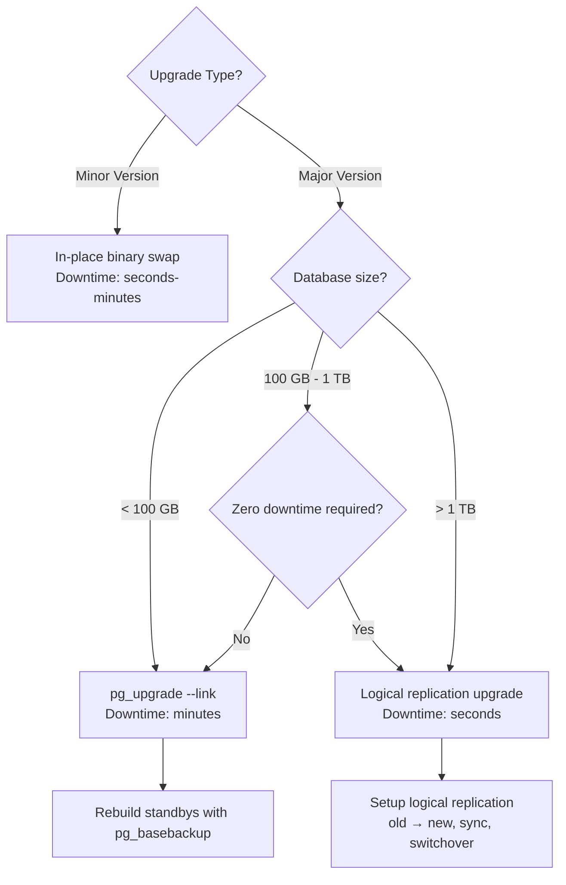

# Concept Overview: Upgrades & Migrations

## Why This Exists

Databases don't stay on one version forever. PostgreSQL releases a new major version annually. MySQL's lifecycle forces eventual upgrades. Schema changes are a weekly occurrence in active products. Each of these operations risks downtime, data loss, or application breakage.

**Upgrades** (changing the database engine version) and **migrations** (changing the schema within a version) are the most dangerous routine operations a DBA performs. The difference between a 2-minute upgrade and a 4-hour outage is preparation, tooling, and strategy.

## Core Concepts & Terminology

| Concept | Deep Definition |
| :--- | :--- |
| **Major Version Upgrade** | Changing the first or second version number (e.g., PG 15 → PG 16, MySQL 5.7 → 8.0). Involves on-disk format changes, catalog changes, and potential SQL behavior changes. Requires `pg_upgrade`, logical replication, or dump/restore. |
| **Minor Version Upgrade** | Changing the patch number (e.g., PG 16.2 → PG 16.3). Bug fixes and security patches only. In-place binary swap. Usually zero or near-zero downtime. |
| **pg_upgrade** | PostgreSQL tool for in-place major version upgrades. Two modes: `--copy` (copies data files, hours) and `--link` (hard-links data files, seconds). Does NOT replicate to standbys—they must be rebuilt. |
| **Logical Replication Upgrade** | Setting up logical replication from the old-version primary to a new-version standby. After sync, promote the new version. Enables near-zero-downtime major version upgrades. |
| **Schema Migration** | Adding, removing, or altering database objects (tables, columns, indexes, constraints). Tools: Flyway, Liquibase, Alembic, Django migrations, Rails ActiveRecord migrations. |
| **Online DDL** | Schema changes that don't block reads or writes. PostgreSQL supports many DDL operations concurrently; MySQL's `ALGORITHM=INSTANT` and `ALGORITHM=INPLACE` avoid table copies. |
| **Blue-Green Deployment** | Running two complete database environments (blue = current, green = new). Traffic switches from blue to green after validation. Provides instant rollback by switching back. |
| **Expand-Contract Pattern** | Schema evolution strategy: (1) **Expand** — add new columns/tables without removing old ones. (2) **Migrate** — application writes to both old and new. (3) **Contract** — remove old columns after all consumers have migrated. |

## Upgrade Strategy Decision Tree

## Schema Migration Strategies

| Strategy | Downtime | Complexity | Best For |
| :--- | :--- | :--- | :--- |
| **Offline migration** | Minutes-hours | Low | Dev/staging, small tables |
| **Online DDL** | Zero | Medium | Adding nullable columns, creating indexes concurrently |
| **Expand-Contract** | Zero | High | Renaming columns, changing types, splitting tables |
| **Ghost table migration** | Zero | High | Large table schema changes (MySQL gh-ost, pt-online-schema-change) |
| **Blue-Green** | Seconds (switchover) | Very High | Full schema overhauls, version upgrades |

## The Cardinal Rule

> **Never run untested DDL on production.** Every migration must be tested on a production-size copy, with timing measured. A migration that takes 2 seconds on a dev database with 1,000 rows can take 2 hours on production with 100 million rows—and lock the table the entire time.
