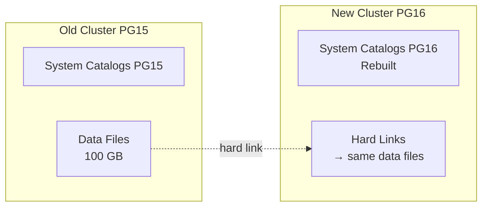
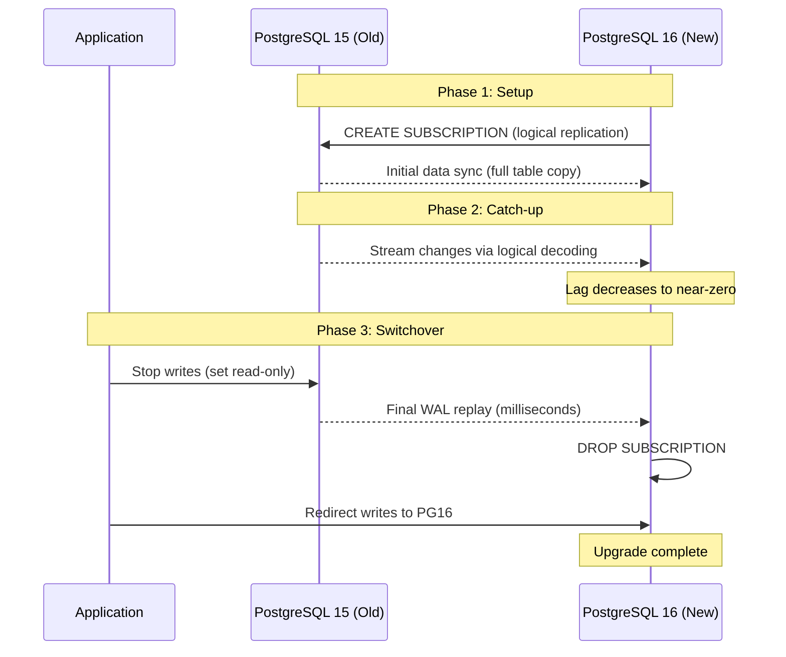

# How It Works: Upgrades & Migrations Internals

## 1. pg_upgrade Internals

### Link Mode (`--link`)
Instead of copying data files, `pg_upgrade --link` creates **hard links** from the new data directory to the old data files. This is near-instant regardless of database size.



**How it works step-by-step:**
1. **Pre-check** (`pg_upgrade --check`): Verifies compatibility—checks for incompatible data types, extensions, encoding mismatches.
2. **Catalog rebuild:** Creates new system catalogs (pg_class, pg_type, pg_attribute, etc.) for the new major version. The on-disk data format is usually unchanged between major versions; only the catalog format changes.
3. **Hard link creation:** For each relation file (table, index, TOAST), creates a hard link in the new data directory pointing to the original file. O(number_of_files), not O(data_size).
4. **Statistics transfer:** Optionally transfers `pg_statistic` data so the query planner doesn't need a full `ANALYZE`.
5. **Start new cluster:** The new PostgreSQL version reads the same physical files through its new catalogs.

**Critical limitations:**
- After `--link`, the old cluster is **unusable** (shared data files). No rollback without a backup.
- Standbys must be rebuilt from scratch (`pg_basebackup` from the upgraded primary).
- Extensions must be compatible with the new version (install new extension packages BEFORE upgrading).

### Copy Mode (`--copy`)
Physically copies all data files to the new data directory. Safe (old cluster remains intact for rollback) but takes hours for large databases.

## 2. Logical Replication Upgrade (Zero-Downtime)

This is the preferred method for large databases requiring zero or near-zero downtime.



**Key considerations:**
- **DDL is NOT replicated:** Logical replication only replicates DML (INSERT/UPDATE/DELETE). Schema must be manually created on PG16 first (using `pg_dump --schema-only`).
- **Sequences are NOT replicated:** After switchover, sequences must be manually advanced to at least the current value on the old server.
- **Large objects (LOBs) are NOT replicated:** Must be migrated separately.
- **Publication/Subscription setup:**
  ```sql
  -- On PG15 (old):
  CREATE PUBLICATION upgrade_pub FOR ALL TABLES;
  
  -- On PG16 (new):
  CREATE SUBSCRIPTION upgrade_sub
    CONNECTION 'host=pg15-host dbname=mydb'
    PUBLICATION upgrade_pub;
  ```

## 3. Online DDL in PostgreSQL

### Safe Operations (No Lock or Brief Lock)
| Operation | Lock Acquired | Blocks Writes? | Notes |
| :--- | :--- | :--- | :--- |
| `ADD COLUMN` (nullable, no default) | `AccessExclusiveLock` briefly | Briefly | Metadata-only change. Instant. |
| `ADD COLUMN ... DEFAULT x` (PG 11+) | `AccessExclusiveLock` briefly | Briefly | Default stored in catalog, not written to rows. Instant. |
| `CREATE INDEX CONCURRENTLY` | `ShareUpdateExclusiveLock` | No | Two-pass build. Doesn't block writes. Takes longer. |
| `DROP INDEX CONCURRENTLY` | Minimal locks | No | Non-blocking drop. |

### Dangerous Operations (Heavy Lock)
| Operation | Lock Acquired | Blocks Writes? | Duration |
| :--- | :--- | :--- | :--- |
| `ALTER TABLE ... ADD COLUMN ... NOT NULL` (without default) | `AccessExclusiveLock` | Yes | Must rewrite table if no default |
| `ALTER TABLE ... ALTER COLUMN TYPE` | `AccessExclusiveLock` | Yes | Full table rewrite |
| `CREATE INDEX` (without CONCURRENTLY) | `ShareLock` | Yes (blocks writes) | Duration of build |
| `ALTER TABLE ... ADD CONSTRAINT ... VALIDATE` | `ShareUpdateExclusiveLock` | Depends | Full table scan |

### The Lock Queue Problem
PostgreSQL's lock system is **queued, not preemptive.** If a long-running `SELECT` holds `AccessShareLock` on a table, and a DDL statement requests `AccessExclusiveLock`, the DDL waits in the queue. But now ALL subsequent queries also queue behind the DDL—even simple `SELECT` statements. This causes a cascading outage.

**The Fix:** Always set a lock timeout before DDL:
```sql
SET lock_timeout = '3s';
ALTER TABLE orders ADD COLUMN status_v2 text;
-- If it can't acquire the lock in 3 seconds, it fails instead of blocking everything.
```

## 4. MySQL Online Schema Change Tools

### gh-ost (GitHub Online Schema Change)
gh-ost doesn't use triggers (unlike pt-online-schema-change). Instead:
1. Creates a **ghost table** with the new schema.
2. Copies existing rows from the original table to the ghost table in batches.
3. **Taps into the MySQL binary log** to capture DML changes to the original table and applies them to the ghost table.
4. After sync, performs an atomic `RENAME TABLE` swap.

**Advantages over pt-online-schema-change:**
- No triggers (triggers add overhead and can cause cascading issues).
- Throttle-aware: can pause/resume based on replication lag.
- Testable: can run in `--test-on-replica` mode first.

## 5. Expand-Contract Pattern

For changing a column name from `user_name` to `display_name`:

| Phase | Database Change | Application Change |
| :--- | :--- | :--- |
| **Expand** | `ALTER TABLE users ADD COLUMN display_name text;` | Write to both `user_name` AND `display_name`. Read from `user_name`. |
| **Migrate** | `UPDATE users SET display_name = user_name WHERE display_name IS NULL;` (batched) | Read from `display_name` (fall back to `user_name` if null). |
| **Contract** | `ALTER TABLE users DROP COLUMN user_name;` | Read/write only `display_name`. |

Each phase is deployed independently. If any phase fails, you can roll back without data loss. The entire process can span days or weeks.
