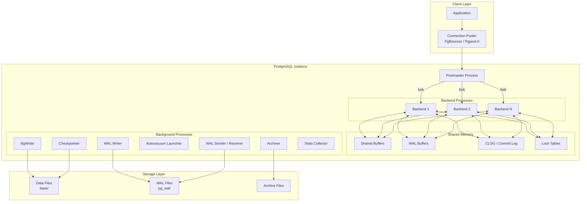

# PostgreSQL Internals — Concept Overview

## Why This Exists

PostgreSQL began in 1986 as the POSTGRES project at UC Berkeley under Michael Stonebraker, building on lessons from the Ingres relational database. The name "Post-Ingres" became Postgres, and the project added SQL support in 1996 to become PostgreSQL. Stonebraker's design goal was an **extensible, standards-compliant RDBMS** that could handle complex data types and user-defined rules — a radical departure from the rigid schema engines of the era.

PostgreSQL's architecture was designed around **process isolation** rather than threading. Every client gets a dedicated OS process — not a thread inside a shared address space. This decision, made in the late 1980s when threads were unreliable and non-portable, trades memory efficiency for crash isolation and debuggability. A segfault in one backend cannot bring down the entire server.

Understanding PostgreSQL's internal architecture is non-negotiable for anyone operating it at scale. Without it, you're guessing at `shared_buffers`, WAL tuning, vacuum behavior, and checkpoint storms.

---

## What Value It Provides

| Benefit | Quantified Impact |
|---|---|
| **Crash Safety** | WAL guarantees zero data loss on committed transactions, even under kernel panic |
| **Extensibility** | Custom data types, operators, index methods (GIN, GiST, BRIN, SP-GiST) without forking the engine |
| **MVCC Without Read Locks** | Readers never block writers, writers never block readers — enabling >100K TPS on commodity hardware |
| **Standards Compliance** | Most complete SQL:2016 implementation of any open-source database |
| **Operational Cost** | Zero license fees; Instagram, Discord, Notion, and Apple run multi-PB PostgreSQL deployments |

---

## Where It Fits

---

## When To Use / When NOT To Use

| Scenario | PostgreSQL? | Why / Alternative |
|---|---|---|
| OLTP with complex queries, joins, CTEs | ✅ Excellent | Best-in-class query optimizer for complex SQL |
| Multi-model (JSON, geospatial, full-text) | ✅ Excellent | Native `jsonb`, PostGIS, `tsvector` — no bolt-on engines needed |
| Time-series at >1M inserts/sec | ⚠️ Use TimescaleDB extension | Vanilla PG lacks hypertable partitioning; TimescaleDB adds it |
| Pure key-value at extreme scale (>10M ops/sec) | ❌ Wrong tool | Use Redis, DynamoDB, or ScyllaDB |
| Analytical queries on 100TB+ | ❌ Wrong tool | Use ClickHouse, DuckDB, or Snowflake |
| Write-heavy with >500 connections | ⚠️ Requires pooler | Process-per-connection model consumes ~10MB per backend |
| Global 5-nines with auto-sharding | ⚠️ Consider Citus or CockroachDB | Vanilla PG is single-node; Citus adds distributed tables |

---

## Key Terminology

| Term | Definition |
|---|---|
| **Postmaster** | The supervisory daemon process. Listens on port 5432, authenticates clients, forks backend processes. Single point of control — if Postmaster dies, the instance is down |
| **Backend Process** | A forked child of Postmaster handling one client connection. Parses SQL, plans queries, executes them, returns results. Each consumes ~10MB RSS |
| **Shared Buffers** | The in-memory page cache. Stores 8KB data/index pages. Recommended: 25% of RAM (e.g., 16GB on a 64GB machine). Uses clock-sweep eviction, not LRU |
| **WAL (Write-Ahead Log)** | The redo log. Every data modification is written to WAL *before* the data page is modified. Guarantees crash recovery. Stored as 16MB segment files in `pg_wal/` |
| **WAL Buffers** | Shared memory region where WAL records are assembled before being flushed to disk by the WAL Writer or at commit time |
| **CLOG (Commit Log)** | Bitmap tracking transaction commit status: in-progress, committed, aborted, or sub-committed. 2 bits per transaction. Stored in `pg_xact/` |
| **BgWriter** | Background process that preemptively writes dirty pages from shared buffers to disk, keeping clean pages available for backends |
| **Checkpointer** | Writes all dirty pages to disk at configured intervals (`checkpoint_timeout`) or WAL volume thresholds (`max_wal_size`). Separated from BgWriter in PG 9.2+ |
| **Autovacuum** | Background process that reclaims dead tuples created by MVCC. Without it, tables bloat indefinitely and transaction ID wraparound can freeze the database |
| **TOAST** | The Oversized Attribute Storage Technique. Automatically compresses and/or out-of-line stores values >2KB. Transparent to queries |
| **OID** | Object Identifier — a 4-byte unsigned integer used to identify database objects internally. Each table, index, and type has an OID |
| **Catalog Tables** | System tables (`pg_class`, `pg_attribute`, `pg_index`, etc.) that store metadata about all database objects. The schema of the schema |
| **MVCC** | Multi-Version Concurrency Control. Each row version has `xmin` (creating transaction) and `xmax` (deleting/updating transaction). Readers see a snapshot, not locks |
| **Buffer Tag** | The composite key `(RelFileNode, ForkNumber, BlockNumber)` that uniquely identifies a page in shared buffers. Used by the buffer manager for lookups via a hash table |
| **Visibility Map** | One bit per heap page indicating whether all tuples on that page are visible to all transactions. Enables index-only scans by telling the executor it can skip heap fetches |
| **Free Space Map** | Tracks available space per heap page. Used by `INSERT` to find a page with room for a new tuple without scanning the entire table |
