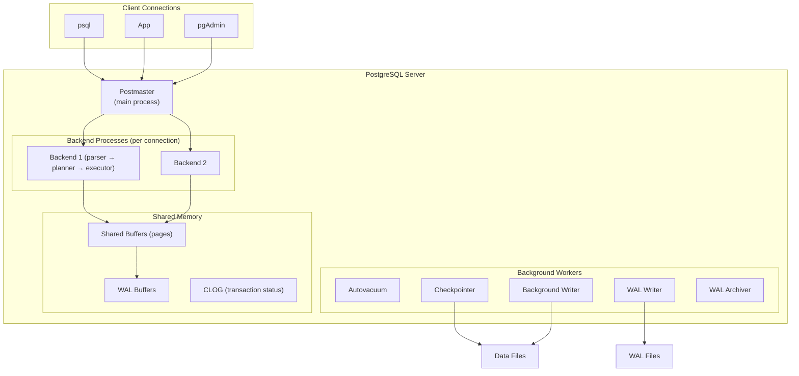

# PostgreSQL Internals — Concept Overview

> Process architecture, query execution, buffer management: what happens under the hood.

## Architecture



**Key insight**: One OS process per connection. This is why connection pooling matters — 1000 connections = 1000 processes.

## Query Execution Pipeline

```
SQL text → Parser → Rewriter → Planner/Optimizer → Executor → Results
       (syntax tree)  (view expansion)  (cost-based plan)  (run plan)
```

## References

| Resource | Link |
|---|---|
| [PostgreSQL Internals](https://www.postgresql.org/docs/current/internals.html) | Official |
| *PostgreSQL 14 Internals* | Egor Rogov (free e-book) |
