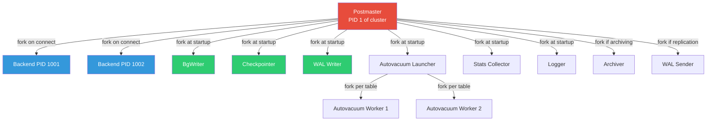
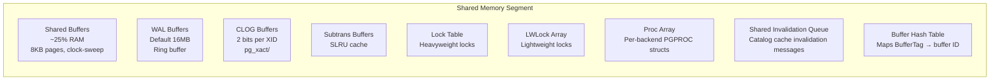
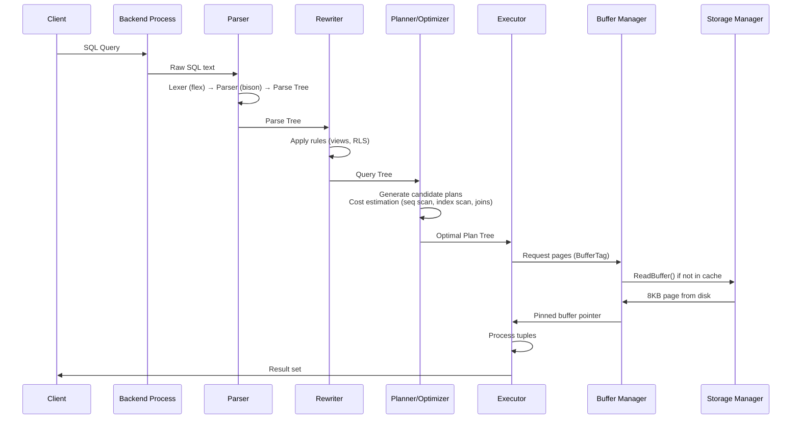
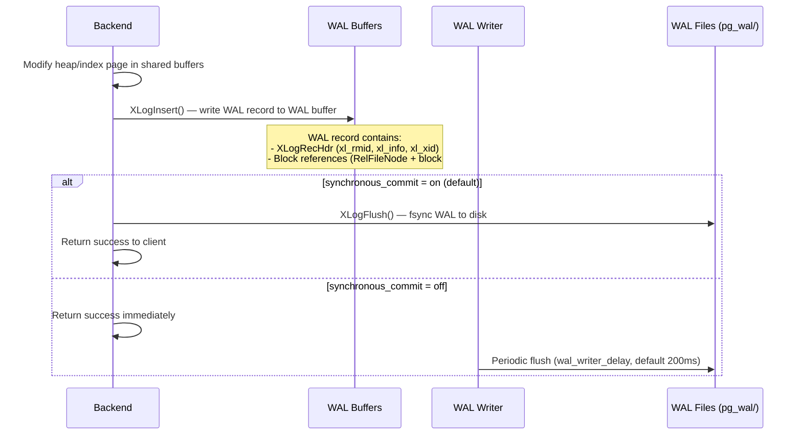
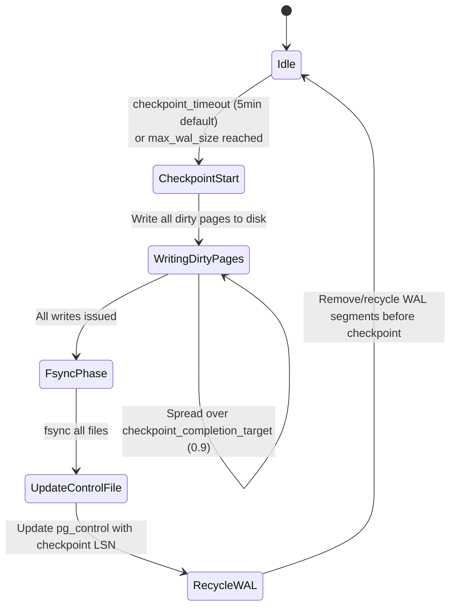
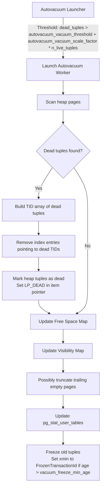

# PostgreSQL Internals — How It Works

## Architecture: Process Model

PostgreSQL uses a **multi-process architecture** (not multi-threaded). Every component runs as a separate OS process, communicating via shared memory and signals.

### Process Hierarchy



**Why processes, not threads?**
- A crashing backend cannot corrupt another backend's memory
- `fork()` on Linux uses Copy-on-Write pages — fast and memory-efficient
- Each backend has its own `work_mem` allocation for sorts/hashes — no contention
- Trade-off: Higher per-connection overhead (~10MB RSS). Mitigated by connection pooling (PgBouncer)

---

## Shared Memory Layout

When the Postmaster starts, it allocates a single large shared memory segment using `shmget()` or `mmap()`. All processes attach to this segment.



### Shared Buffers Deep Dive

The buffer manager is the heart of PostgreSQL's I/O system.

**Data Structure:** A hash table maps `BufferTag → buffer_id`. Each buffer descriptor contains:

| Field | Purpose |
|---|---|
| `tag` | `{RelFileNode, ForkNumber, BlockNumber}` — identifies which page |
| `state` | Atomic uint32: refcount (18 bits) + flags (valid, dirty, pinned, io_in_progress) |
| `usage_count` | Clock-sweep counter (0-5). Incremented on access, decremented by sweep |
| `content_lock` | LWLock for shared/exclusive access to the page content |
| `buf_id` | Index into the buffer pool array |

**Eviction Algorithm — Clock Sweep:**

```
1. Maintain a global "sweep hand" pointing to a buffer slot
2. When a backend needs a free buffer:
   a. If usage_count > 0: decrement, advance hand
   b. If usage_count == 0 AND not pinned: victim found
   c. If dirty: schedule write via BgWriter ring
3. After eviction, read the requested page from disk into this slot
```

Clock sweep is O(1) amortized vs. LRU's O(n) list maintenance under contention. This is why PostgreSQL can handle buffer pools >128GB without eviction becoming a bottleneck.

---

## Query Execution Pipeline



### Planner/Optimizer Internals

PostgreSQL uses a **cost-based optimizer** with these key mechanics:

1. **Statistics**: `pg_statistic` stores column-level histograms, MCVs (Most Common Values), ndistinct, and correlation. `ANALYZE` refreshes these.

2. **Cost Model**: Two cost units:
   - `seq_page_cost` = 1.0 (baseline: sequential disk read)
   - `random_page_cost` = 4.0 (default; set to 1.1 for SSDs)
   - `cpu_tuple_cost` = 0.01
   - `cpu_operator_cost` = 0.0025

3. **Join Strategies**: Nested Loop, Hash Join, Merge Join. For >12 tables, switches to **GEQO** (Genetic Query Optimizer) because factorial join orderings exceed brute-force limits.

4. **Partitioning Pruning**: Planner eliminates partitions at plan time using CHECK constraints or partition bounds.

---

## WAL (Write-Ahead Log) Internals

### Write Path



### WAL Record Structure

```
+------------------+-------------------+------------------+
| XLogRecord Hdr   | Block References  | Data Payload     |
| (24 bytes)       | (variable)        | (variable)       |
+------------------+-------------------+------------------+
| xl_tot_len       | RelFileNode       | Actual changed   |
| xl_xid           | ForkNumber        | bytes or full-   |
| xl_prev          | BlockNumber       | page image       |
| xl_info          | Flags (FPW, etc.) |                  |
| xl_rmid          |                   |                  |
| xl_crc           |                   |                  |
+------------------+-------------------+------------------+
```

**LSN (Log Sequence Number):** A 64-bit pointer into the WAL stream — `(segment_number, byte_offset)`. Every page header stores the LSN of the last WAL record that modified it. During recovery, pages with LSN < WAL record's LSN get replayed; pages with LSN >= are skipped.

### Checkpoint Process



**Spread checkpointing** (`checkpoint_completion_target = 0.9`): Instead of flushing all dirty pages at once (causing I/O storm), PostgreSQL spreads writes over 90% of the checkpoint interval. This is why a 5-minute checkpoint_timeout with 0.9 completion target means writes are spread over 4.5 minutes.

---

## MVCC Deep Dive

### Tuple Header (HeapTupleHeaderData)

Every row version carries metadata for visibility:

| Field | Size | Purpose |
|---|---|---|
| `t_xmin` | 4 bytes | TransactionId that inserted this tuple |
| `t_xmax` | 4 bytes | TransactionId that deleted/updated this tuple (0 if current) |
| `t_cid` | 4 bytes | Command ID within the transaction |
| `t_ctid` | 6 bytes | Current TID (self-referencing if current; points to next version if updated) |
| `t_infomask` | 2 bytes | Flags: HEAP_XMIN_COMMITTED, HEAP_XMAX_INVALID, HEAP_UPDATED, etc. |
| `t_infomask2` | 2 bytes | Number of attributes + additional flags |
| `t_hoff` | 1 byte | Offset to user data (after null bitmap) |
| Null bitmap | variable | One bit per column — 1 if NULL |

**Total overhead: 23 bytes minimum per row** (plus alignment padding to 8 bytes = 24 bytes typical).

### Visibility Check Algorithm

```
function is_visible(tuple, snapshot):
    if tuple.xmin is aborted:
        return false  // inserting transaction rolled back
    
    if tuple.xmin is not committed:
        if tuple.xmin == my_transaction:
            // I inserted this row
            if tuple.xmax is valid and tuple.cid < my_cid:
                return false  // I deleted it in an earlier command
            return true
        return false  // another in-progress transaction's insert
    
    // xmin is committed
    if tuple.xmin > snapshot.xmax:
        return false  // inserted after my snapshot started
    if tuple.xmin in snapshot.xip:
        return false  // inserted by a transaction in-progress at snapshot time
    
    if tuple.xmax is invalid:
        return true   // not deleted
    if tuple.xmax is not committed:
        if tuple.xmax == my_transaction:
            return false  // I deleted this row
        return true   // deleting transaction still in progress
    
    // xmax is committed
    if tuple.xmax > snapshot.xmax:
        return true   // deleted after my snapshot
    if tuple.xmax in snapshot.xip:
        return true   // deleted by in-progress transaction at snapshot time
    return false      // deleted and committed before my snapshot
```

### VACUUM Process



**Critical: Transaction ID Wraparound Prevention**

PostgreSQL uses 32-bit transaction IDs (~4.2 billion). With MVCC, old XIDs must be "frozen" to prevent wraparound, where a future XID wraps around and would make old committed rows appear to be from the future (invisible). Autovacuum's aggressive mode triggers at `autovacuum_freeze_max_age` (default 200M transactions) to freeze tuples proactively.

---

## Storage Layout

### On-Disk Structure

```
$PGDATA/
├── base/                    # Database directories
│   ├── 1/                   # Template database (template1)
│   ├── 13395/               # User database (OID)
│   │   ├── 16384            # Table file (relfilenode)
│   │   ├── 16384.1          # First 1GB fork
│   │   ├── 16384_fsm        # Free Space Map fork
│   │   └── 16384_vm         # Visibility Map fork
├── global/                  # Cluster-wide tables (pg_database, pg_authid)
├── pg_wal/                  # WAL segment files (16MB each)
│   ├── 000000010000000000000001
│   └── 000000010000000000000002
├── pg_xact/                 # Commit log (CLOG) — 2 bits per XID
├── pg_multixact/            # Multixact members and offsets
├── pg_stat_tmp/             # Temporary statistics files
├── pg_tblspc/               # Symlinks to tablespace locations
├── postgresql.conf          # Main configuration
├── pg_hba.conf              # Host-based authentication
└── pg_control               # Cluster control file (checkpoint info, WAL position)
```

### Page Layout (8KB)

```
+--------------------------------------------------+
| PageHeaderData (24 bytes)                         |
|   pd_lsn (8B) | pd_checksum (2B) | pd_flags (2B)|
|   pd_lower (2B) | pd_upper (2B) | pd_special (2B)|
|   pd_pagesize_version (2B) | pd_prune_xid (4B)  |
+--------------------------------------------------+
| Item Pointers (Line Pointers) — 4 bytes each     |
|   [lp1] [lp2] [lp3] ... [lpN]                    |
|   Each: offset (15 bits) | flags (2 bits) |       |
|          length (15 bits)                          |
+--------------------------------------------------+
| Free Space                                        |
+--------------------------------------------------+
| Tuple Data (grows downward from top)              |
|   Tuple N ... Tuple 3 | Tuple 2 | Tuple 1        |
+--------------------------------------------------+
| Special Space (index-specific metadata)           |
+--------------------------------------------------+
```

`pd_lower` points to the end of item pointers (growing down). `pd_upper` points to the beginning of tuple data (growing up). When `pd_lower` meets `pd_upper`, the page is full.
