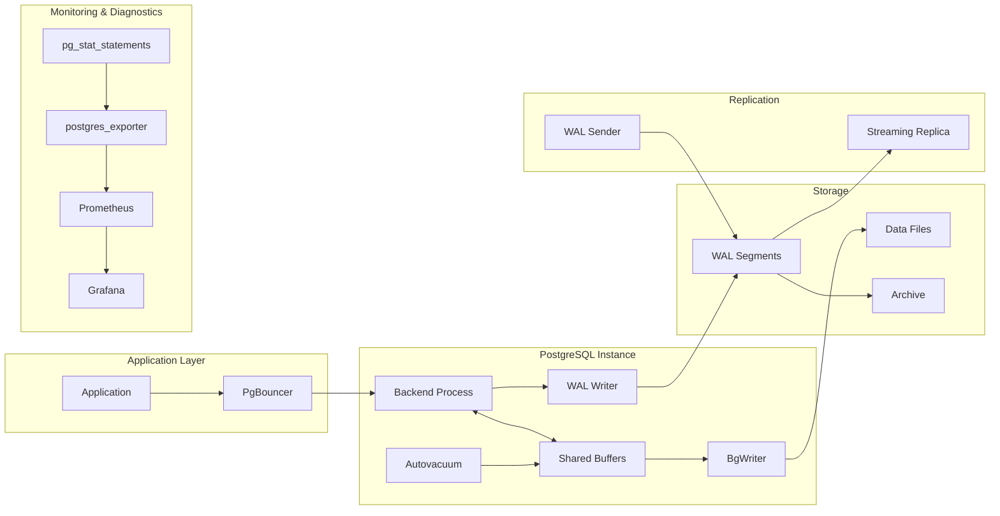

# PostgreSQL Internals — Hands-On Examples

## Inspecting Shared Buffers

### Querying the Buffer Cache

The `pg_buffercache` extension exposes every page currently in shared buffers.

```sql
-- Install the extension
CREATE EXTENSION IF NOT EXISTS pg_buffercache;

-- Top 10 relations consuming the most buffer cache
SELECT
    c.relname,
    c.relkind,
    pg_size_pretty(count(*) * 8192) AS buffered_size,
    count(*) AS buffers,
    round(100.0 * count(*) / (SELECT setting::int FROM pg_settings WHERE name = 'shared_buffers'), 2) AS pct_of_cache,
    round(100.0 * count(*) FILTER (WHERE b.isdirty) / GREATEST(count(*), 1), 2) AS pct_dirty
FROM pg_buffercache b
JOIN pg_class c ON c.relfilenode = b.relfilenode
WHERE b.reldatabase = (SELECT oid FROM pg_database WHERE datname = current_database())
GROUP BY c.relname, c.relkind
ORDER BY buffers DESC
LIMIT 10;
```

**What this reveals:**
- Tables hogging cache while contributing zero to active queries
- Dirty page ratio — if >30% sustained, your `bgwriter_lru_maxpages` or `checkpoint_completion_target` may need tuning
- Index vs heap ratio — healthy OLTP shows ~60% index, ~40% heap pages in cache

### Cache Hit Ratio — The Misleading Metric

```sql
-- Commonly cited but dangerously misleading
SELECT
    round(100.0 * sum(blks_hit) / NULLIF(sum(blks_hit + blks_read), 0), 2) AS cache_hit_ratio
FROM pg_stat_database
WHERE datname = current_database();
```

**Why this lies:** The cache hit ratio reports the ratio of logical reads served from shared buffers vs disk. A freshly restarted database shows 0%. A database running for weeks shows 99%+ even if it's thrashing — because background reads from the OS page cache still count as "disk" reads. The true signal is `blks_read` rate (blocks/sec), not the ratio.

```sql
-- Better: actual disk I/O rate
SELECT
    datname,
    blks_read AS physical_reads_total,
    blks_hit AS cache_hits_total,
    round(blks_read / GREATEST(EXTRACT(EPOCH FROM (now() - stats_reset)), 1), 2) AS reads_per_sec,
    stats_reset
FROM pg_stat_database
WHERE datname = current_database();
```

---

## WAL Analysis

### Inspecting WAL Generation Rate

```sql
-- WAL bytes generated per second (PostgreSQL 14+)
SELECT
    pg_wal_lsn_diff(pg_current_wal_lsn(), '0/0') AS total_wal_bytes,
    pg_size_pretty(pg_wal_lsn_diff(pg_current_wal_lsn(), '0/0')::bigint) AS total_wal_size;

-- WAL generation rate over time
SELECT
    now() AS sample_time,
    pg_current_wal_lsn() AS current_lsn,
    pg_walfile_name(pg_current_wal_lsn()) AS current_wal_file;
```

### Reading WAL Contents with pg_walinspect

```sql
-- PostgreSQL 15+ — inspect WAL records
CREATE EXTENSION IF NOT EXISTS pg_walinspect;

-- Last 20 WAL records
SELECT
    start_lsn,
    end_lsn,
    prev_lsn,
    xid,
    resource_manager,
    record_type,
    record_length,
    main_data_length,
    fpi_length
FROM pg_get_wal_records_info(
    pg_current_wal_lsn() - '0/100000'::pg_lsn,  -- ~1MB back
    pg_current_wal_lsn()
)
ORDER BY start_lsn DESC
LIMIT 20;
```

### Monitoring Checkpoint Activity

```sql
-- Checkpoint frequency and performance
SELECT
    checkpoints_timed,
    checkpoints_req,
    checkpoint_write_time / 1000 AS write_time_seconds,
    checkpoint_sync_time / 1000 AS sync_time_seconds,
    buffers_checkpoint,
    buffers_clean,
    buffers_backend,
    maxwritten_clean,
    stats_reset
FROM pg_stat_bgwriter;
```

**Red flags:**
- `checkpoints_req >> checkpoints_timed` → `max_wal_size` is too small; WAL fills up before `checkpoint_timeout` fires
- `buffers_backend > 0` growing → backends forced to write dirty pages because bgwriter/checkpointer can't keep up
- `maxwritten_clean > 0` → bgwriter hit `bgwriter_lru_maxpages` limit per round and gave up

---

## VACUUM Monitoring and Tuning

### Dead Tuple Accumulation

```sql
-- Tables with the most bloat potential
SELECT
    schemaname,
    relname,
    n_live_tup,
    n_dead_tup,
    round(100.0 * n_dead_tup / GREATEST(n_live_tup + n_dead_tup, 1), 2) AS dead_pct,
    last_vacuum,
    last_autovacuum,
    last_analyze,
    last_autoanalyze
FROM pg_stat_user_tables
WHERE n_dead_tup > 1000
ORDER BY n_dead_tup DESC
LIMIT 15;
```

### Tracking Autovacuum Workers in Real-Time

```sql
-- Currently running autovacuum workers
SELECT
    pid,
    datname,
    relid::regclass AS table_name,
    phase,
    heap_blks_total,
    heap_blks_scanned,
    heap_blks_vacuumed,
    index_vacuum_count,
    max_dead_tuples,
    num_dead_tuples
FROM pg_stat_progress_vacuum;
```

### Measuring Table Bloat

```sql
-- Estimate table bloat using pgstattuple
CREATE EXTENSION IF NOT EXISTS pgstattuple;

SELECT
    table_len,
    tuple_count,
    tuple_len,
    dead_tuple_count,
    dead_tuple_len,
    free_space,
    round(100.0 * free_space / GREATEST(table_len, 1), 2) AS free_pct,
    round(100.0 * dead_tuple_len / GREATEST(table_len, 1), 2) AS dead_pct
FROM pgstattuple('your_table_name');
```

### Before vs After: Autovacuum Tuning for a High-Write Table

**Before (defaults):**

```sql
-- Default autovacuum settings (postgresql.conf)
-- autovacuum_vacuum_threshold = 50
-- autovacuum_vacuum_scale_factor = 0.2
-- A 10M-row table needs 2,000,050 dead tuples before autovacuum triggers
```

**After (per-table override for high-write tables):**

```sql
-- Override for a high-write table: trigger vacuum at 10,000 dead tuples
ALTER TABLE orders SET (
    autovacuum_vacuum_threshold = 5000,
    autovacuum_vacuum_scale_factor = 0.01,
    autovacuum_analyze_threshold = 2500,
    autovacuum_analyze_scale_factor = 0.005,
    autovacuum_vacuum_cost_delay = 2  -- ms; default 20ms; aggressive
);

-- For tables with heavy UPDATE patterns:
ALTER TABLE session_data SET (
    fillfactor = 85  -- Leave 15% free per page for HOT updates
);
```

---

## TOAST Inspection

### Identifying TOASTed Columns

```sql
-- Find TOAST tables and their sizes
SELECT
    c.relname AS main_table,
    t.relname AS toast_table,
    pg_size_pretty(pg_relation_size(t.oid)) AS toast_size,
    pg_size_pretty(pg_relation_size(c.oid)) AS main_size,
    round(100.0 * pg_relation_size(t.oid) / GREATEST(pg_total_relation_size(c.oid), 1), 2) AS toast_pct
FROM pg_class c
JOIN pg_class t ON t.oid = c.reltoastrelid
WHERE c.relkind = 'r'
    AND pg_relation_size(t.oid) > 0
ORDER BY pg_relation_size(t.oid) DESC
LIMIT 10;
```

### TOAST Compression Strategies (PostgreSQL 14+)

```sql
-- Change TOAST compression from default pglz to lz4
ALTER TABLE events ALTER COLUMN payload SET COMPRESSION lz4;

-- Compare compression ratios
SELECT
    a.attname,
    a.attstorage,  -- 'x' = extended (compress+out-of-line), 'e' = external (out-of-line only)
    CASE a.attcompression
        WHEN 'p' THEN 'pglz'
        WHEN 'l' THEN 'lz4'
        ELSE 'default'
    END AS compression
FROM pg_attribute a
JOIN pg_class c ON c.oid = a.attrelid
WHERE c.relname = 'events'
    AND a.attnum > 0
    AND NOT a.attisdropped;
```

---

## EXPLAIN Deep Analysis

### Reading Execution Plans Like an Expert

```sql
-- Full diagnostic EXPLAIN
EXPLAIN (ANALYZE, BUFFERS, TIMING, FORMAT TEXT)
SELECT o.order_id, c.name, sum(oi.quantity * oi.unit_price) AS total
FROM orders o
JOIN customers c ON c.customer_id = o.customer_id
JOIN order_items oi ON oi.order_id = o.order_id
WHERE o.order_date >= '2024-01-01'
    AND o.order_date < '2024-04-01'
GROUP BY o.order_id, c.name
ORDER BY total DESC
LIMIT 20;
```

**Key EXPLAIN fields to watch:**

| Field | What It Means | Red Flag |
|---|---|---|
| `actual rows` vs `rows` (estimated) | Planner's estimate accuracy | >10x mismatch → stale statistics |
| `Buffers: shared hit` | Pages read from cache | Low ratio → cold cache or table too large |
| `Buffers: shared read` | Pages read from disk | High number → missing index or wrong plan |
| `Sort Method: external merge Disk` | Sort spilled to disk | Increase `work_mem` for this query |
| `Hash Batch: 4` | Hash join spilled to multiple batches | Increase `work_mem` |
| `Rows Removed by Filter` | Post-fetch filtering | Indicates a missing index predicate |

### Before vs After: Index-Only Scan Optimization

**Before (heap fetch required):**

```sql
-- Visibility map not up to date; index scan must check heap
EXPLAIN (ANALYZE, BUFFERS)
SELECT customer_id, order_date FROM orders WHERE customer_id = 42;

-- Output includes: Heap Fetches: 847
```

**After (VACUUM enables index-only scan):**

```sql
VACUUM orders;  -- Updates visibility map

EXPLAIN (ANALYZE, BUFFERS)
SELECT customer_id, order_date FROM orders WHERE customer_id = 42;

-- Output: Index Only Scan using idx_orders_customer
--         Heap Fetches: 0     ← zero heap access
```

---

## Index Diagnostics

### Finding Unused Indexes

```sql
-- Indexes never used since last stats reset
SELECT
    s.schemaname,
    s.relname AS table_name,
    s.indexrelname AS index_name,
    pg_size_pretty(pg_relation_size(s.indexrelid)) AS index_size,
    s.idx_scan,
    s.idx_tup_read,
    s.idx_tup_fetch
FROM pg_stat_user_indexes s
WHERE s.idx_scan = 0
    AND s.indexrelname NOT LIKE '%_pkey'  -- Keep primary keys
ORDER BY pg_relation_size(s.indexrelid) DESC;
```

### Detecting Index Bloat

```sql
-- B-tree index bloat estimation (without pgstattuple)
SELECT
    nspname AS schema,
    relname AS index_name,
    round(100 * pg_relation_size(indexrelid) / GREATEST(pg_relation_size(indrelid), 1)) AS index_to_table_pct,
    pg_size_pretty(pg_relation_size(indexrelid)) AS index_size,
    pg_size_pretty(pg_relation_size(indrelid)) AS table_size
FROM pg_stat_user_indexes
JOIN pg_index USING (indexrelid)
JOIN pg_class ON pg_class.oid = indexrelid
JOIN pg_namespace ON pg_namespace.oid = pg_class.relnamespace
ORDER BY pg_relation_size(indexrelid) DESC
LIMIT 20;
```

### Creating Indexes Concurrently

```sql
-- Non-blocking index creation (production-safe)
CREATE INDEX CONCURRENTLY idx_orders_customer_date
ON orders (customer_id, order_date DESC);

-- CONCURRENTLY takes ~2-3x longer but does NOT lock the table for writes
-- If it fails midway, it leaves an INVALID index:
SELECT indexrelid::regclass, indisvalid
FROM pg_index
WHERE NOT indisvalid;

-- Clean up invalid indexes:
DROP INDEX CONCURRENTLY idx_orders_customer_date;
-- Then retry creation
```

---

## Integration Diagram



---

## Runnable Exercises

### Exercise 1: Measure the Cost of Mistuned shared_buffers

```bash
# Start PostgreSQL with intentionally small shared_buffers
# In postgresql.conf:
# shared_buffers = 32MB

pgbench -i -s 100 mydb          # Load 10M rows (~1.5GB)
pgbench -c 16 -T 60 -S mydb    # Read-only benchmark, 16 clients, 60 seconds

# Record: TPS, latency, blks_read from pg_stat_database

# Now change shared_buffers = 2GB, restart, run again
# Expected: 3-5x TPS improvement on datasets that fit in cache
```

### Exercise 2: Observe Transaction ID Wraparound Risk

```sql
-- Check oldest unfrozen transaction age
SELECT
    datname,
    age(datfrozenxid) AS frozen_xid_age,
    CASE
        WHEN age(datfrozenxid) > 1500000000 THEN '🔴 CRITICAL'
        WHEN age(datfrozenxid) > 1000000000 THEN '🟡 WARNING'
        ELSE '🟢 SAFE'
    END AS status
FROM pg_database
ORDER BY frozen_xid_age DESC;

-- Per-table check
SELECT
    c.relname,
    age(c.relfrozenxid) AS xid_age,
    pg_size_pretty(pg_total_relation_size(c.oid)) AS total_size
FROM pg_class c
WHERE c.relkind = 'r'
ORDER BY age(c.relfrozenxid) DESC
LIMIT 10;
```

### Exercise 3: HOT Update Verification

```sql
-- Create a table with fillfactor to enable HOT updates
CREATE TABLE hot_test (
    id serial PRIMARY KEY,
    status text,
    updated_at timestamp DEFAULT now()
) WITH (fillfactor = 80);

INSERT INTO hot_test (status)
SELECT 'active' FROM generate_series(1, 100000);

-- Update a non-indexed column
UPDATE hot_test SET status = 'inactive', updated_at = now()
WHERE id BETWEEN 1 AND 10000;

-- Check HOT update ratio
SELECT
    relname,
    n_tup_upd,
    n_tup_hot_upd,
    round(100.0 * n_tup_hot_upd / GREATEST(n_tup_upd, 1), 2) AS hot_pct
FROM pg_stat_user_tables
WHERE relname = 'hot_test';
-- hot_pct should be >90% since 'status' is not indexed
```
