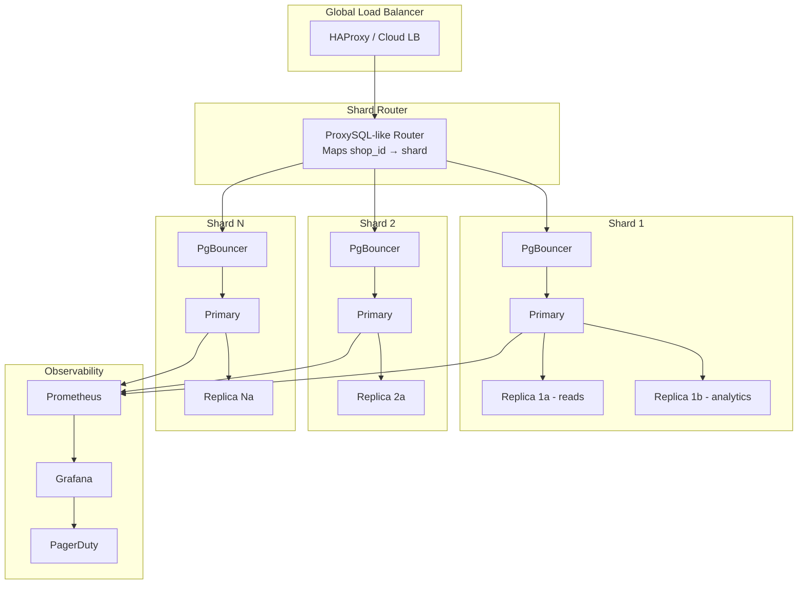
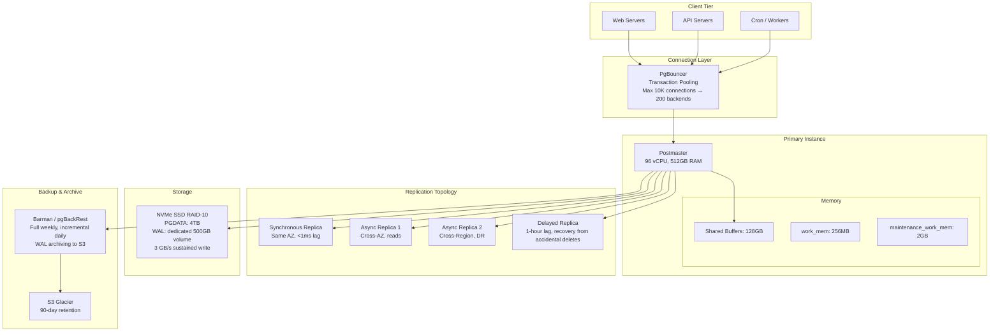

# PostgreSQL Internals — Real-World Scenarios

## Case Study 1: Instagram — Sharding PostgreSQL to Handle 2B+ Users

### The Setup

Instagram was one of the earliest large-scale PostgreSQL deployments. By 2012, they were serving 300M+ photos and running on a handful of PostgreSQL instances. By 2019, the platform served 2B+ monthly active users with PostgreSQL as the primary OLTP store.

### Scale Numbers

| Metric | Value |
|---|---|
| Monthly active users | 2B+ |
| Primary data store | PostgreSQL (sharded) |
| Sharding strategy | Application-level logical sharding by user ID |
| Shard count | Thousands of PostgreSQL instances |
| Connection pooling | PgBouncer in transaction mode |
| Replication | Streaming replication with synchronous standbys |

### Architecture Decisions

Instagram chose **application-level sharding** over built-in partitioning. Each user's data (posts, likes, follows) is co-located on the same shard using consistent hashing on `user_id`. This avoids cross-shard joins for the dominant access pattern (loading a user's feed/profile).

They encoded the shard ID directly into their IDs:

```
 64-bit ID structure:
 ┌─────────────────┬──────────────┬──────────────┐
 │ 41 bits: ms     │ 13 bits:     │ 10 bits:     │
 │ since epoch     │ logical      │ auto-incr    │
 │                 │ shard ID     │ sequence     │
 └─────────────────┴──────────────┴──────────────┘
```

This ID-embedded sharding means any ID lookup can determine the shard without a routing table. They open-sourced this approach and it influenced Twitter Snowflake and similar ID generators.

### What Went Wrong: Transaction ID Wraparound

In one incident, a long-running migration script held open a transaction for hours. This pinned the `xmin` horizon, preventing VACUUM from freezing old tuples. The `age(datfrozenxid)` climbed past 1.5 billion on multiple shards. PostgreSQL's wraparound protection triggers forced shutdown at 2^31 (~2.1 billion) remaining XIDs — leaving a ~600M XID window before catastrophic table freeze.

**Root cause:** No alerting on `age(datfrozenxid)`. Long-running transactions were not killed automatically.

**Fix:**
- Added monitoring on `age(datfrozenxid)` with PagerDuty alerts at 500M, 1B, 1.5B
- Implemented `idle_in_transaction_session_timeout = 300000` (5 minutes)
- Autovacuum tuned per-shard: `autovacuum_freeze_max_age = 100000000` (100M)

---

## Case Study 2: Discord — Moving from MongoDB to PostgreSQL at Trillion-Message Scale

### The Setup

Discord initially used MongoDB for message storage but migrated to Cassandra in 2017, then added PostgreSQL for metadata and relationship-heavy queries. By 2023, they published their architecture serving 200M+ monthly active users with trillions of messages.

### Scale Numbers

| Metric | Value |
|---|---|
| Messages stored | Trillions |
| PostgreSQL role | User profiles, guilds, permissions, relationships |
| Cassandra role | Message storage (append-heavy, partition by channel) |
| Peak concurrent connections | 10M+ WebSocket connections |
| PostgreSQL instances | Hundreds (Citus-sharded for some services) |

### Architecture Decision: Why Not Just PostgreSQL for Messages?

Discord's message access pattern is:
1. Write-once, read-many
2. Partitioned by channel (guild + channel ID)
3. Range scans by timestamp within a channel
4. 99%+ of reads are the most recent 50 messages

PostgreSQL's MVCC creates per-row overhead that's wasteful for immutable append-only data. Cassandra's LSM-tree storage is more efficient for time-series-like append patterns. PostgreSQL excels where Discord needs it: complex joins across users, guilds, roles, permissions.

### What Went Wrong: Connection Exhaustion

With thousands of microservices each opening PostgreSQL connections, they hit the process-per-connection limit. Even with PgBouncer, the total backend process count exceeded available memory.

**Fix:**
- Deployed PgBouncer in `transaction` mode (connections returned to pool between transactions, not sessions)
- Set `statement_timeout = 30000` to kill runaway queries
- Implemented connection request queuing with backpressure at the application layer
- Reduced prepared statement usage (incompatible with transaction-mode pooling)

---

## Case Study 3: Notion — PostgreSQL as the Everything Database

### The Setup

Notion runs on a monolithic PostgreSQL deployment that stores virtually all application data: pages, blocks, permissions, comments, team metadata. Their approach deliberately avoided microservices and polyglot persistence early on.

### Scale Numbers

| Metric | Value |
|---|---|
| Users | 100M+ |
| Primary store | PostgreSQL (sharded by workspace) |
| Data model | Block-based (every element is a block with parent/child relationships) |
| Query patterns | Recursive CTEs for block trees, JSONB for dynamic properties |
| Sharding | Application-level by workspace_id |

### Architecture: JSONB as a Schema Store

Notion stores block properties as JSONB columns rather than fixed schema columns. This allows users to add, rename, and restructure properties without DDL migration.

```sql
-- Simplified Notion block schema
CREATE TABLE blocks (
    id uuid PRIMARY KEY DEFAULT gen_random_uuid(),
    workspace_id uuid NOT NULL,
    parent_id uuid REFERENCES blocks(id),
    type text NOT NULL,       -- 'page', 'text', 'heading', 'table', 'database'
    properties jsonb NOT NULL DEFAULT '{}',
    content text[],
    created_at timestamptz DEFAULT now(),
    updated_at timestamptz DEFAULT now()
);

-- GIN index for JSONB property queries
CREATE INDEX idx_blocks_properties ON blocks USING gin (properties jsonb_path_ops);
```

### What Went Wrong: TOAST Bloat on JSONB Columns

Updating any property in a JSONB column rewrites the entire JSONB value. For blocks with large `properties` objects (100KB+ with formulas, rollups, relations), every property change caused:
1. Insert of a new TOAST chunk (decompressed → modified → recompressed → stored)
2. The old TOAST chunk marked dead but not reclaimed until VACUUM
3. TOAST table grew 5x faster than the main table

**Root cause:** PostgreSQL cannot do in-place partial updates on JSONB. The entire value is replaced.

**Fix:**
- Decomposed frequently-updated properties into separate columns
- Implemented application-level caching to reduce write frequency
- Aggressive TOAST-table-specific autovacuum: `toast.autovacuum_vacuum_scale_factor = 0.01`
- Migrated hot properties to Redis for sub-ms reads

---

## Case Study 4: Shopify — PostgreSQL at Massive Multi-Tenant Scale

### The Setup

Shopify runs one of the largest PostgreSQL deployments: thousands of shards, each hosting data for thousands of merchants. They use Rails with PostgreSQL and have invested heavily in vertical scaling (large instances) and horizontal sharding.

### Scale Numbers

| Metric | Value |
|---|---|
| Merchants | 2M+ |
| Stores per shard | Thousands |
| Sharding key | shop_id (merchant ID) |
| Peak transactions | Millions of TPS aggregate across fleet |
| Instance size | Up to 96 vCPU, 768GB RAM per shard |
| Storage | NVMe SSDs, multi-TB per instance |

### Deployment Topology



### What Went Wrong: Checkpoint Storms During Black Friday

During peak traffic (Black Friday/Cyber Monday), the combination of:
1. Massive write volume → WAL generation spiking to 10GB/min
2. `max_wal_size = 1GB` (too low for the write rate)
3. Checkpoints triggered every 30 seconds instead of every 5 minutes

This caused **checkpoint storms**: all dirty pages flushed simultaneously, saturating disk I/O and causing P99 latency to spike from 5ms to 800ms+.

**Fix:**
- Increased `max_wal_size` to 16GB and `min_wal_size` to 4GB
- Set `checkpoint_completion_target = 0.9` (spread writes over 90% of interval)
- Upgraded to NVMe SSDs with 3GB/s sustained write throughput
- Added `wal_compression = lz4` (PostgreSQL 15+) reducing WAL volume by ~40%
- Pre-warmed replicas before traffic ramp using `pg_prewarm`

---

## Deployment Topology — Production PostgreSQL at Scale



### Key Production Tuning Parameters

| Parameter | Small (8GB RAM) | Medium (64GB) | Large (512GB) | Why |
|---|---|---|---|---|
| `shared_buffers` | 2GB | 16GB | 128GB | 25% of RAM; beyond 40% OS page cache suffers |
| `effective_cache_size` | 6GB | 48GB | 400GB | Informs planner about total cache (PG + OS) |
| `work_mem` | 16MB | 128MB | 256MB | Per-sort/hash; `connections × work_mem < RAM` |
| `maintenance_work_mem` | 256MB | 1GB | 2GB | For VACUUM and CREATE INDEX |
| `max_wal_size` | 1GB | 4GB | 16GB | WAL retained before forced checkpoint |
| `random_page_cost` | 1.1 | 1.1 | 1.1 | Set to 1.1 for SSDs (default 4.0 is for HDDs) |
| `effective_io_concurrency` | 200 | 200 | 200 | NVMe can handle 200+ concurrent I/O requests |
| `max_parallel_workers_per_gather` | 2 | 4 | 8 | Parallel query workers per plan node |
