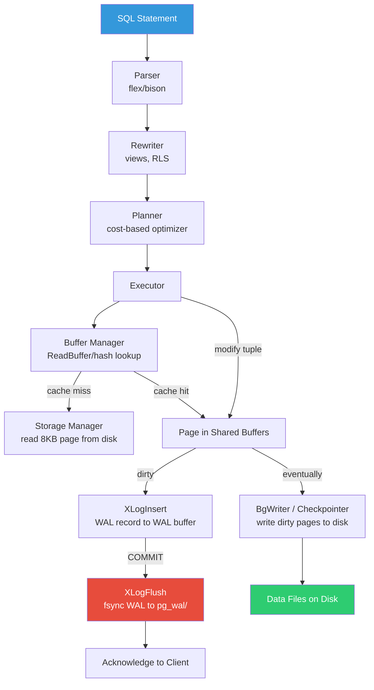

# PostgreSQL Internals — Interview Angle

## How This Appears

PostgreSQL internals questions appear in **Staff/Principal engineer system design interviews** and **database-focused deep dives**. Companies like Google, Meta, Shopify, and Stripe explicitly test understanding of:
- MVCC mechanics and its trade-offs vs lock-based concurrency
- WAL architecture and crash recovery guarantees
- VACUUM as a maintenance requirement and its failure modes
- Query optimizer behavior and what makes plans go wrong
- Connection management at scale

Interviewers often start with an innocuous question ("Tell me about PostgreSQL's concurrency model") and drill down until they find the boundary of your knowledge. Principal-level candidates are expected to trace the path from SQL statement to disk I/O and back.

---

## Sample Questions

### Q1: "How does PostgreSQL handle concurrent reads and writes without readers blocking writers?"

**What they're really testing**: MVCC internals — tuple versioning, visibility maps, snapshot isolation, and the trade-off that creates the need for VACUUM.

**Weak answer (Senior):** "PostgreSQL uses MVCC. Each transaction sees a consistent snapshot. Readers and writers don't block each other."

**Strong answer (Principal):**

"PostgreSQL implements MVCC by storing multiple physical versions of each row. Every tuple carries an `xmin` (inserting transaction ID) and `xmax` (deleting/retiring transaction ID). When a backend starts a transaction or statement, it takes a snapshot — a list of all in-progress transaction IDs at that moment plus the highest committed XID.

To check visibility, PostgreSQL evaluates whether `xmin` is committed and within the snapshot, and whether `xmax` is either unset, uncommitted, or outside the snapshot. This happens for every tuple access — thousands of times per query.

The trade-off is dead tuples. An UPDATE doesn't modify the row in-place — it inserts a new version and marks the old one with `xmax = current_xid`. The old version persists until VACUUM removes it. This is why PostgreSQL needs VACUUM: without it, tables bloat indefinitely, and you risk transaction ID wraparound at 2^31 XIDs, which forces a database shutdown.

Key optimization: the Visibility Map tracks pages where all tuples are visible to all transactions. This enables index-only scans by letting the executor skip heap fetches for those pages. VACUUM maintains the visibility map."

### Q2: "You're seeing P99 latencies spike from 5ms to 200ms every few minutes. What's your investigation process?"

**What they're really testing**: Checkpoint behavior, I/O patterns, ability to use PostgreSQL diagnostic views.

**Weak answer:** "I'd look at slow query log and check for missing indexes."

**Strong answer (Principal):**

"Periodic latency spikes usually point to checkpoint storms or autovacuum I/O interference.

First, I check `pg_stat_bgwriter`: if `checkpoints_req` is growing faster than `checkpoints_timed`, checkpoints are being triggered by WAL volume rather than the timer — meaning `max_wal_size` is too small. The spike aligns with checkpoint timing because all dirty pages get flushed to disk, saturating I/O.

Fix: increase `max_wal_size` and ensure `checkpoint_completion_target = 0.9` to spread writes. Also check `buffers_backend` — if this is non-zero, backends are directly writing dirty pages because the bgwriter can't keep up.

If it's not checkpoints, I check `pg_stat_progress_vacuum` for autovacuum workers doing I/O-intensive index cleanup. For large tables, autovacuum can trigger multiple index scans, each touching millions of index pages.

Third possibility: the OS is flushing dirty pages from the filesystem cache. PostgreSQL writes to the OS page cache, and the kernel's `dirty_expire_centisecs` triggers periodic writeback storms. Solution: tune `vm.dirty_background_ratio` and `vm.dirty_ratio` on Linux to smooth out I/O."

### Q3: "Design a PostgreSQL deployment that handles 100K TPS with 5-nines availability."

**What they're really testing**: Understanding of replication topology, failover mechanics, connection pooling, and operational awareness.

**Weak answer:** "Use a primary with two replicas and auto-failover."

**Strong answer (Principal):**

"For 100K OLTP TPS with 5-nines (5.26 minutes downtime/year):

**Connection layer:** PgBouncer in transaction mode, mapping 10K application connections to ~200 PostgreSQL backends. Without pooling, 10K backends = 100GB RAM wasted on process overhead.

**Replication topology:**
- 1 synchronous replica (same AZ) for zero-RPO failover
- 2 async replicas (cross-AZ) for read scaling and geographic reads
- 1 delayed replica (1-hour lag) for accidental deletion recovery

**Failover:** Patroni with etcd for consensus-based leader election. Patroni monitors the primary via health checks and promotes a replica if the primary is unreachable. Fencing the old primary is critical — without STONITH, split-brain can cause data divergence.

**Critical tuning:**
- `synchronous_commit = remote_apply` (not just `on`) ensures the synchronous standby has applied the WAL, not just written it
- `wal_level = replica` (minimum for streaming replication)
- `hot_standby_feedback = on` on replicas to avoid query cancellation from vacuum conflicts

**What 5-nines actually requires:** The database itself can achieve very high availability, but the real risk is human error (accidental DROP TABLE, bad migration). The delayed replica is the safety net. I'd also implement `pg_cron` for automated health checks and Barman for continuous WAL archiving to S3 with PITR."

### Q4: "What happens internally between the moment a client sends an INSERT statement and when the commit is acknowledged?"

**What they're really testing**: End-to-end write path through parser → planner → executor → buffer manager → WAL.

**Strong answer (Principal):**

"1. **Network**: The client sends the SQL bytes over TCP to PgBouncer, which assigns it to a backend connection.

2. **Parser**: The backend's parser (flex lexer + bison grammar) tokenizes the SQL and builds a parse tree. Syntax errors caught here.

3. **Analyzer**: Resolves table names, column names, and types using the system catalog (`pg_class`, `pg_attribute`). Checks permissions.

4. **Rewriter**: Applies any rewrite rules (views, RLS policies). Transforms the parse tree into a query tree.

5. **Planner**: For INSERT, the planner determines the target partition (if partitioned), TOAST strategy for large columns, and any triggers to fire.

6. **Executor**: Allocates a new tuple in the target heap page:
   - Calls the buffer manager to find/pin the page (via `ReadBuffer`)
   - Sets `xmin = current_xid`, `xmax = 0`, fills in column data
   - Writes the tuple into free space on the page (tracked by the Free Space Map)
   - Updates item pointers (`pd_lower` advances)

7. **Index maintenance**: For each index on the table, inserts an index entry pointing to the new tuple's TID `(page_number, item_offset)`.

8. **WAL**: `XLogInsert()` writes a WAL record to the WAL buffer containing the table, block number, and the inserted data. The first change to a page after a checkpoint includes a Full Page Image (FPI) — the entire 8KB page — for crash recovery safety.

9. **Commit**: When the client issues COMMIT (or autocommit), `XLogFlush()` calls `fsync()` on the WAL file up to the commit record's LSN. This is the durability guarantee — the data file can be stale, but the WAL is on stable storage.

10. **Response**: The backend sends a 'C' (CommandComplete) message back to the client with the number of rows inserted."

---

## Follow-Up Questions Interviewers Use

| After Question | They'll Ask | What They Want |
|---|---|---|
| MVCC explanation | "What's the per-row overhead of MVCC?" | 23-24 bytes per tuple (xmin, xmax, cid, ctid, infomask, etc.) |
| VACUUM explanation | "What happens if autovacuum can't keep up?" | Table bloat → index bloat → performance degradation → XID wraparound → forced shutdown |
| Checkpoint explanation | "What's a Full Page Image and why does it exist?" | FPI = entire 8KB page written to WAL after first change post-checkpoint. Prevents torn pages (partial writes where OS writes 4KB of the 8KB page before a crash) |
| Replication setup | "What's the difference between `synchronous_commit = on` vs `remote_apply`?" | `on` → WAL written to standby disk. `remote_apply` → WAL applied to standby data files. `remote_apply` is stronger for read-your-writes from replicas |
| INSERT walkthrough | "What if the INSERT is into a JSONB column with a GIN index?" | GIN index maintenance is deferred via the pending list. Inserts add to the pending list; when it reaches `gin_pending_list_limit` (default 4MB) or VACUUM runs, the pending entries are batch-merged into the GIN tree |

---

## Whiteboard Exercise

**Draw from memory in 5 minutes: PostgreSQL write path, from SQL to disk.**

**Key points to verbalize while drawing:**
1. WAL is written AND fsynced BEFORE commit is acknowledged (write-ahead guarantee)
2. Data files are written lazily by BgWriter/Checkpointer (not in the commit path)
3. Crash recovery replays WAL records to reconstruct any data file changes that weren't yet written
4. The buffer manager uses a hash table (BufferTag → buffer_id) with clock-sweep eviction
