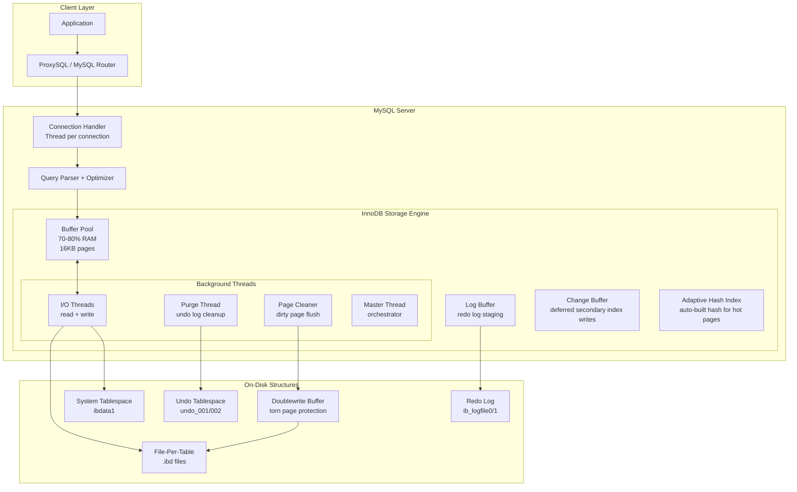

# MySQL InnoDB — Concept Overview

## Why This Exists

InnoDB was developed by Innobase Oy (founded by Heikki Tuuri) in 1995 as a transactional storage engine for MySQL, which at the time only had MyISAM — a non-transactional, table-locking engine unsuitable for any serious concurrent workload. Oracle acquired Innobase in 2005 (and MySQL AB via Sun Microsystems in 2010), making InnoDB the default storage engine from MySQL 5.5 onward.

The fundamental design decision that separates InnoDB from PostgreSQL's heap-based storage: **the primary key IS the table**. InnoDB stores rows in a clustered B+ Tree ordered by the primary key. This is the single most important architectural difference to understand, because it dictates everything — from secondary index performance to write amplification to data locality.

---

## What Value It Provides

| Benefit | Quantified Impact |
|---|---|
| **ACID Transactions** | Full ACID compliance with redo/undo logs; crash recovery in seconds |
| **Row-Level Locking** | Concurrent writes without table-level contention (unlike MyISAM) |
| **Clustered Index** | PK range scans are physically sequential I/O — 10-100x faster than heap-based PK lookups |
| **Buffer Pool Efficiency** | 70-80% of RAM dedicated to caching data+index pages; adaptive hash index for hot pages |
| **Change Buffer** | Defers secondary index writes for non-unique indexes; reduces random I/O by 50-80% on write-heavy workloads |
| **MVCC Without Read Locks** | Consistent reads via undo logs; readers never block writers |
| **Market Dominance** | MySQL powers Wikipedia, Facebook (Meta), Uber, Netflix, Airbnb, Shopify, GitHub — all running InnoDB |

---

## Where It Fits

---

## When To Use / When NOT To Use

| Scenario | InnoDB? | Why / Alternative |
|---|---|---|
| OLTP with high concurrency (web apps, SaaS) | ✅ Excellent | Row-level locking, MVCC, mature ecosystem |
| PK range scans (time-series by PK, ordered data) | ✅ Excellent | Clustered index = physically sequential reads |
| Read-heavy with complex joins | ✅ Good | optimizer improved significantly in MySQL 8.0+ |
| Full-text search as primary access pattern | ⚠️ Limited | InnoDB full-text is functional but lacks Elasticsearch's BM25, facets, fuzzy matching |
| Analytical queries on large datasets | ❌ Wrong tool | No columnar storage, no vectorized execution; use ClickHouse, DuckDB |
| Multi-model (JSON, geo, graph) | ⚠️ Partial | `JSON` type exists but no GIN-equivalent index; PostGIS-level geospatial needs PostgreSQL |
| Global distributed transactions | ❌ Wrong tool | Single-node engine; use TiDB (MySQL-compatible), Vitess, or CockroachDB |
| Schema-less document store | ❌ Wrong tool | JSON support is bolted-on, not native; use MongoDB or PostgreSQL JSONB |

---

## Key Terminology

| Term | Definition |
|---|---|
| **Clustered Index** | The B+ Tree that stores both the index key (PK) and the full row data in leaf nodes. There is exactly one clustered index per table — the table IS the clustered index |
| **Secondary Index** | A B+ Tree where leaf nodes store the indexed columns plus the primary key value. A secondary index lookup requires two B+ Tree traversals: secondary → PK → clustered index |
| **Buffer Pool** | The main memory cache for InnoDB. Stores 16KB data/index pages using a modified LRU with young/old sublists. Recommended: 70-80% of RAM |
| **Redo Log** | The write-ahead log. Records physical changes to pages. Circular log files (`ib_logfile0`, `ib_logfile1`). Ensures crash recovery by replaying changes to pages not yet flushed to data files |
| **Undo Log** | Records how to reverse a change (pre-change row image). Stored in undo tablespaces. Used for MVCC consistent reads and transaction rollback |
| **Change Buffer** | An in-memory structure that defers writes to non-unique secondary index pages. When the target page isn't in the buffer pool, the change is buffered and later merged. Dramatically reduces random I/O |
| **Adaptive Hash Index (AHI)** | InnoDB automatically builds in-memory hash indexes for frequently accessed B+ Tree pages. Provides O(1) lookups for hot data. Can be disabled if causing contention (`innodb_adaptive_hash_index = OFF`) |
| **Doublewrite Buffer** | Before writing a dirty page to its data file, InnoDB first writes it to a contiguous doublewrite buffer area. If a crash occurs mid-write (torn page), the intact copy from the doublewrite buffer is used during recovery |
| **Page** | The fundamental unit of I/O and storage. Default 16KB (configurable: 4KB, 8KB, 16KB, 32KB, 64KB). Contains a page header, row data, and page trailer with checksum |
| **Tablespace** | A logical container for InnoDB data files. System tablespace (`ibdata1`), file-per-table (`.ibd`), general tablespace, temporary tablespace, undo tablespace |
| **Purge Thread** | Background thread that removes undo log records no longer needed by any active transaction. Analogous to PostgreSQL's VACUUM but operates on undo logs rather than heap pages |
| **Page Cleaner** | Background thread that flushes dirty pages from the buffer pool to disk. Replaced the single master thread's flushing responsibilities in MySQL 5.7+ for better I/O parallelism |
| **LSN (Log Sequence Number)** | A monotonically increasing 64-bit integer representing a byte offset in the redo log stream. Every page stores the LSN of the last modification; during recovery, pages with LSN < redo record's LSN get replayed |
| **FIL Header/Trailer** | The 38-byte header and 8-byte trailer on every InnoDB page. Contains page type, space ID, page number, checksums, and LSN for crash recovery validation |

---

## InnoDB vs PostgreSQL — Architectural Comparison

| Aspect | InnoDB (MySQL) | PostgreSQL |
|---|---|---|
| **Row Storage** | Clustered B+ Tree (PK = table) | Heap (unordered) + separate B-Tree indexes |
| **Page Size** | 16KB default | 8KB (compile-time) |
| **Secondary Index Lookup** | Two traversals: secondary → PK → clustered | One traversal: index → TID → heap page |
| **MVCC Implementation** | Undo log (old versions in undo tablespace) | In-place versions (old + new tuples in heap) |
| **Dead Row Cleanup** | Purge thread (cleans undo logs) | VACUUM (removes dead heap tuples) |
| **Write Amplification** | Redo log + doublewrite buffer + data file | WAL + data file (no doublewrite; uses full-page images in WAL) |
| **Partial Page Write Protection** | Doublewrite buffer | Full-page images in WAL after checkpoint |
| **Buffer Pool Recommendation** | 70-80% of RAM | 25% of RAM (relies on OS page cache for the rest) |
| **Connection Model** | Thread per connection | Process per connection |
| **Hot Update Optimization** | Change buffer (defers secondary index writes) | HOT updates (avoids index update if unindexed column changed + same page) |
