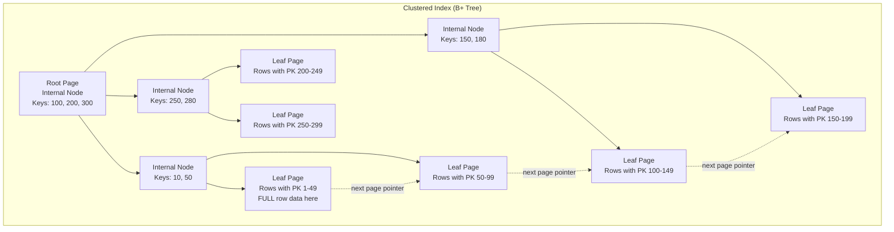
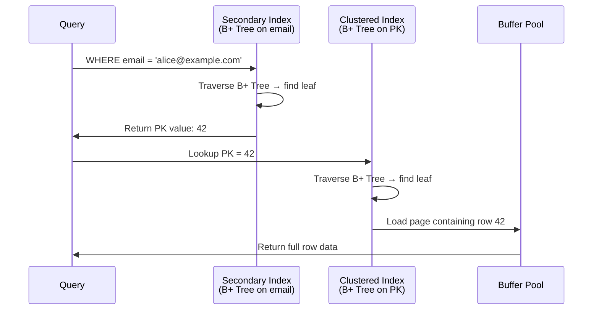
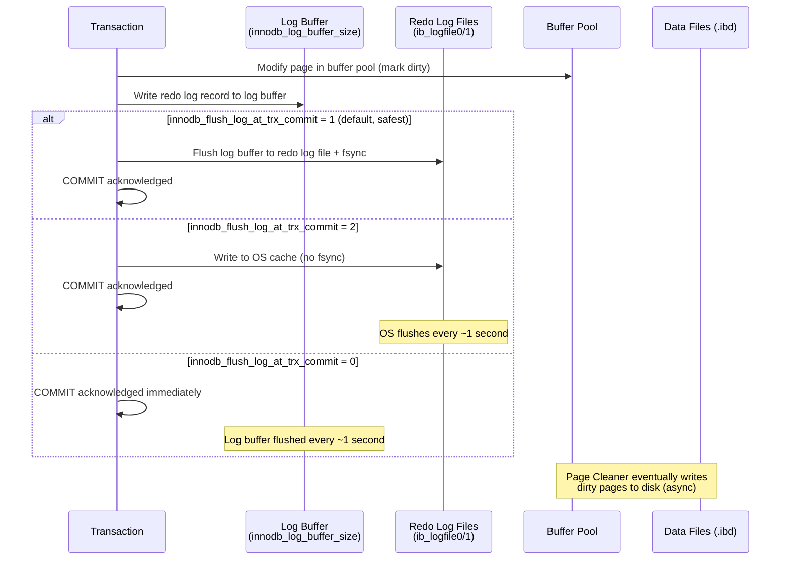
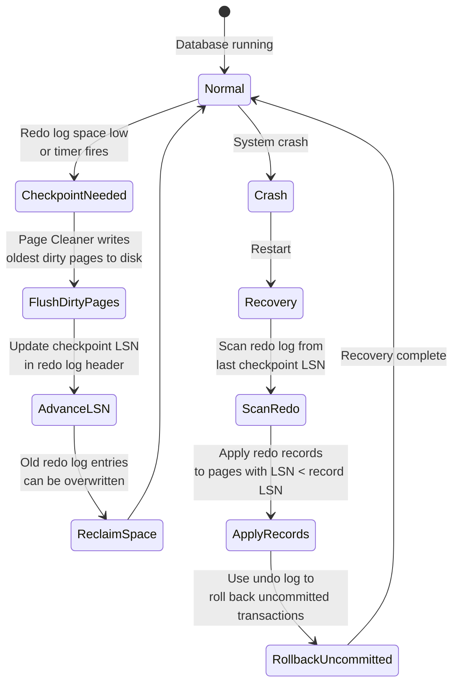
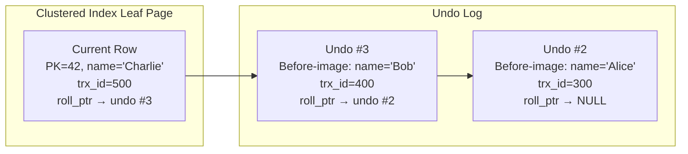
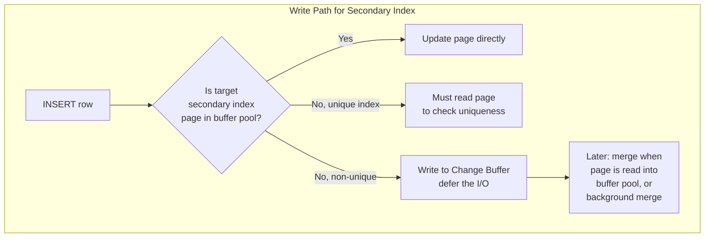
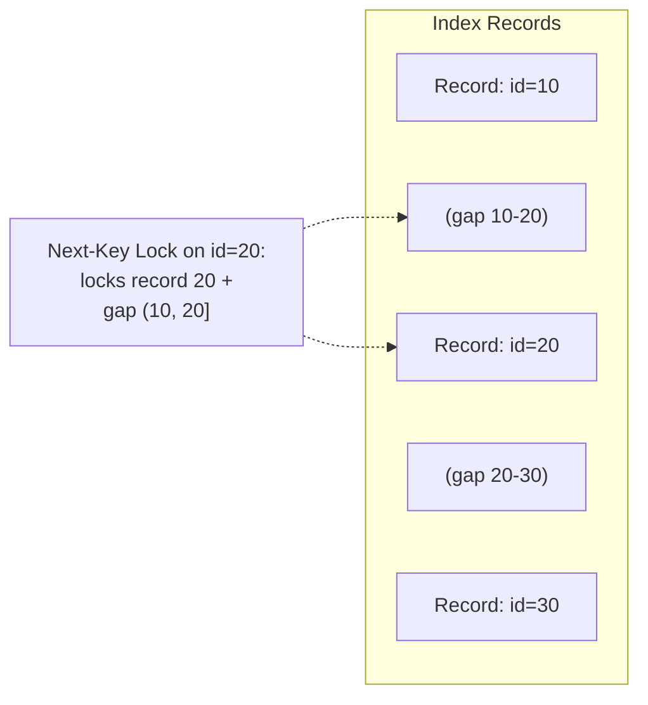
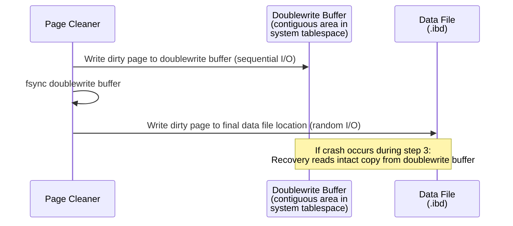

# MySQL InnoDB — How It Works

## Architecture: Clustered Index Storage

The defining characteristic of InnoDB: **the primary key B+ Tree IS the table**. Rows are stored in PK order in the leaf nodes of the clustered index.

### Clustered Index Structure



**Consequence of clustered storage:**
- PK range scans are sequential I/O (rows are physically adjacent)
- Insert order matters: random UUIDs as PK cause massive page splits (each insert goes to a random leaf page)
- Secondary indexes are larger: they store the PK value (not a physical row pointer) in each entry

### Secondary Index Lookup — The Double Traversal



This "bookmark lookup" means every secondary index access requires **two** B+ Tree traversals. For covering indexes (all queried columns in the index), the second lookup is avoided.

---

## Buffer Pool Deep Dive

### LRU with Young/Old Sublist

InnoDB's buffer pool uses a modified LRU list split into two sublists:

```
┌──────────────────────────────────────────────────────┐
│                  Buffer Pool LRU List                 │
│                                                       │
│  ┌────────────────────────┬─────────────────────────┐ │
│  │   Young Sublist (5/8)  │   Old Sublist (3/8)     │ │
│  │   ← Hot pages          │   ← New pages land here │ │
│  │   (recently accessed   │   (must be accessed a   │ │
│  │    again = promoted)   │    second time within   │ │
│  │                        │    innodb_old_blocks_time│ │
│  │                        │    to be promoted)      │ │
│  └────────────────────────┴─────────────────────────┘ │
│    MRU end ←────────────────────────────→ LRU end     │
│    (eviction from LRU end)                            │
└──────────────────────────────────────────────────────┘
```

**Why the split?** A full table scan reads every page. Without the old sublist, a sequential scan would flush all hot pages from the buffer pool. With the split, scanned pages enter the old sublist and are evicted quickly unless accessed again within `innodb_old_blocks_time` (default 1000ms).

### Buffer Pool Configuration

```
innodb_buffer_pool_size = 48G          # 75% of 64GB server
innodb_buffer_pool_instances = 8       # Reduce mutex contention (1 per 1-8GB)
innodb_old_blocks_pct = 37             # 37% of pool is old sublist (default)
innodb_old_blocks_time = 1000          # ms before old sublist page can be promoted
innodb_buffer_pool_dump_at_shutdown = ON   # Save buffer pool state for fast warm-up
innodb_buffer_pool_load_at_startup = ON     # Restore on restart
```

---

## Redo Log Architecture

### Write Path



### Redo Log Record Structure

```
┌──────────────────────────────────────────────────────┐
│ Redo Log Record                                       │
├──────────────┬──────────────┬────────────────────────┤
│ Type (1B)    │ Space ID     │ Page Number            │
│ MLOG_WRITE   │ (4B)        │ (4B)                   │
├──────────────┴──────────────┴────────────────────────┤
│ Offset within page (2B)                               │
│ Data length (variable)                                │
│ Data bytes (the actual change)                        │
└──────────────────────────────────────────────────────┘
```

InnoDB redo log records are **physiological**: they record the physical page and offset, but the operation is logical (e.g., "insert this row at this offset on this page"). This is more space-efficient than full-page images.

### Checkpoint and Recovery



---

## Undo Log and MVCC

### How InnoDB Implements MVCC

Unlike PostgreSQL (which stores all tuple versions in the heap), InnoDB stores **only the current version** in the clustered index. Previous versions are reconstructed from the **undo log**.



**To read a consistent snapshot as of trx_id=350:**
1. Read current row (trx_id=500) — too new, not visible
2. Follow `roll_ptr` to undo #3 (trx_id=400) — still too new
3. Follow `roll_ptr` to undo #2 (trx_id=300) — visible! Return `name='Alice'`

### Purge Thread

The purge thread removes undo log records that are no longer needed by any active transaction (no read view references them). This is InnoDB's equivalent of PostgreSQL's VACUUM — but it operates on undo logs rather than heap pages.

Key difference: InnoDB doesn't suffer from heap bloat like PostgreSQL. The clustered index always contains only the current row version. Bloat in InnoDB comes from undo log growth (long transactions preventing purge) and secondary index fragmentation.

---

## Page Layout (16KB)

```
┌──────────────────────────────────────────────────────┐
│ FIL Header (38 bytes)                                 │
│   Space ID (4B) │ Page Number (4B) │ Page Type (2B)  │
│   Prev Page (4B) │ Next Page (4B) │ LSN (8B)        │
│   Checksum (4B) │ Flush LSN (8B)                     │
├──────────────────────────────────────────────────────┤
│ Page Header (56 bytes)                                │
│   Slots │ Heap Top │ Record Count │ Free Space Ptr  │
│   Garbage Size │ Last Insert Position │ Direction     │
│   Index ID │ Level (0 for leaf)                       │
├──────────────────────────────────────────────────────┤
│ Infimum Record (13 bytes) — lowest possible record    │
├──────────────────────────────────────────────────────┤
│ Supremum Record (13 bytes) — highest possible record  │
├──────────────────────────────────────────────────────┤
│ User Records (grows downward)                         │
│   Record 1: [header(5B)] [PK fields] [non-PK fields] │
│   Record 2: ...                                       │
│   (Records linked via next-record pointer offsets)    │
├──────────────────────────────────────────────────────┤
│ Free Space                                            │
├──────────────────────────────────────────────────────┤
│ Page Directory (grows upward)                         │
│   Slots pointing to records for binary search         │
├──────────────────────────────────────────────────────┤
│ FIL Trailer (8 bytes)                                 │
│   Old-style Checksum (4B) │ LSN low 4 bytes (4B)     │
└──────────────────────────────────────────────────────┘
```

Records within a page are linked as a singly-linked list ordered by PK. The page directory provides sparse slots for binary search — not every record has a slot, but every 4-8 records do.

---

## Change Buffer



**Impact:** Without the change buffer, every INSERT would require reading secondary index pages for ALL secondary indexes — even if the page isn't in memory. For a table with 5 non-unique secondary indexes, a single INSERT could require 5 random disk reads. The change buffer converts these into sequential writes.

Configure with: `innodb_change_buffer_max_size = 25` (% of buffer pool, default 25%)

---

## Locking Mechanism

InnoDB uses a combination of record locks, gap locks, and next-key locks:

| Lock Type | What It Locks | When Used |
|---|---|---|
| **Record Lock** | Single index record | `WHERE id = 42` with unique index |
| **Gap Lock** | Gap between index records | Prevents phantom reads in REPEATABLE READ |
| **Next-Key Lock** | Record + gap before it | Default in REPEATABLE READ; prevents phantoms |
| **Insert Intention Lock** | Intent to insert in a gap | Multiple transactions can hold insert intentions for different positions in the same gap |
| **Auto-Inc Lock** | Table-level for AUTO_INCREMENT | Brief lock to allocate next auto-increment value |



---

## Doublewrite Buffer

### Why It Exists

InnoDB pages are 16KB; most filesystems write in 4KB blocks. A crash during a 16KB page write can result in a **torn page** — half old data, half new data. The page checksum would detect this, but recovery can't proceed because the page is corrupted and the redo log contains physiological records (not full-page images).

### How It Works



Trade-off: 2x write amplification for data pages. On SSDs with atomic 16KB writes, the doublewrite buffer can be disabled: `innodb_doublewrite = OFF`.
