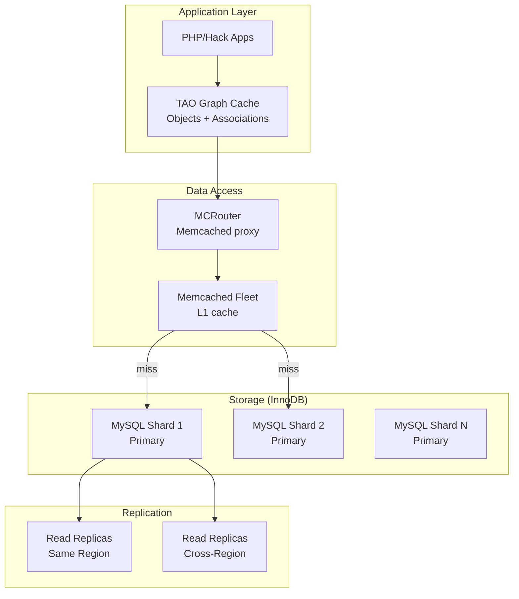
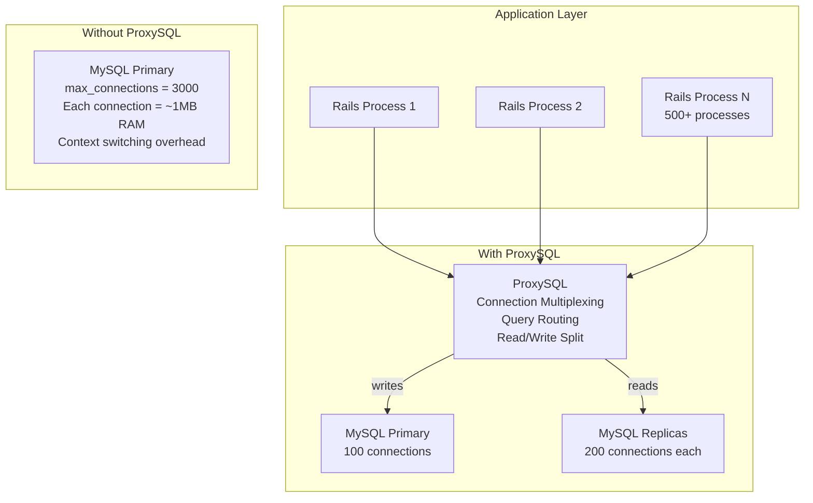
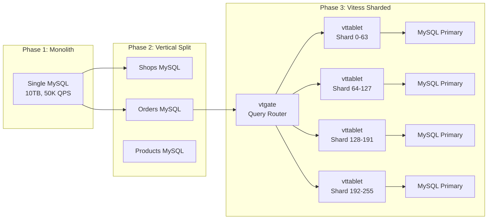

# MySQL InnoDB — Real-World Scenarios

## Case Study 01: Meta (Facebook) — Massive InnoDB Deployments

### Context
Meta operates one of the largest MySQL/InnoDB deployments in the world, underpinning its TAO social graph storage layer and user data stores. Their MySQL fleet spans thousands of servers across multiple data centers.

### Scale Numbers
| Metric | Value |
|---|---|
| MySQL Instances | Thousands of shards |
| Data Volume | Petabytes of InnoDB data |
| Queries Per Second | Billions across the fleet |
| Replication Topology | Primary → multiple read replicas per shard |

### Architecture Decisions


### Key Technical Decision: MyRocks (RocksDB Engine)
Meta developed **MyRocks** (MySQL + RocksDB storage engine) to complement InnoDB for certain workloads:
- **InnoDB**: Used for latency-sensitive OLTP with small working sets
- **MyRocks**: Used for space-sensitive replicas and cold storage — RocksDB's LSM tree provides 2x better compression than InnoDB's B+ tree because it avoids the internal fragmentation inherent in page-based storage

### Production Issue: Replication Lag During Schema Changes

**Problem**: `ALTER TABLE` on a 100+ billion row table caused replication lag of hours. The DDL replicated as a single statement to replicas, and while the primary used Online DDL (InnoDB's in-place algorithm), replicas executed it single-threaded, stalling the entire replication stream.

**Root Cause**: MySQL's multi-threaded replica applier uses LOGICAL_CLOCK assignment, but DDL statements require exclusive metadata lock, serializing all subsequent DML until the DDL completes on the replica.

**Solution**: Meta developed `gh-ost` (GitHub Online Schema Change), which:
1. Creates a ghost table with the new schema
2. Uses binlog streaming to capture changes to the original table
3. Copies rows in batches with configurable throttling
4. Atomically swaps tables via `RENAME TABLE`
5. Works on replicas without blocking replication

---

## Case Study 02: Uber — The Infamous PostgreSQL to MySQL Migration

### Context
In 2016, Uber published a controversial blog post explaining why they migrated from PostgreSQL to MySQL/InnoDB. This case is instructive because it highlights the practical tradeoffs between heap-based (PostgreSQL) and clustered-index (InnoDB) storage.

### Uber's Specific Problems with PostgreSQL (at their scale)
| Issue | Detail |
|---|---|
| Write amplification | Every index update required writing the full tuple TID. For a table with 10 indexes, a single row update wrote to 10 index B-Trees |
| Replication | PostgreSQL WAL-based replication shipped physical page-level changes. Index page changes were replicated even though replicas could rebuild indexes locally |
| MVCC bloat | Dead tuples accumulated between VACUUM runs; table sizes grew 3-5x |
| Upgrade path | Major version upgrades required `pg_upgrade` or logical replication, which was operationally risky at their scale |

### Why InnoDB Worked Better (For Their Workload)
| InnoDB Advantage | Mechanism |
|---|---|
| Secondary index efficiency | Secondary indexes store only the PK (not a physical TID). UPDATE to a non-indexed column = zero secondary index writes |
| Row-based replication | MySQL replicates logical row changes (INSERT/UPDATE/DELETE), not physical pages. Replicas rebuild their own indexes |
| Online DDL | InnoDB supports in-place ALTER TABLE for most operations; PostgreSQL required locks or external tools |
| Undo-based MVCC | Old row versions in undo log, not inline in the heap. No heap bloat from MVCC |

### Critical Nuance (What Uber Didn't Mention)
- PostgreSQL has since addressed many of these issues: logical replication (PG 10+), improved VACUUM performance, parallel index build
- InnoDB's clustered index disadvantage: secondary index lookups require a "bookmark lookup" back to the clustered index — PostgreSQL's TID-based index lookups are single-hop
- The migration was specific to Uber's write-heavy, many-indexed workload pattern

---

## Case Study 03: GitHub — Managing InnoDB at Scale with ProxySQL

### Context
GitHub runs MySQL/InnoDB for its core application data (repositories, issues, pull requests, users). Their challenge: managing thousands of application connections across hundreds of Ruby on Rails processes to a relatively small number of MySQL backends.

### The Connection Problem



### Key Decisions
| Decision | Rationale |
|---|---|
| ProxySQL over MaxScale | Open source, transparent to application, supports query-level routing rules |
| Read/write splitting | Route SELECT to replicas, everything else to primary. Reduces primary load by 70% |
| Connection multiplexing | 2000 app connections → 100 MySQL connections. Eliminates thread-per-connection overhead |
| Query caching in ProxySQL | Cache read-only queries with TTL; reduces MySQL load for repetitive queries |

### Production Issue: Undo Log Purge Lag

**Problem**: A long-running analytics query (joining across large tables) held a read view open for 2 hours. During that time, the purge thread couldn't clean undo logs. The history list length grew from 200 to 2,000,000+, causing:
1. MVCC reads became slower (more undo records to traverse for each row)
2. Undo tablespace file grew from 1GB to 40GB
3. Even after the query finished, purge took 30 minutes to catch up

**Root Cause**: `innodb_max_purge_lag = 0` (default, no throttling). No alerting on history list length.

**Fix**:
- `innodb_max_purge_lag = 100000` (throttle DML when purge is behind)
- `innodb_max_purge_lag_delay = 30000` (max microseconds of delay per DML)
- Set `MAX_EXECUTION_TIME` hint on analytics queries
- Moved analytics to a dedicated replica with longer timeout allowances

---

## Case Study 04: Shopify — Vitess for Horizontal MySQL Sharding

### Context
Shopify's MySQL infrastructure evolved from single monolithic MySQL instances to a Vitess-managed sharded MySQL fleet. Vitess is an open-source sharding middleware originally developed by YouTube for MySQL.

### Evolution



### InnoDB-Specific Considerations in Vitess

| Challenge | Vitess Solution |
|---|---|
| Cross-shard transactions | Two-phase commit via vttablet; trades availability for consistency |
| Schema changes across shards | `vtctl ApplySchema` orchestrates DDL across all shards sequentially |
| Shard split (resharding) | Copy data to new shards using row-based replication; atomic cutover |
| Primary key selection | Shard key must be in the PK (required by InnoDB's clustered index for efficient routing) |
| Buffer pool sizing | Each shard has smaller working set; buffer pool per instance can be smaller |

### Production Issue: Bulk DELETE Causing Replication Lag

**Problem**: A merchant deactivation job ran `DELETE FROM order_items WHERE shop_id = ?` on a shop with 50 million order items. The single DELETE:
1. Acquired millions of row locks + gap locks (REPEATABLE READ)
2. Generated a massive undo log entry on the primary
3. Replicated as a single binlog event; replica had to replay it single-threaded
4. Replication lag hit 6 hours

**Root Cause**: Large single-transaction DML on InnoDB causes unbounded undo log growth and replication lag.

**Fix**:
- Batch deletes: `DELETE FROM order_items WHERE shop_id = ? ORDER BY id LIMIT 10000` in a loop
- `binlog_row_image = MINIMAL` reduces binlog event size
- `replica_parallel_workers = 16` + `replica_parallel_type = LOGICAL_CLOCK` for multi-threaded replica applier
- Added monitoring: alert if any single DML affects > 100K rows

---

## Cross-Cutting Production Patterns

### Pattern: InnoDB Warm-Up After Restart

Every MySQL restart means a cold buffer pool. For large databases, this can cause 10-30 minutes of degraded performance.

```sql
-- Pre-MySQL 5.6: No built-in solution; run table scans to warm cache
-- MySQL 5.6+: Buffer pool warmup via dump/load
innodb_buffer_pool_dump_at_shutdown = ON
innodb_buffer_pool_load_at_startup = ON
innodb_buffer_pool_dump_pct = 75   -- dump 75% of most recently used pages
```

### Pattern: Monitoring InnoDB Health

```sql
-- The 5 numbers you must check daily:
-- 1. Buffer pool hit ratio (>99%)
-- 2. History list length (<10000)
-- 3. Redo log checkpoint age (< 75% of total redo log capacity)
-- 4. Row lock waits per second (< 100)
-- 5. Page reads/sec (< storage IOPS capacity)

SELECT
    (SELECT COUNT FROM INFORMATION_SCHEMA.INNODB_METRICS WHERE NAME = 'buffer_pool_read_requests') AS logical_reads,
    (SELECT COUNT FROM INFORMATION_SCHEMA.INNODB_METRICS WHERE NAME = 'buffer_pool_reads') AS disk_reads,
    (SELECT COUNT FROM INFORMATION_SCHEMA.INNODB_METRICS WHERE NAME = 'trx_rseg_history_len') AS history_list_len,
    (SELECT COUNT FROM INFORMATION_SCHEMA.INNODB_METRICS WHERE NAME = 'lock_row_lock_waits') AS lock_waits;
```
