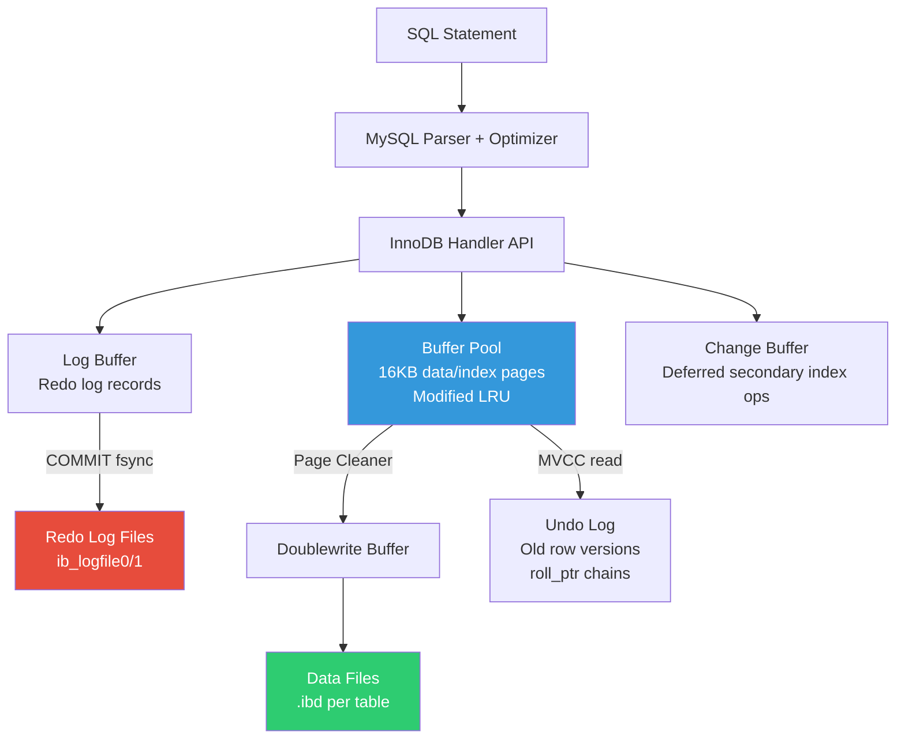

# MySQL InnoDB — Interview Angle

## How This Appears

MySQL/InnoDB questions appear in **backend engineering interviews** at companies using MySQL at scale (Meta, Uber, Shopify, GitHub, Pinterest). The clustered index design, replication model, and locking behavior are the main areas of deep questioning. Principal-level candidates must articulate the **trade-offs of InnoDB's architecture** versus PostgreSQL and explain how those trade-offs impact system design decisions.

---

## Sample Questions

### Q1: "Explain InnoDB's clustered index and how it affects secondary index lookups."

**What they're really testing**: Do you understand that the table IS the B+ Tree, and that this has cascading effects on index design, write patterns, and query performance?

**Weak answer (Senior):** "InnoDB stores data in a B+ Tree ordered by the primary key. Secondary indexes have a pointer back to the primary key."

**Strong answer (Principal):**

"In InnoDB, the clustered index IS the table. The leaf nodes of the primary key B+ Tree contain the full row data — not just the key. There is exactly one clustered index per table, and if you don't define a PK, InnoDB creates a hidden 6-byte ROW_ID as the clustered key.

The consequence for secondary indexes is significant. A secondary index leaf node stores the indexed columns plus the **primary key value** — not a physical row pointer. So a secondary index lookup requires two B+ Tree traversals:

1. Traverse the secondary index B+ Tree to find the matching leaf node → extract the PK value
2. Traverse the clustered index B+ Tree using the PK value → extract the full row

This is called a **bookmark lookup**. For a query returning 10,000 rows via a secondary index, that's 20,000 B+ Tree traversals.

The mitigation is **covering indexes**: if all columns needed by the query are present in the secondary index, InnoDB can answer the query from the secondary index alone — `EXPLAIN` shows 'Using index.'

Another consequence: the size of the primary key directly affects every secondary index. A 36-byte UUID primary key means every secondary index entry carries 36 extra bytes. For a table with 5 secondary indexes and 100M rows, that's 5 × 100M × 36 bytes = ~18GB of redundant PK storage across secondary indexes.

This is why InnoDB best practice is to use a compact PK — `BIGINT AUTO_INCREMENT` (8 bytes) — and store any UUID as a secondary unique index."

### Q2: "Your MySQL replica is 4 hours behind the primary. How do you diagnose and fix it?"

**What they're really testing**: Understanding of MySQL replication mechanics, binary log format, multi-threaded applier, and operational triage.

**Weak answer:** "Check the slow query log on the replica."

**Strong answer (Principal):**

"Replication lag has three main causes: network, single-threaded replay, or I/O contention on the replica.

**Step 1: Characterize the lag.**
```sql
SHOW REPLICA STATUS\G
```
Key fields: `Seconds_Behind_Source`, `Replica_IO_Running`, `Replica_SQL_Running`, `Exec_Source_Log_Pos` vs `Read_Source_Log_Pos`.

If `Replica_IO_Running = NO` → network issue or primary unavailable. Fix the connection.

If `Replica_SQL_Running = YES` but lag is growing → the SQL applier can't keep up.

**Step 2: Check for large transactions.**
A single `DELETE FROM big_table WHERE created < '2024-01-01'` deleting 50M rows generates a huge binlog event. The replica processes it as a single thread. Check:
```sql
SELECT * FROM performance_schema.replication_applier_status_by_worker;
```
If one worker shows `APPLYING_TRANSACTION` for minutes, it's processing a large transaction.

**Step 3: Enable multi-threaded applier (if not already).**
```sql
STOP REPLICA;
SET GLOBAL replica_parallel_workers = 16;
SET GLOBAL replica_parallel_type = 'LOGICAL_CLOCK';
SET GLOBAL binlog_transaction_dependency_tracking = 'WRITESET';
START REPLICA;
```
WRITESET-based parallelism allows independent transactions to replay concurrently even if they were sequential on the primary.

**Step 4: If the cause is a large DDL (ALTER TABLE).**
Online DDL on the primary may use the in-place algorithm, but the replica applies the DDL from the binlog as a single-threaded operation with a metadata lock. Use `gh-ost` or `pt-online-schema-change` which replicate as row-level DML changes instead.

**Step 5: Long-term prevention.**
- Batch large DML operations: limit to 10K rows per transaction
- Set `binlog_row_image = MINIMAL` to reduce binlog event size
- Monitor replication lag and alert at 30 seconds"

### Q3: "How does InnoDB's MVCC implementation differ from PostgreSQL's, and what are the practical implications?"

**Strong answer (Principal):**

"The fundamental difference is where old row versions live.

**PostgreSQL**: Stores all row versions in the heap. An UPDATE creates a new tuple in the same heap page (HOT) or a different page. Old versions remain until VACUUM removes them. Consequence: heap bloat. A table with 10M rows that gets updated frequently might consume 2-3x the space.

**InnoDB**: Stores only the current version in the clustered index. Old versions are reconstructed from the **undo log**. Each row has a `roll_ptr` that chains through undo records. To read an old snapshot, InnoDB follows the chain until it finds a version visible to the transaction's read view.

**Practical implications:**

| Aspect | InnoDB | PostgreSQL |
|---|---|---|
| Heap bloat | None — clustered index always contains current rows only | Yes — dead tuples accumulate until VACUUM |
| Read performance for old snapshots | Degrades with chain length (must traverse undo) | Same cost — old tuple is a regular heap tuple |
| Cleanup mechanism | Purge thread (cleans undo logs) | VACUUM (removes dead heap tuples) |
| Failure mode | History list length grows → undo tablespace bloat | VACUUM lag → table bloat → XID wraparound |
| OPS overhead | Monitor history list length | Monitor dead tuple ratio + autovacuum |

The subtle trap: InnoDB's approach avoids heap bloat but introduces **undo tablespace bloat** if long-running transactions prevent purge. I've seen undo tablespace grow from 1GB to 100GB when a single analytics query held a read view for 6 hours."

### Q4: "Walk me through what happens internally when InnoDB processes an INSERT, from SQL to durable commit."

**Strong answer (Principal):**

"1. **Parse and optimize**: MySQL's query parser validates SQL and the optimizer determines the target table, partition (if partitioned), and auto-increment value (brief table-level lock for AI allocation).

2. **Buffer pool page access**: InnoDB hashes the target leaf page ID `(space_id, page_no)` in the buffer pool hash table. If the page isn't in memory, it's read from disk into the buffer pool's old sublist.

3. **Record insertion**: The row is formatted as an InnoDB record (5-byte record header + PK fields + non-PK fields) and inserted into the appropriate position in the page's record list. The page directory is updated if needed.

4. **Redo log write**: A redo log record (type = MLOG_COMP_REC_INSERT) is written to the log buffer. This records the space ID, page number, offset, and the inserted data. The record is physiological — physical page reference, logical operation.

5. **Secondary index updates**: For each secondary index:
   - If the index page is in the buffer pool → insert directly
   - If non-unique index and page NOT in buffer pool → write to the **change buffer** (deferred insert)
   - If unique index and page NOT in buffer pool → must read the page to verify uniqueness, then insert

6. **Commit**: Based on `innodb_flush_log_at_trx_commit`:
   - `= 1` (default): flush log buffer to redo log files + fsync. Durability guaranteed.
   - `= 2`: write to OS cache (no fsync). Data survives MySQL crash but not OS/power failure.
   - `= 0`: don't even write to OS cache immediately. Fastest, least durable.

7. **Binary log write** (if enabled): The transaction is written to the binary log for replication. MySQL uses a two-phase commit protocol between InnoDB and the binlog to ensure they're consistent.

8. **Dirty page** remains in buffer pool. The **page cleaner** thread will eventually write it to the `.ibd` data file. If the page cleaner hasn't flushed it before the redo log wraps around, InnoDB forces a checkpoint.

9. **Doublewrite**: When the page IS eventually flushed, it's first written to the doublewrite buffer (contiguous area), fsynced, then written to the final data file location. This protects against torn pages."

---

## Follow-Up Questions Interviewers Use

| After Question | They'll Ask | What They Want |
|---|---|---|
| Clustered index | "What if you don't define a primary key?" | InnoDB uses first UNIQUE NOT NULL index; if none exists, creates hidden 6-byte ROW_ID |
| UUID as PK | "What's the measured impact on write throughput?" | 3-4x slower inserts, 60%+ more disk space, 2000x more page splits vs AUTO_INCREMENT |
| Replication lag | "What's the difference between LOGICAL_CLOCK and WRITESET?" | LOGICAL_CLOCK: parallel if committed in same binlog group; WRITESET: parallel if no row-level overlap (finer-grained, more parallelism) |
| MVCC comparison | "Can InnoDB have a VACUUM-like crisis?" | Yes — history list length explosion from long transactions; undo tablespace grows unbounded |
| INSERT walkthrough | "What's the change buffer optimization?" | Non-unique secondary index changes buffered in memory when target page isn't loaded; merged later to avoid random I/O |

---

## Whiteboard Exercise

**Draw: InnoDB architecture from SQL to disk, showing buffer pool, redo log, undo log, and data files.**


