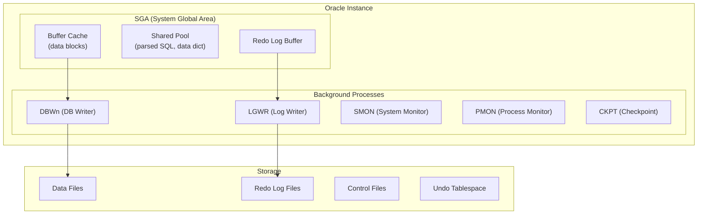

# Oracle Architecture — Concept Overview

> SGA, PGA, and the multi-process architecture that dominated enterprise databases for 40 years.

## Architecture

## Oracle vs PostgreSQL Conceptual Mapping

| Oracle Concept | PostgreSQL Equivalent |
|---|---|
| SGA | Shared Buffers + WAL Buffers |
| PGA | Backend process memory (work_mem) |
| Redo Log | WAL (Write-Ahead Log) |
| Undo Tablespace | MVCC dead tuples + VACUUM |
| DBWn | Background Writer + Checkpointer |
| LGWR | WAL Writer |
| Shared Pool | Prepared statement cache |

## References

| Resource | Link |
|---|---|
| *Oracle Database Concepts* | Oracle official documentation |
| *Expert Oracle Database Architecture* | Thomas Kyte |
