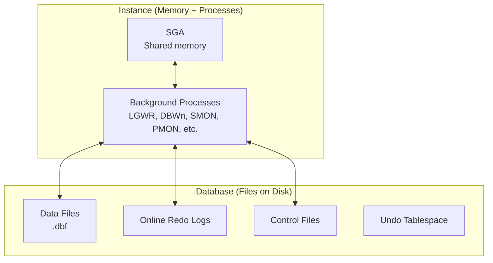
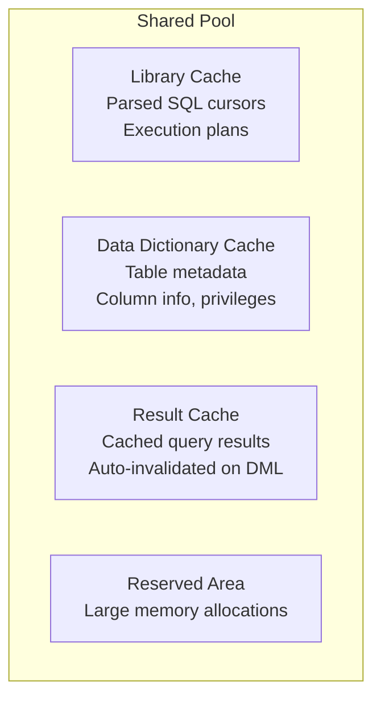
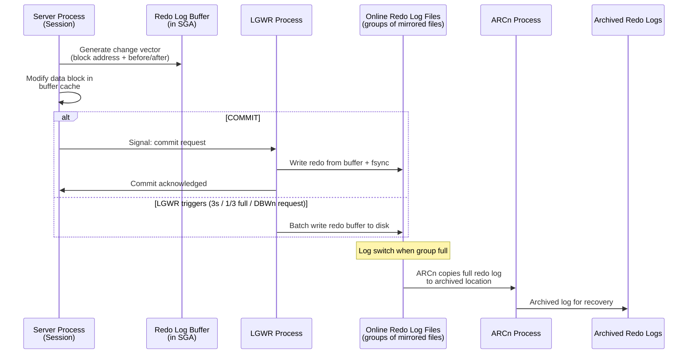
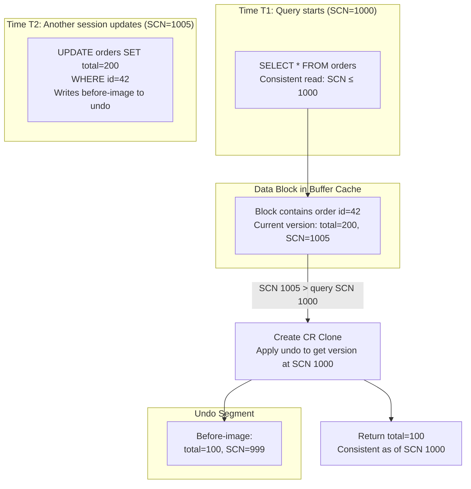
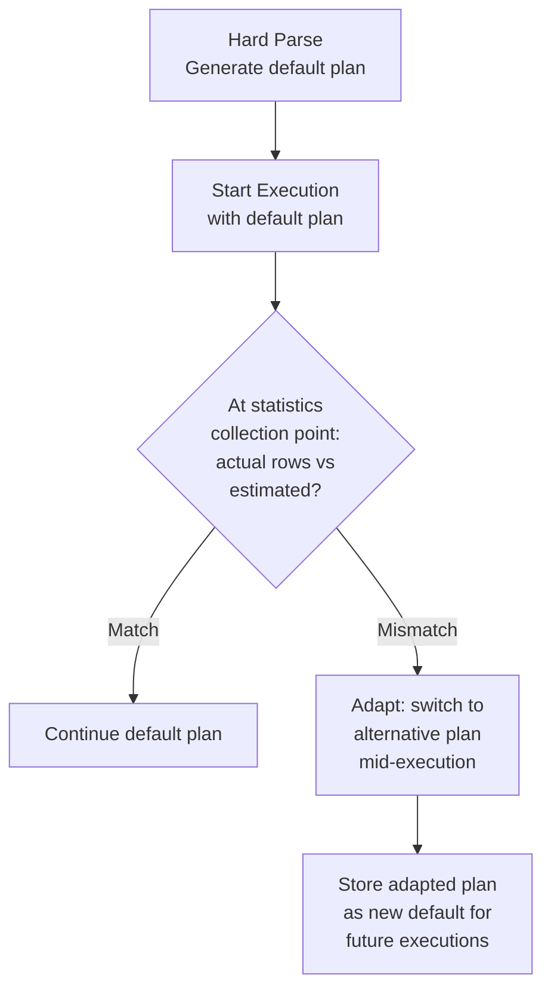
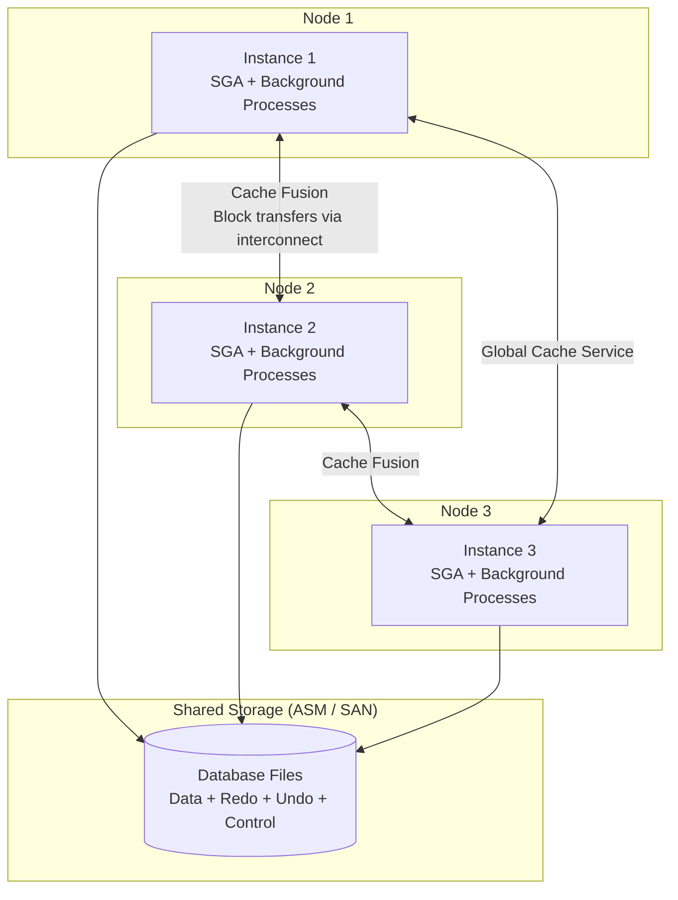

# Oracle Database Architecture — How It Works

## Instance vs Database

This is the single most important distinction in Oracle architecture:

- **Database**: The physical files on disk — data files, redo log files, control files, archived logs
- **Instance**: The memory structures (SGA) + background processes that access the database



One database can have **multiple instances** (Oracle RAC — Real Application Clusters). Each RAC node runs its own SGA and background processes, but all nodes access the same shared disk storage. This enables horizontal scaling with automatic failover.

---

## SGA Deep Dive

### Buffer Cache

The buffer cache stores copies of data blocks read from disk. Oracle uses a **touch-count-based LRU** with multiple pools:

```
┌──────────────────────────────────────────────────────┐
│                    Buffer Cache                       │
│                                                       │
│  ┌─────────────────┐  ┌──────────────┐  ┌──────────┐ │
│  │ DEFAULT Pool     │  │ KEEP Pool     │  │ RECYCLE  │ │
│  │ (main cache)     │  │ (pin hot data │  │ Pool     │ │
│  │                  │  │  permanently) │  │ (large   │ │
│  │  Hot end ← → Cold │  │              │  │  scans)  │ │
│  │  Touch count ≥ 2  │  │              │  │          │ │
│  │  moves to hot end │  │              │  │          │ │
│  └─────────────────┘  └──────────────┘  └──────────┘ │
└──────────────────────────────────────────────────────┘
```

- **DEFAULT pool**: Standard LRU. Blocks with touch count ≥ 2 are moved to the hot end. Unlike InnoDB's young/old split, Oracle uses a touch count threshold.
- **KEEP pool**: For small, frequently accessed tables. Assign with `ALTER TABLE t STORAGE (BUFFER_POOL KEEP);`
- **RECYCLE pool**: For large tables that are scanned once. Prevents them from flushing the default pool.

### Shared Pool



**Library cache** is critical for performance. When Oracle parses a SQL statement:
1. Computes a hash of the SQL text
2. Searches library cache for a matching hash
3. **Soft parse (hit)**: Reuses the existing execution plan. ~0.1ms.
4. **Hard parse (miss)**: Full parse → optimize → plan generation. 1-100ms depending on complexity.

Hard parses are expensive and don't scale. At 1000 hard parses/second, the shared pool latch becomes a bottleneck. This is why **bind variables** are mandatory in Oracle environments.

```sql
-- BAD: literal SQL → each execution is a hard parse
SELECT * FROM users WHERE id = 42;
SELECT * FROM users WHERE id = 43;
-- Each is a different SQL text → separate library cache entry

-- GOOD: bind variable → one hard parse, many soft parses
SELECT * FROM users WHERE id = :1;
-- Same SQL text for all executions → one library cache entry
```

---

## Redo Log Architecture

### Write Path



### Online Redo Log Groups

Oracle uses **log groups** for redundancy:

```
Group 1: /u01/redo1A.log + /u02/redo1B.log (mirrored)
Group 2: /u01/redo2A.log + /u02/redo2B.log (mirrored)
Group 3: /u01/redo3A.log + /u02/redo3B.log (mirrored)
         ↑ CURRENT        ↑ INACTIVE        ↑ INACTIVE
         (LGWR writing)    (archived)         (archived)
```

- Minimum 2 groups; production typically uses 3-6
- Each group has ≥2 members (mirrored) on separate disks
- **Log switch**: LGWR moves from current to next group when current is full
- **Checkpoint**: All dirty blocks modified before a redo log can be overwritten must be flushed to disk by DBWn

---

## Undo and Read Consistency

### How Oracle Achieves Read Consistency

Oracle's read consistency model is the most elegant implementation of MVCC in any commercial database:



**Consistent Read (CR) mechanism:**
1. Query notes its SCN at start (e.g., SCN=1000)
2. When reading a block, checks the block's SCN
3. If block SCN > query SCN → block was modified after the query started
4. Oracle creates a **CR clone** of the block in the buffer cache
5. Applies undo records (before-images) in reverse until the block is consistent with query SCN
6. Returns data from the CR clone

This means: **readers NEVER block writers, and writers NEVER block readers.** There are no read locks.

### ORA-01555: Snapshot Too Old

The failure mode of undo-based read consistency. If a long-running query needs to construct a CR clone, but the required undo records have been overwritten (undo retention period expired), Oracle raises ORA-01555.

**Causes:**
- `UNDO_RETENTION` too small (default 900 seconds = 15 minutes)
- Long-running queries (hours) on heavily modified tables
- Undo tablespace too small → undo records recycled aggressively

**Fix:**
- `UNDO_RETENTION = 3600` (1 hour minimum for analytical workloads)
- Size undo tablespace for peak DML + longest query duration
- Use `UNDO_RETENTION GUARANTEE` for critical analytical databases

---

## Data Block Layout (8KB default)

```
┌──────────────────────────────────────────────────────┐
│ Block Header (fixed)                                  │
│   ┌──────────────────────────────────────────────────┤
│   │ Cache Layer: type, format, SCN, checksum          │
│   │ Transaction Layer:                                │
│   │   ITL (Interested Transaction List)               │
│   │   Slot 1: XID=0x000A.015.00000032, UBA=...       │
│   │   Slot 2: XID=0x000B.008.00000045, UBA=...       │
│   │   (Each active/recent txn modifying this block    │
│   │    gets an ITL slot)                              │
│   ├──────────────────────────────────────────────────┤
│   │ Data Layer:                                       │
│   │   Table Directory: offset to table's row data     │
│   │   Row Directory: offset to each row in the block  │
│   └──────────────────────────────────────────────────┤
├──────────────────────────────────────────────────────┤
│ Free Space                                            │
│   (rows grow downward, row directory grows upward)    │
├──────────────────────────────────────────────────────┤
│ Row Data (grows downward from top of free space)      │
│   Row 1: [row header] [col1 len] [col1 data] ...     │
│   Row 2: ...                                          │
│   (Rows are stored with column length + data pairs)   │
└──────────────────────────────────────────────────────┘
```

**ITL (Interested Transaction List)** is unique to Oracle. Each block has a configurable number of ITL slots (default 2, max determined by `INITRANS`/`MAXTRANS`). If all ITL slots are in use by active transactions, other transactions trying to modify the block must wait. This is the "ITL wait" event — fix by increasing `INITRANS` on hot tables.

---

## Background Processes

| Process | Responsibility | Failure Impact |
|---|---|---|
| **LGWR** | Writes redo buffer to online redo log files on commit | Instance crash (no recovery possible without redo) |
| **DBWn** | Writes dirty blocks from buffer cache to data files | Blocks can't be evicted; buffer cache fills up; new reads stall |
| **CKPT** | Updates data file headers with checkpoint SCN; signals DBWn | Recovery takes longer (must replay more redo) |
| **SMON** | Instance recovery on startup; coalesces free space | Database can't open after crash |
| **PMON** | Detects dead user processes; releases locks and rolls back their transactions | Orphaned locks; resource leaks |
| **ARCn** | Copies full online redo logs to archive destination | Redo log groups fill up; database stalls (cannot switch logs) |
| **MMON** | Captures AWR snapshots; monitors memory advisors | No performance diagnostics |
| **MMAN** | Manages automatic memory management (SGA_TARGET) | Memory can't be re-allocated between SGA components |

---

## Oracle Optimizer

Oracle has the most mature cost-based optimizer (CBO) in the industry:

### Adaptive Query Plans (12c+)



### SQL Plan Baselines

Prevent plan regression by preserving known-good execution plans:

```sql
-- Capture all plans for a SQL statement
ALTER SYSTEM SET optimizer_capture_sql_plan_baselines = TRUE;

-- Verify plans; only accepted plans are used
SELECT sql_handle, plan_name, enabled, accepted, fixed
FROM dba_sql_plan_baselines
WHERE sql_text LIKE '%orders%';

-- Evolve: test new plans against baseline before accepting
DECLARE
  l_report CLOB;
BEGIN
  l_report := DBMS_SPM.evolve_sql_plan_baseline(sql_handle => 'SQL_abc123');
  DBMS_OUTPUT.PUT_LINE(l_report);
END;
/
```

---

## RAC (Real Application Clusters) — In Brief



**Cache Fusion**: When Node 1 needs a block that's in Node 2's buffer cache, the block is transferred directly over the high-speed interconnect (InfiniBand) — no disk I/O. This is Oracle's patented shared-cache clustering technology.

**Global Cache Service (GCS)**: Coordinates block ownership. Each block has a "master" node that tracks which node has the current version. Lock modes: Null, Shared (S), Exclusive (X).

**Practical implication**: RAC works best when different nodes access different data partitions. If multiple nodes frequently modify the same blocks, Cache Fusion traffic on the interconnect becomes the bottleneck ("gc buffer busy" waits).
