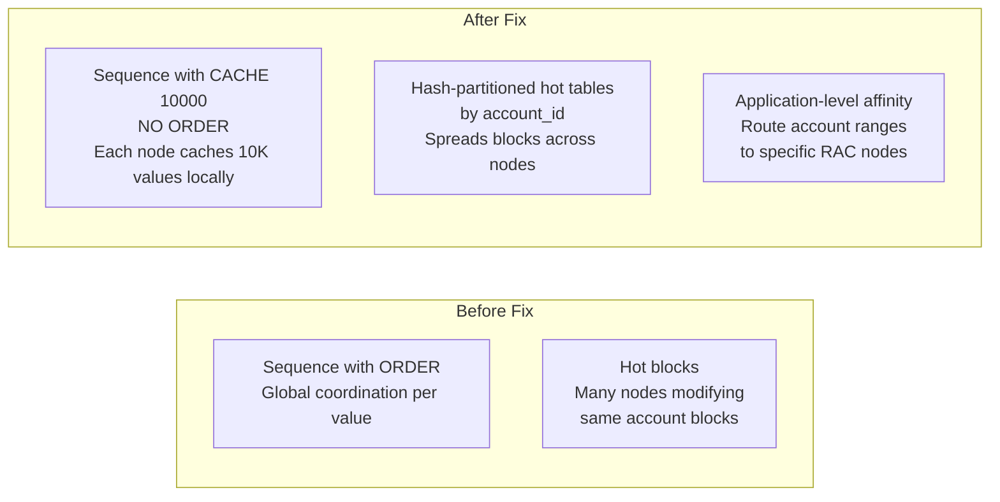
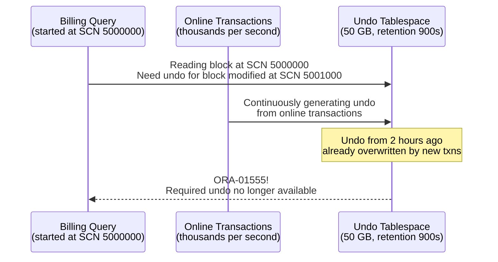
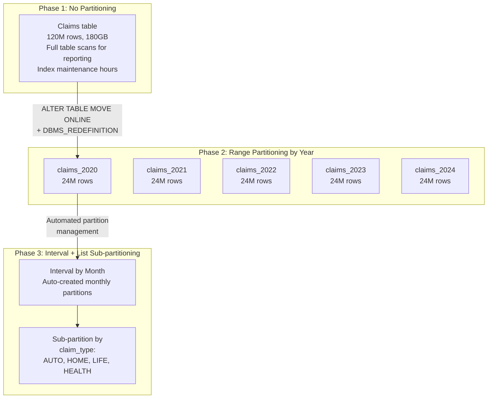

# Oracle Database Architecture — Real-World Scenarios

## Case Study 01: Major Bank — RAC Performance Degradation

### Context
A top-10 global bank runs its core banking application on a 4-node Oracle RAC cluster with ASM storage on an all-flash SAN. The system processes 50,000 TPS during business hours.

### Scale Numbers
| Metric | Value |
|---|---|
| RAC Nodes | 4 (2 active + 2 passive for DR) |
| SGA per node | 128 GB |
| Database size | 22 TB |
| Peak TPS | 50,000 |
| Online users | 15,000 concurrent sessions |

### The Problem: "gc buffer busy" Dominating Wait Events

During peak hours, P99 latency climbed from 8ms to 250ms. AWR report showed:

```
Top 5 Timed Foreground Events:
Event                       Waits      Time(s)   Avg wait(ms)
gc buffer busy acquire      1,234,567  8,456     6.85
gc buffer busy release      456,789    3,210     7.03
db file sequential read     890,123    2,345     2.63
log file sync              234,567    1,890     8.06
```

### Root Cause Analysis

`gc buffer busy` means multiple RAC nodes are contending for the same data blocks. The Cache Fusion protocol transfers blocks between nodes over the interconnect, but when many nodes modify the same block simultaneously, serialization occurs.

Investigation revealed: the application used a sequence-based primary key with `ORDER` option (`CREATE SEQUENCE ... ORDER`), which forced all sequence value generation to a single "master" node. Every INSERT required cross-node coordination for the sequence value.

Additionally, the "hot" accounts table had a `LAST_UPDATED` column that every transaction modified. A few hundred high-activity accounts were concentrated on the same data blocks — creating constant cross-node block ping-pong.

### Solution



1. Change sequence to `CACHE 10000 NOORDER` — each node caches 10K values locally; no cross-node coordination
2. Hash-partition the accounts table by `account_id` — different partitions live on different nodes' buffer caches
3. Implement application-level connection affinity — route accounts 1-25K to Node 1, 25K-50K to Node 2, etc.

**Result**: `gc buffer busy` dropped from 8,456 seconds to 340 seconds (96% reduction). P99 latency returned to 10ms.

---

## Case Study 02: Telecom — ORA-01555 During Billing Runs

### Context
A national telecom operator runs nightly billing on Oracle 19c. The billing batch reads 500M+ CDR (Call Detail Record) rows, aggregates them, and generates invoices. The query runs for 3-4 hours.

### The Problem

```
ORA-01555: snapshot too old: rollback segment number 12 with name "_SYSSMU12_1234567890$"
too small
```

The billing query failed 2 hours into its execution, wasting all processing time.

### Root Cause



`UNDO_RETENTION = 900` (15 minutes) was sufficient for online transactions but far too short for a 4-hour batch query. The 50GB undo tablespace was being recycled every ~30 minutes under peak OLTP load.

### Solution

1. **Increase undo retention**: `ALTER SYSTEM SET undo_retention = 14400;` (4 hours)
2. **Guarantee retention**: `ALTER TABLESPACE undo_tbs RETENTION GUARANTEE;` — prevents undo overwrite even if tablespace is full; new DML will get ORA-30036 instead
3. **Size appropriately**: Calculated undo generation rate (2GB/hour OLTP) × 4 hours = 8GB minimum + safety margin → expanded to 100GB
4. **Separate billing to a standby**: Moved the billing workload to an Active Data Guard standby database. The standby has its own undo, and applying redo on the standby doesn't interfere with billing's read consistency

---

## Case Study 03: Government ERP — Hard Parse Storm

### Context
A government agency deployed a custom ERP application on Oracle 12c. The application was built by a contracting company using string concatenation for SQL generation (no bind variables).

### The Problem

System response time degraded from sub-second to 10+ seconds. AWR showed:

| Metric | Value |
|---|---|
| Parse count (total) | 15,000/sec |
| Parse count (hard) | 14,200/sec |
| Hard parse ratio | 94.7% |
| Library cache lock waits | 45% of DB time |
| Shared pool free | 2% |

### Root Cause

The application generated SQL like:
```sql
SELECT * FROM employees WHERE emp_id = 42;
SELECT * FROM employees WHERE emp_id = 43;
SELECT * FROM employees WHERE emp_id = 44;
```

Each query had a unique SQL text → each required a hard parse → the shared pool filled with thousands of one-use cursors → library cache latches became the bottleneck → massive contention.

### Solution — Emergency and Long-Term

**Emergency (same day):**
```sql
-- Force Oracle to replace literals with placeholders
ALTER SYSTEM SET cursor_sharing = 'FORCE';
```
This tells Oracle to transform `WHERE emp_id = 42` into `WHERE emp_id = :"SYS_B_0"` before parsing. Immediate 90% reduction in hard parses.

**Long-term:**
1. Application rewrite to use bind variables (PreparedStatement in JDBC)
2. Shared pool sized to 4GB (from 1GB)
3. Implemented connection pooling (UCP) to reduce connection churn
4. Set `cursor_sharing = EXACT` after application fix
5. Established coding standards with mandatory bind variable usage

---

## Case Study 04: Insurance — Partition Strategy Evolution

### Context
A large insurance company stores policy data in Oracle, with a `claims` table growing by 2M rows/month. Initial design: single un-partitioned table. After 5 years: 120M rows, 180GB, and performance was degrading.

### Evolution of Partition Strategy



### Key Decisions

| Decision | Rationale |
|---|---|
| Range by date | Claims always queried by date range; partition pruning eliminates 80% of I/O |
| Interval partitioning | Auto-creates monthly partitions without DBA intervention |
| List sub-partitioning | Report queries filter by claim_type; sub-partition pruning reduces I/O further |
| Local indexes | Each partition has its own index segment; index maintenance is per-partition |
| Partition exchange for ETL | Load data into staging table, then `ALTER TABLE EXCHANGE PARTITION` — instant, no row movement |

### Result

| Metric | Before | After | Improvement |
|---|---|---|---|
| Monthly report query | 45 minutes | 90 seconds | 30x faster |
| Index rebuild time | 8 hours (full table) | 15 minutes (single partition) | 32x faster |
| Archive operation | Not possible (table too large) | `DROP PARTITION` — instant | ∞ |
| Backup time | 4 hours (full) | 30 min (incremental + partition) | 8x faster |

---

## Cross-Cutting Production Patterns

### Pattern: AWR Report as Primary Diagnostic Tool

```sql
-- Generate AWR report between two snapshot IDs
-- First, find available snapshots:
SELECT snap_id, begin_interval_time, end_interval_time
FROM dba_hist_snapshot
ORDER BY snap_id DESC
FETCH FIRST 10 ROWS ONLY;

-- Generate HTML AWR report
@$ORACLE_HOME/rdbms/admin/awrrpt.sql
-- Choose: html, snap_id range, output file

-- Key sections to analyze (in order):
-- 1. Load Profile: DB time, redo per second, parses per second
-- 2. Top 5 Timed Events: where is time being spent?
-- 3. SQL ordered by Elapsed Time: which SQL is slowest?
-- 4. Instance Efficiency: buffer cache hit ratio, parse efficiency
-- 5. Wait Event Histogram: distribution of wait times
```

### Pattern: Monitoring Critical Oracle Metrics

```sql
-- The 5 numbers every Oracle DBA checks:
-- 1. Buffer cache hit ratio (>95%)
-- 2. Hard parse ratio (<5%)
-- 3. Redo log switches per hour (<6)
-- 4. Undo retention vs longest query
-- 5. Top wait events (should be "db file sequential read" not latches)
```
