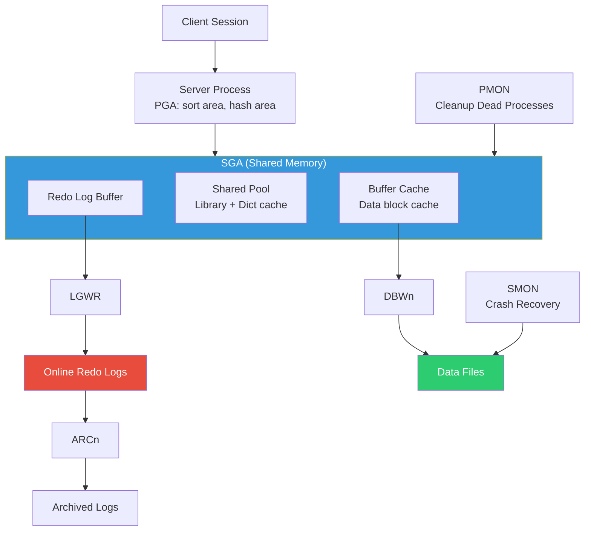

# Oracle Database Architecture — Interview Angle

## How This Appears

Oracle internals appear in **enterprise architect** and **Staff/Principal database engineer** interviews at companies with Oracle investments (banking, insurance, telecom, government, large enterprises). The SGA/PGA memory model, read consistency mechanism, RAC architecture, and the shared pool/bind variable pattern are the key areas.

---

## Sample Questions

### Q1: "Explain Oracle's read consistency model and how it differs from PostgreSQL's MVCC."

**Weak answer:** "Oracle uses MVCC. Readers don't block writers."

**Strong answer (Principal):**

"Both Oracle and PostgreSQL provide MVCC, but the implementation is fundamentally different.

**Oracle**: Uses **undo-based** read consistency. The current version of each row lives in the data block. When a row is modified, the before-image is written to an undo segment. A reading transaction that started before the modification constructs a **Consistent Read (CR) clone** of the block by applying undo records in reverse until the block matches the reader's SCN (System Change Number).

The key: Oracle's data blocks always contain only the current version. There's no heap bloat from old versions. The trade-off is **ORA-01555 (Snapshot Too Old)** — if a long-running query needs undo records that have already been overwritten, it fails.

**PostgreSQL**: Uses **heap-based** MVCC. Both old and new versions exist as physical tuples in the heap. The visibility check evaluates `xmin`/`xmax` against the transaction's snapshot. The trade-off is heap bloat — dead tuples accumulate until VACUUM removes them.

**Practical implications:**
- Oracle: monitor undo retention and tablespace size; risk is ORA-01555
- PostgreSQL: monitor dead tuple ratio and autovacuum; risk is table bloat and XID wraparound
- Oracle doesn't need VACUUM; PostgreSQL doesn't have snapshot too old (queries just read old tuples from the heap)
- Oracle's approach is more space-efficient for the data; PostgreSQL's approach is simpler conceptually"

### Q2: "Your Oracle database has P95 latency of 200ms. AWR shows 'log file sync' as the top wait. What's happening?"

**Strong answer (Principal):**

"'log file sync' means the server process is waiting for LGWR to flush redo to disk and acknowledge the commit. This is the commit latency.

**Diagnosis:**

First, check the average `log file sync` time:
```sql
SELECT event, average_wait * 10 AS avg_wait_ms
FROM v$system_event WHERE event = 'log file sync';
```

If average wait > 5ms:

1. **I/O latency on redo log disk**: Check `log file parallel write` wait time. If this is also high, the redo log files are on slow storage.
   - Fix: Move redo logs to dedicated NVMe or battery-backed write cache RAID
   - Never place redo logs on the same I/O path as data files

2. **Too many commits per second (high commit frequency)**: Each COMMIT triggers LGWR to flush. Applications doing single-row autocommit generate one LGWR flush per row.
   - Fix: Batch commits (INSERT...SELECT, FORALL, commit every 1000 rows)
   - Check: `user commits` / elapsed seconds from `v$sysstat`

3. **LGWR contention from group commit inefficiency**: LGWR writes once for multiple concurrent commits (group commit or 'piggyback'). If there's only one active session, each commit is a separate write.
   - Fix: Not usually a problem at scale; optimize the I/O path

4. **Async commit (if acceptable)**: `COMMIT WRITE NOWAIT;` returns immediately without waiting for LGWR. Risk: last committed transaction may be lost on instance crash (similar to InnoDB `innodb_flush_log_at_trx_commit = 2`)"

### Q3: "Design an Oracle-based architecture for a system processing 100K financial transactions per second with zero data loss."

**Strong answer (Principal):**

"**Hardware**: 2-node RAC on dedicated servers with 256GB RAM each. All-flash SAN with 100μs latency. Redundant InfiniBand interconnect for Cache Fusion.

**SGA Configuration:**
- `SGA_TARGET = 160G` (ASMM manages component sizes automatically)
- Buffer cache will auto-size to ~120G
- Shared pool: ~20G for cursor caching

**Redo Architecture:**
- 6 redo log groups, 4GB each, on dedicated NVMe
- `ARCHIVE_LOG_MODE` enabled
- Redo on separate I/O from data and undo

**Zero Data Loss:**
- Data Guard with **Maximum Protection** mode
- Synchronous standby at same site (RPO=0)
- Asynchronous standby at DR site (RPO < 1 second via far sync)
- LGWR won't acknowledge commit until standby confirms redo receipt

**Connection Pooling:**
- Oracle UCP (Universal Connection Pool) or HikariCP
- DRCP (Database Resident Connection Pooling) for lightweight stateless connections
- 100K TPS ÷ 1ms per transaction = ~100 concurrent sessions needed

**Partition Strategy:**
- Range-partition transaction table by date (interval monthly)
- Hash sub-partition by account_id for even distribution across RAC nodes

**Critical Monitoring:**
- AWR reports every 30 minutes during business hours
- Alert on: `log file sync` > 3ms, `gc buffer busy` > 5% of DB time, undo retention < longest query
- Active Data Guard for reporting to avoid OLTP impact"

### Q4: "What's the difference between a hard parse and a soft parse, and why does it matter at scale?"

**Strong answer (Principal):**

"When Oracle receives a SQL statement:

1. **Hash the SQL text** and search the library cache (in the shared pool)
2. If found → **Soft parse**: Verify permissions, reuse the existing execution plan. Cost: ~0.1ms, no latch contention.
3. If not found → **Hard parse**: Full cycle — syntax check, semantic analysis (resolve names using data dictionary cache), optimization (compute all possible plans, cost each, choose cheapest), generate execution plan, store in library cache. Cost: 1-100ms, holds shared pool latches.

At scale, the difference is dramatic:

| Rate | Hard Parse Cost | Shared Pool Impact |
|---|---|---|
| 50 hard parses/sec | Negligible | No contention |
| 500 hard parses/sec | 0.5-50 CPU-seconds/sec wasted | Latch contention visible |
| 5000 hard parses/sec | System unusable | ORA-04031 (shared pool exhaustion) |

The fix is bind variables. `SELECT * FROM users WHERE id = :1` is one SQL text regardless of the ID value. One hard parse, millions of soft parses.

The reason Oracle is more sensitive than PostgreSQL: PostgreSQL's extended query protocol (prepared statements) achieves a similar effect, but PostgreSQL per-session plan caching is less impactful because it uses a process-per-connection model. Oracle's shared library cache serves ALL sessions — so one bad application without bind variables poisons the shared pool for everyone."

---

## Follow-Up Questions

| After Question | They'll Ask | What They Want |
|---|---|---|
| Read consistency | "What causes ORA-01555?" | Undo overwritten before query finished; fix with retention + sizing |
| Log file sync | "What's group commit?" | LGWR batches multiple concurrent commits into one I/O; amortizes fsync cost |
| RAC design | "What's Cache Fusion?" | Direct block transfers between nodes over interconnect; avoids disk I/O for shared data |
| Hard parse | "What's cursor_sharing = FORCE?" | Oracle auto-replaces literals with binds; emergency fix for literal SQL applications |
| Zero data loss | "Compare Maximum Protection vs Maximum Availability" | Protection: primary halts if standby unreachable (zero data loss guaranteed). Availability: primary continues alone (possible data loss) |

---

## Whiteboard Exercise

**Draw: Oracle instance architecture showing SGA, PGA, background processes, and on-disk structures.**


