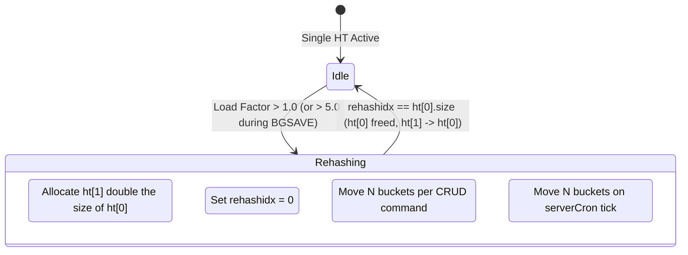
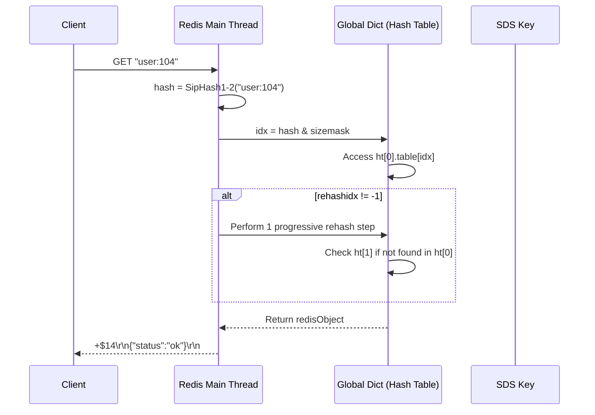

# How It Works: Redis Data Structures internals

Redis is written in C. Because C lacks robust built-in data structures (no native hash maps, safe strings, or linked lists), Salvatore Sanfilippo had to build them from scratch. This constraint forced a fanatical focus on byte-level memory efficiency and algorithmic mechanical sympathy.

## Architecture: The Event Loop & Memory Allocator

Redis is fundamentally a single-threaded event loop driven by the OS's I/O multiplexing API (`epoll` on Linux, `kqueue` on BSD). 
1. `epoll_wait` collects ready sockets.
2. The main thread reads the RESP command bytes, parses them, executes the data structure logic, and buffers the output.
3. Because execution is strictly serialized, there is zero need for mutexes, spinlocks, or concurrent data structure design (like ConcurrentHashMap). This allows the structures to remain incredibly compact.

Memory is heavily managed. Redis relies on **jemalloc** to prevent fragmentation. Every key-value pair is wrapped in a `redisObject` header which dictates its type and encoding.

## Internal Data Structures (Byte-Level)

### 1. `redisObject` Header
Every value in the global dictionary is wrapped in a `redisObject`.

```text
+-------------------------------------------------------------+
|                     redisObject (16 bytes)                  |
+----------+------------+------------+-----------+------------+
| type     | encoding   | lru / lfu  | refcount  | *ptr       |
| (4 bits) | (4 bits)   | (24 bits)  | (4 bytes) | (8 bytes)  |
+----------+------------+------------+-----------+------------+
```
- `type`: String, List, Set, Zset, Hash.
- `encoding`: How it's stored under the hood (e.g., raw, int, listpack, hashtable).
- `lru`: 24 bits. Holds the LRU timestamp to track eviction candidates.

### 2. SDS — Simple Dynamic String
Native C strings are null-terminated, forcing O(N) `strlen()`, preventing binary data (like images containing `\0`), and leading to buffer overflows. Redis uses SDS. There are 5 headers: `sdshdr5`, `8`, `16`, `32`, and `64`.

```c
struct __attribute__ ((__packed__)) sdshdr8 {
    uint8_t len;        // 1 byte: number of used bytes
    uint8_t alloc;      // 1 byte: total allocated capacity
    unsigned char flags;// 1 byte: lowest 3 bits indicate type (hdr8)
    char buf[];         // flexible array member: the actual string + '\0'
};
```
ASCII Layout in memory for the string "hello":
```text
+-----+-------+-------+----+----+----+----+----+------+
| len | alloc | flags | h  | e  | l  | l  | o  | '\0' |
+-----+-------+-------+----+----+----+----+----+------+
| 0x05| 0x08  | 0x01  | 68 | 65 | 6C | 6C | 6F |  00  |
+-----+-------+-------+----+----+----+----+----+------+
```

### 3. Progressive Rehashing (Global Dict)
To prevent O(N) blocking latency bubbles when a Hash Table needs to grow (from 1M to 2M keys), Redis maintains **two** hash tables internally (`ht[0]` and `ht[1]`). 



## Core Algorithms

### Progressive Rehash Step
When rehashing is active, *every* CRUD operation on the dictionary does a tiny bit of the migration work.

```python
# Pseudocode: dict.c / dictRehash
def dict_rehash(dict, count=1):
    # Do exactly 'count' bucket migrations
    buckets_processed = 0
    while buckets_processed < count:
        if dict.ht[0].size == 0:
            # Rehash complete
            dict.ht[0] = dict.ht[1]
            dict.ht[1] = null
            dict.rehashidx = -1
            return True
            
        # Find next non-empty bucket
        while dict.ht[0].table[dict.rehashidx] == null:
            dict.rehashidx += 1
            
        # Move all elements in this bucket chain
        entry = dict.ht[0].table[dict.rehashidx]
        while entry != null:
            next_entry = entry.next
            # Calculate new index for ht[1]
            new_idx = hash_function(entry.key) & dict.ht[1].sizemask
            # Insert into new bucket
            entry.next = dict.ht[1].table[new_idx]
            dict.ht[1].table[new_idx] = entry
            entry = next_entry
            
        # Clear original bucket
        dict.ht[0].table[dict.rehashidx] = null
        dict.rehashidx += 1
        buckets_processed += 1
        
    return False # Rehash still ongoing
```

### ZSET insertion (Skiplist Random Level)
To achieve O(log N) insertion without complex Red-Black tree rotations, Skiplists rely on probabilistic balancing.

```python
# Pseudocode: t_zset.c / zslRandomLevel
def generate_random_level():
    level = 1
    # ZSKIPLIST_P = 0.25
    # Keep adding a level with 25% probability
    while (random() & 0xFFFF) < (ZSKIPLIST_P * 0xFFFF):
        level += 1
    
    return min(level, ZSKIPLIST_MAXLEVEL) # Max is 32 (Redis 6) or 64 (Redis 7)

def insert_zset(skiplist, score, member):
    update = [None] * ZSKIPLIST_MAXLEVEL
    node = skiplist.head
    
    # Traverse from highest level down to find insert position
    for i in range(skiplist.level - 1, -1, -1):
        while node.level[i].forward != null and \
              (node.level[i].forward.score < score or \
              (node.level[i].forward.score == score and node.level[i].forward.member < member)):
            node = node.level[i].forward
        update[i] = node
        
    level = generate_random_level()
    new_node = create_node(level, score, member)
    
    # Splice pointers
    for i in range(0, level):
        new_node.level[i].forward = update[i].level[i].forward
        update[i].level[i].forward = new_node
```

### 4. Listpack vs Ziplist (Redis 7.0 Evolution)

Historically, Redis used **Ziplists** to save memory. However, Ziplists suffered from **Cascading Updates** — if one entry grew in the middle, every subsequent entry's "previous length" field had to be recalculated and re-allocated, leading to O(N^2) worst-case performance.

Redis 7.0 replaces Ziplists with **Listpacks**. Listpacks encode the *current* entry length at the *end* of the entry, allowing backward traversal without needing the previous entry's length. This eliminates cascading re-allocations universally.

```mermaid
graph LR
    subgraph "Ziplist (Legacy - Cascading Risk)"
        Z1[PrevLen | Core | Entry] --> Z2[PrevLen | Core | Entry]
        Z2 --> Z3[PrevLen | Core | Entry]
        note right of Z1: If Z1 grows,\nZ2's PrevLen grows,\nZ3's PrevLen grows...
    end

    subgraph "Listpack (Modern - Stable)"
        L1[Core | Entry | TotalLen] --- L2[Core | Entry | TotalLen]
        L2 --- L3[Core | Entry | TotalLen]
        note right of L1: Metadata is at the END.\nNo dependency on neighbors.
    end
```

## Data Structure Flow and Conversion

Redis starts with memory-optimized encodings (like IntSet or Listpack) and automatically "upgrades" them to performance-optimized encodings (like Hash Tables) when they breach threshold limits.

```mermaid
graph TD
    classDef packed fill:#b2bec3,stroke:#636e72,stroke-width:2px;
    classDef full fill:#ff7675,stroke:#d63031,stroke-width:2px,color:#fff;

    Start((SADD)) --> IsInt{All Integers?}
    
    IsInt -- Yes --> IntSet["IntSet Encoding\n(Compact O(N) array)"]:::packed
    IsInt -- No --> HT["Dict/Hash Table\n(O(1) memory heavy)"]:::full
    
    IntSet -->|Surpasses 512 elements\n(set-max-intset-entries)| Upgrade
    IntSet -->|Add Non-Integer String| Upgrade
    
    Upgrade[Upgrade Encoding] --> HT
```

## Hash Key Lookups


