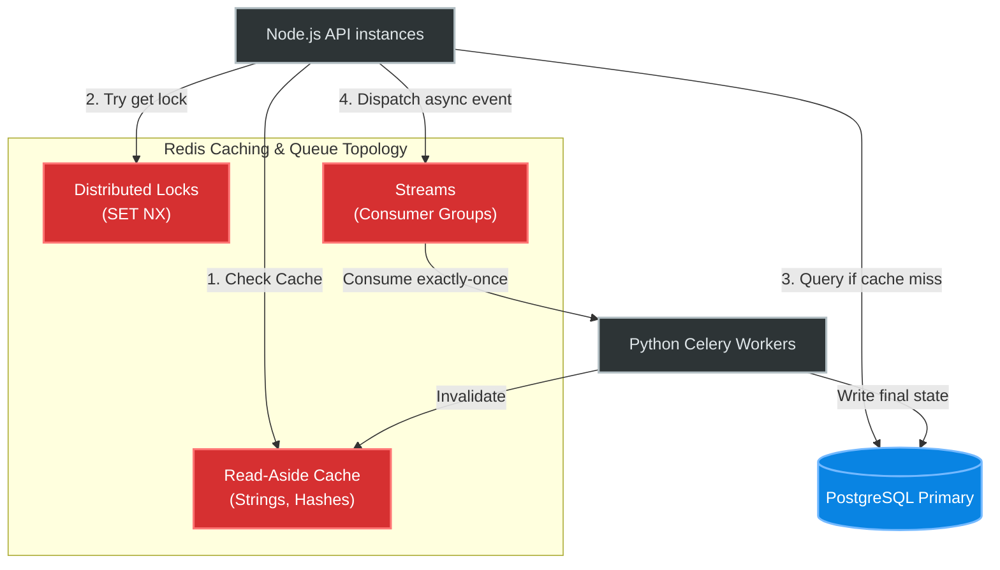

# Hands-On Examples: Redis Data Structures

## Scenario 1: Object Caching (String vs. Hash)

When caching domain objects (e.g., User Profiles) in Redis, engineers often serialize them to JSON and store them as simple strings. At scale, this causes severe network congestion and CPU waste when only single attributes change.

### ❌ Before (Anti-Pattern)
Storing a large JSON blob in a single String key.
```python
# The JSON string is 24KB
user_data = json.dumps({"id": 104, "name": "Ali", "last_login": 1718293021, "history": [...]})
redis.set("user:104", user_data)

# Requirement: Update only the last_login timestamp
# Developer must fetch the 24KB string, parse it, modify it, re-stringify, and send it back
raw = redis.get("user:104")             # Network IN: 24KB
obj = json.loads(raw)                   # CPU Burn: JSON parsing
obj["last_login"] = 1718295000
redis.set("user:104", json.dumps(obj))  # Network OUT: 24KB
```
**Result:** Updating 1 byte of state costs **48KB in network I/O** and triggers garbage collector pauses in the application layer from JSON parsing string allocations.

### ✅ After (Correct Approach)
Storing attributes directly in a Redis Hash. If the Hash has fewer than 512 fields (default `hash-max-listpack-entries`), it is encoded compactly in memory.
```python
# Store as Hash fields
redis.hset("user:104", mapping={"name": "Ali", "last_login": 1718293021, "history_ref": "hs:104"})

# Requirement: Update only the last_login timestamp
redis.hset("user:104", "last_login", 1718295000) # Network OUT: 30 bytes
```
**Result:** **99.9% reduction in network overhead**. No JSON parsing CPU burn. Operation latency drops from **1.2ms to 0.15ms**.

---

## Scenario 2: Real-time Leaderboards (Sorted Sets)

Creating global leaderboards in SQL requires heavy `ORDER BY` operations. Redis Sorted Sets (ZSet) maintain elements continuously sorted via an internal Skiplist.

### ❌ Before (Anti-Pattern)
Using PostgreSQL to calculate real-time ranks on 50 million players every page load.
```sql
SELECT rank FROM (
  SELECT user_id, RANK() OVER (ORDER BY score DESC) as rank FROM player_scores
) ranked WHERE user_id = 99842;
```
**Result:** Database CPU hits 100%. P99 latency spikes to **450ms**. 

### ✅ After (Correct Approach)
Using Redis `ZADD` and `ZREVRANK`.
```bash
# Insert or update a player's score in O(log N) — Takes ~1 microsecond
ZADD global:leaderboard 15400 px:99842
ZADD global:leaderboard 12000 px:10221

# Get Rank (0-indexed, descending) in O(log N) — Takes ~1 microsecond
ZREVRANK global:leaderboard px:99842
# Output: (integer) 0  (Player is #1)

# Get top 3 players
ZREVRANGE global:leaderboard 0 2 WITHSCORES
```
**Result:** Query latency drops to **<1ms**. DB CPU offloaded completely. O(log N) skip-list search beats O(N log N) B-Tree sorts.

---

## Scenario 3: Memory-Efficient Event Tracking (Bitmaps)

Tracking unique daily active users (DAUs) over 100M users.

### ❌ Before (Anti-Pattern)
Storing each event in a giant Set.
```bash
# O(1) insert, but costs lots of RAM
SADD dau:2024-06-15 104593
SADD dau:2024-06-15 289122
```
**Result:** 100M integer IDs in a Set consumes **~800MB RAM** per day. 30 days of data = **24GB RAM**.

### ✅ After (Correct Approach)
Using bit manipulation. A user ID maps directly to an offset in an array of bits (up to 512MB long).
```bash
# User 104593 logged in; set bit 104593 to 1
SETBIT dau:2024-06-15 104593 1
SETBIT dau:2024-06-15 289122 1

# How many unique users today? O(N) but insanely fast CPU bitwise operations
BITCOUNT dau:2024-06-15
# Output: (integer) 2
```
**Result:** 100M users fit into exactly **12.5MB RAM**. 30 days of data = **375MB RAM**. A **64x memory savings**. You can run `BITOP AND weekly_active dau:day1 dau:day2...` to find retained users via vector operations at hardware speeds.

---

## Scenario 4: Stream Processing (Redis Streams)

Pub/Sub is fire-and-forget; if a consumer is down, messages are lost. Redis Streams (created as a lightweight Kafka alternative) persist messages and implement consumer groups.

### Runnable Exercise: Building a Task Queue
Start a local Redis instance and run these directly via `redis-cli`:

**1. Producer pushes events mapping to an ID generated by Redis (`*`):**
```bash
> XADD payments:queue * user_id 104 amount 49.99
"1689254001234-0"
```

**2. Create a Consumer Group looking at all unread messages (`$`):**
```bash
> XGROUP CREATE payments:queue fraud_detectors $ MKSTREAM
OK
```

**3. Consumer reads the next pending message (`>`) and claims it:**
```bash
> XREADGROUP GROUP fraud_detectors worker_1 COUNT 1 STREAMS payments:queue >
1) 1) "payments:queue"
   2) 1) 1) "1689254001234-0"
         2) 1) "user_id"
            2) "104"
            3) "amount"
            4) "49.99"
```

**4. Consumer explicitly acknowledges processing (removes from Pending Entries List):**
```bash
> XACK payments:queue fraud_detectors 1689254001234-0
(integer) 1
```

## System Integration Diagram


