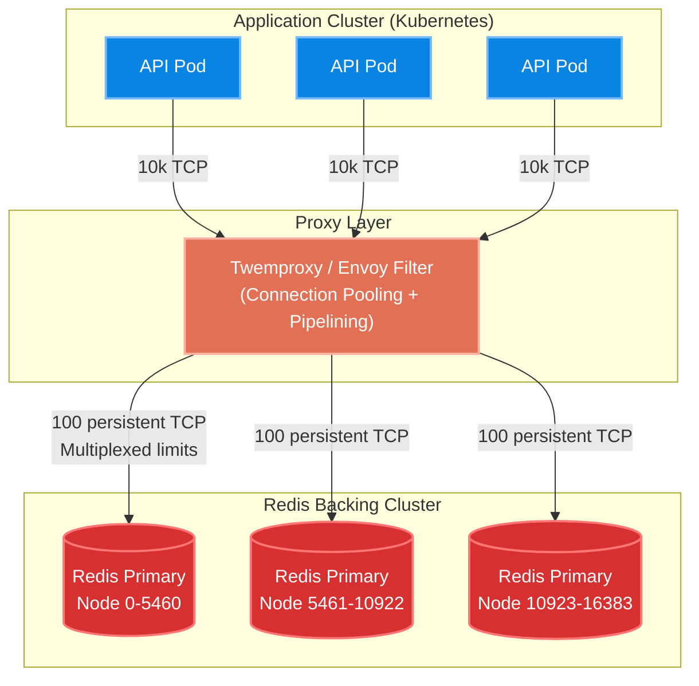

# Real-World Scenarios: Redis Data Structures

## 01: Twitter — Timeline Home Feed (Fan-out on Write)
- **Scale**: Hundreds of millions of active users, peaking at **300,000+ timeline renders per second**.
- **Architecture Decision**: Caching the Timeline as a Redis **List**. When a user tweets, a background worker runs a "fan-out on write" (Push model). It retrieves the author's followers and pushes the Tweet ID (`LPUSH`) into each follower's dedicated Redis List.
- **Trade-Off**: For massive accounts (e.g., Elon Musk with 150M followers), pushing to 150M lists takes too much compute and blocks the write queues (the "Justin Bieber problem").
- **Key Configuration**: Twitter enforces a hybrid model. Standard users push to their followers' Lists. Massive celebrities skip the push; instead, the timeline read path pulls the celebrity's tweets dynamically at read time (`LPATH` + `ZUNION`). Lists are capped at a maximum of **800 tweets** via `LTRIM` to prevent unbounded memory growth.
- **Lesson**: Data structure purity fails at scale percentiles. Mixing Push (Redis Lists) for P99 users and Pull (Application code) for P1 users is required.

## 02: GitHub — API Rate Limiting Infrastructure
- **Scale**: Billions of API requests per day.
- **Architecture Decision**: Distributed, atomic sliding window rate limiting utilizing Redis **Sorted Sets (ZSet)** and Lua Scripting.
- **Implementation**: The ZSet key is uniquely tied to `{user_id}:{endpoint}`. The member is a UUID of the request, and the score is the precise Unix millisecond timestamp.
  - Phase 1: `ZREMRANGEBYSCORE` to remove scores older than {current_time - window_size}.
  - Phase 2: `ZCARD` to count remaining elements. If within limit, `ZADD` the new request and `EXPIRE` the key.
- **Trade-Off**: Using Lua scripts to wrap these four commands ensures atomicity (since Redis executes the script synchronously, preventing concurrency races), but a slow Lua script halts the entire single-threaded instance.
- **Production Numbers**: Execution time of the Lua script averages **<0.15ms**. Memory per user limit tracking is roughly ~2-3KB. 

## 03: Post-Mortem: The "KEYS *" Production Outage
- **Incident**: A Tier-1 microservice cluster experienced a cascading failure resulting in 100% 504 Gateway Timeouts during a flash sale.
- **Root Cause**: An inexperienced developer triggered a cron job intending to delete stale temporary cart keys. The code used `redisClient.keys("temp_cart_*")`. The `KEYS` command runs an O(N) full scan of the global Hash Table. Because the dictionary contained **40M keys**, the single-threaded event loop blocked execution for **~6 seconds** to compute the results. During these 6 seconds, 120,000 incoming user requests queued up, overflowing the TCP backlog, severing connections, and triggering application-layer circuit breakers.
- **Fix**: Replaced `KEYS` with `SCAN`, a cursor-based iterator that returns immediately after checking a small bucket (e.g., `COUNT 1000`), allowing standard traffic to interleave with the cleanup job.
- **Prevention**: In `redis.conf`, implemented `rename-command KEYS ""` which permanently disables the command in production, rendering any accidental CI/CD deployment of the command useless.

## Deployment Topology
Large-scale infrastructure rarely exposes raw Redis directly to 50,000 application pods. Connection pooling proxy layers are inserted to protect the single-threaded CPU from TCP connection overhead limits.

