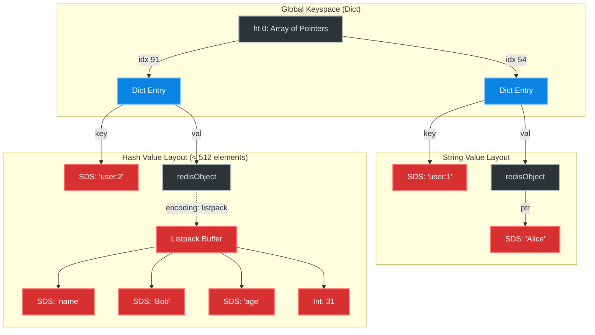

# Interview Angle: Redis Data Structures

## Q1: "Why is Redis single-threaded? Isn't that a bottleneck?"

### What They Are Really Testing
Do you understand the difference between CPU-bound and I/O-bound workloads? Do you understand the mechanical sympathy of avoiding lock contention vs multi-core scaling?

### Senior Engineer Answer
"Redis is single-threaded for command execution because it's usually network I/O or memory bandwidth bound, not CPU bound. A single CPU core can process hundreds of thousands of operations per second in memory. By staying single-threaded, Redis completely avoids the need for locks (mutexes) on its internal data structures, preventing concurrency bugs and context-switching overhead."

### Principal Architect Answer
"Redis is single-threaded *strictly for the event loop and data structure mutation*. This guarantees atomicity for all operations without locking overhead, allowing the C structs (like dicts and skiplists) to be incredibly memory-efficient. However, it is not strictly single-threaded anymore. Since version 6, Redis uses multi-threading for network I/O (parsing RESP buffers and writing to sockets), which was actually the true bottleneck. For the rare cases where a single core's ~150K ops/sec isn't enough, we scale horizontally using Redis Cluster, mapping hash slots across multiple single-threaded shard processes, rather than trying to make a single enormous concurrent dictionary."

### Follow-Up Probe
*Interviewer: "What happens when a large `DEL` command is executed on a single thread?"*
**Answer:** "It creates a latency spike (a 'latency bubble') that queues all other incoming commands. That's why `UNLINK` was introduced in Redis 4.0, which removes the pointer in O(1) on the main thread but hands the actual memory deallocation (`free()`) to a background bio (Background I/O) thread."

---

## Q2: "How would you design a real-time 'Trending Topics' system for 10 million users?"

### What They Are Really Testing
Can you map business requirements to the correct specific algorithmic data structure (Sorted Sets)? Do you understand the time complexity of those updates?

### Senior Engineer Answer
"I would use a Redis Sorted Set (ZSet). The member is the hashtag, and the score is the integer count of mentions. When a hashtag is used, I call `ZINCRBY trending 1 '#tech'`. To get the top 10 trending topics, I run `ZREVRANGE trending 0 9 WITHSCORES`. This is fast because ZSets keep the data sorted internally."

### Principal Architect Answer
"I would use a ZSet, but with time-decay. A basic `ZINCRBY` creates an ever-growing historically skewed list—'#tech' will stay trending forever.
1. We segment ZSets into time buckets (e.g., `trending:2024-10-14:hour_10`).
2. We write to the current hour's block using `ZINCRBY` (O(log N)).
3. Every minute, a background worker runs `ZUNIONSTORE` combining the last 4 hours with weights (e.g., Hour 0 weight = 4, Hour -1 = 3, Hour -2 = 2) to naturally decay older topics.
4. We cap the size using `ZREMRANGEBYRANK` so the set doesn't grow unbounded.
5. We query the aggregated `ZUNIONSTORE` key which represents the current 'trending momentum'."

---

## Whiteboard Exercise: Redis Internal Keyspace

**Prompt:** Draw how Redis physically stores a String and a Hash in memory.

**Key talking points for the whiteboard:**
1. Draw the `redisObject` explicitly. Explain it proves Redis is NOT just storing raw bytes; it's strongly typed.
2. Highlight how short Hashes are compressed into a `listpack` (a single contiguous allocation) rather than a full Hash Table to prevent pointer overhead and fragmentation.
