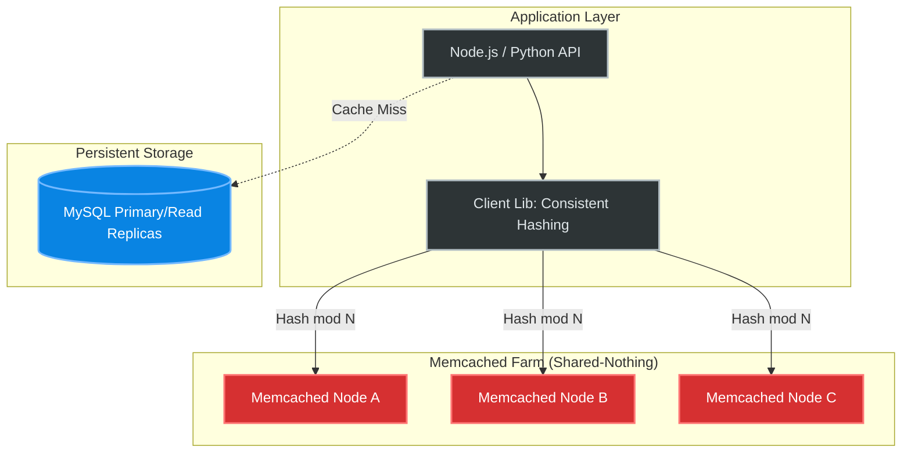

# Concept Overview: Memcached

## Why This Exists
Created by **Brad Fitzpatrick** in **2003** for LiveJournal, Memcached was born out of sheer necessity to relieve database load. Dynamic websites were rendering the same slow MySQL queries simultaneously for millions of page views. The solution was simple: allocate unused RAM across web servers, stitch it together via consistent hashing on the client side, and store the computed HTML/objects transiently as key-value pairs. Memcached pioneered the distributed, transient, memory-centric caching architecture that allows modern web scaling.

## What Value It Provides

| Benefit | Quantified Impact |
|---|---|
| **O(1) Data Retrieval** | Serves cached objects in **< 0.5ms**, bypassing the ~10-100ms penalty of disk-based relational joins. |
| **Database Relief** | Achieves **95%+ cache hit ratios**, dropping backend DB CPU utilization from 100% to < 5%, allowing massive traffic spikes without database meltdown. |
| **Massive Vertical Scaling** | Built specifically as a **multi-threaded** architecture. A single Memcached instance on a 64-core machine can process **millions of ops/sec** (significantly outperforming single-threaded Redis on a per-VM basis). |
| **Simplicity & Predictability** | Zero disk I/O, no persistence, no complex data structures. Memory is managed deterministically via Slab Allocation, entirely preventing OS-level memory fragmentation. |

## Where It Fits

## When To Use / When NOT To Use

| Scenario | Verdict | Why / Alternative |
|---|---|---|
| Pure HTML/JSON string caching at immense scale on massive multi-core VMs | ✅ YES | Multi-threading allows 1 massive instance to saturate 100Gbps network interfaces efficiently. |
| Simple transient state caching (e.g., Session tokens) | ✅ YES | Unbeatable simplicity. Nothing touches disk. When it crashes, it starts fresh instantly. |
| Caching complex data structures (Lists, Sets) | ❌ NO | Memcached only stores binary blobs (strings). A 1MB JSON requires full round-trip retrieval and parsing to modify 1 attribute. Use **Redis** Hashes instead. |
| Message queues or pub/sub requirements | ❌ NO | It does not support blocking operations or streaming. Use **Kafka** or **Redis Streams**. |
| Data must survive a power outage | ❌ NO | It is strictly ephemeral. Zero persistent logging. |

## Key Terminology

| Term | Definition & Operational Significance |
|---|---|
| **Slab Allocation** | Memcached pre-allocates memory into 1MB pages and divides them into fixed-size chunks to eliminate fragmentation. You must fit your data into these chunks, or suffer wasted padding space. |
| **Slab Class** | A categorization of memory chunks. Class 1 might hold 96-byte chunks, Class 2 holds 120-byte chunks. Values are matched to the smallest class they fit within. |
| **Growth Factor** | The multiplier (`-f`, default 1.25) determining the size difference between sequential Slab Classes. Lower values mean less wasted space but more discrete classes for the LRU to manage. |
| **LRU (Least Recently Used)** | The eviction policy triggered when a Slab Class is full. Memcached evicts per *Slab Class*, not globally. A heavily used 120-byte object might be evicted while an unused 2KB object remains. |
| **Segmented LRU** | Modern Memcached (v1.5+) splits the LRU into HOT, WARM, and COLD bands to prevent "scans" (large background reads) from flashing out the working set. |
| **Consistent Hashing** | A client-side mathematical algorithm (e.g., `ketama`) mapping keys to nodes onto a virtual ring. Allows adding/removing nodes while only invalidating `1/N` of the cache instead of `100%`. |
| **CAS (Compare-And-Swap)** | Optimistic concurrency control. `gets` returns a token; `cas` writes only if the token hasn't changed. Critical for preventing cache overwrite races. |
| **Cache Stampede (Thundering Herd)** | When a viral, highly accessed key expires, 10,000 parallel web requests miss the cache and hit the database simultaneously, instantly taking the database offline. |
| **Mcrouter** | Facebook's open-source Memcached protocol router. Allows connection pooling, prefix-routing, and shadowing across thousands of massive cache clusters. |
