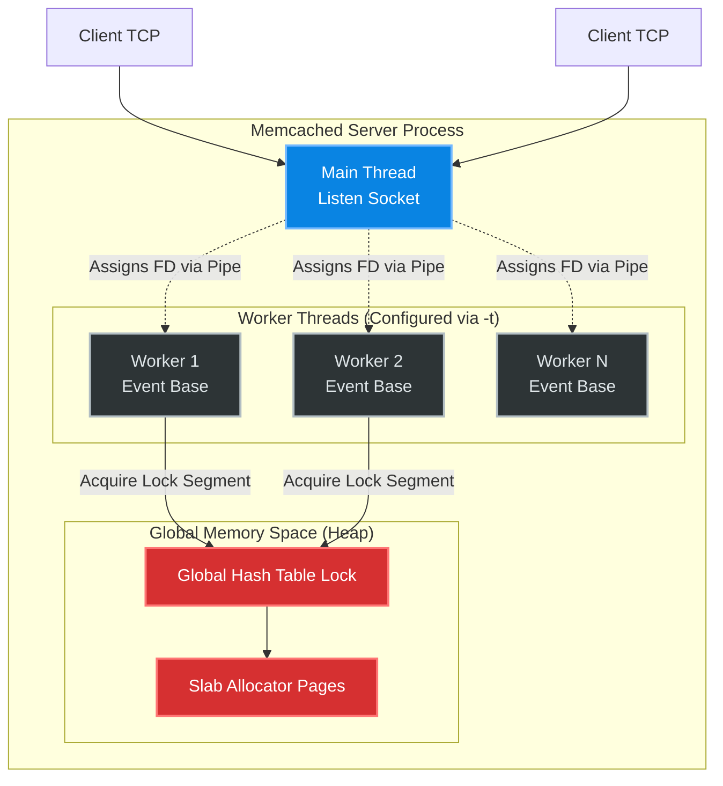
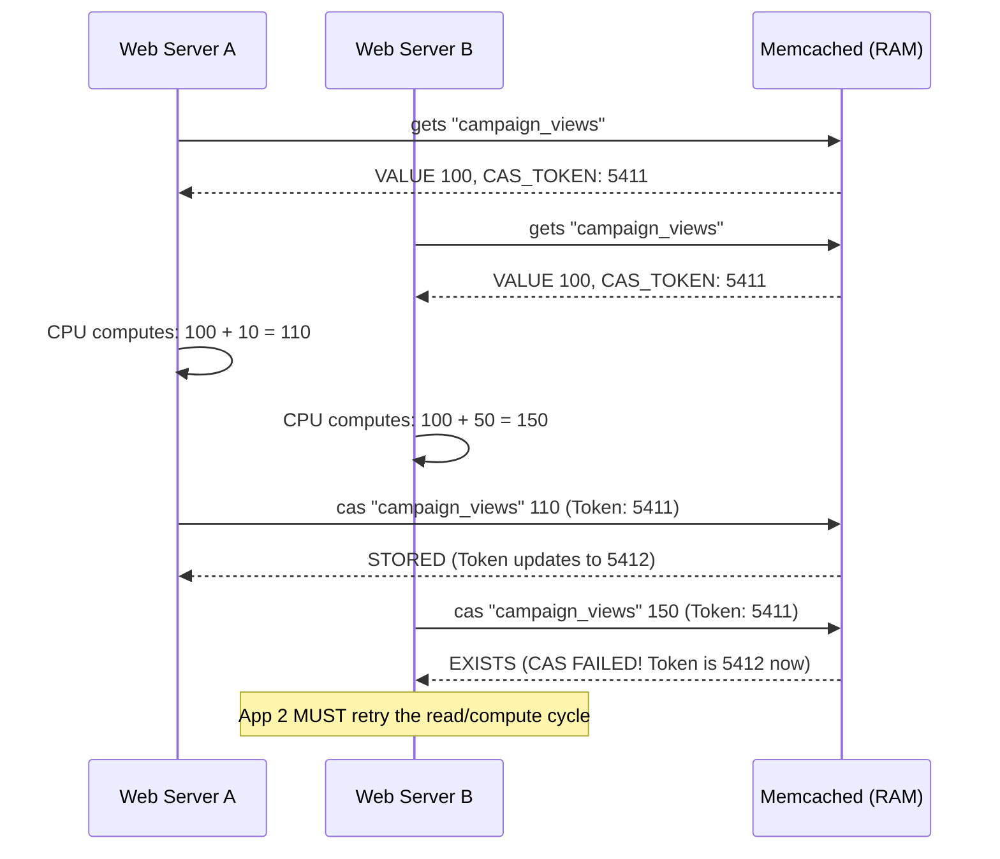

# How It Works: Memcached Internals

Memcached is written in C and is structurally a massive distributed hash table in memory. Unlike Redis, which focuses on sophisticated data structures and single-threaded predictability, Memcached's primary architecture maximizes bare-metal mechanical sympathy through aggressive multi-threading, strict non-blocking network I/O, and custom memory layout.

## High-Level Design (HLD)

Memcached uses a multi-threaded architecture based on `libevent`.



## Mechanical Feature 1: The Slab Allocator

Native memory allocation (`malloc`/`free`) in C is historically catastrophic for caching. Allocating and freeing millions of wildly different sized strings (e.g., 20 bytes, then 4.3 KB, then 200 bytes) causes the OS heap memory to look like swiss cheese — extreme fragmentation. 

Memcached bypasses the OS entirely using a **Slab Allocator**.

### ASCII Byte Layout: Slab Classes
Memcached grabs memory in large **1 Megabyte Pages** and permanently slices them into uniform chunks.

```text
+-----------------------------------------------------------+
| Slab Class 1 (Chunk Size: 96 bytes)                       |
| [Page 1 (1MB)] -> | 96b | 96b | 96b | ... (10,922 chunks) |
+-----------------------------------------------------------+
| Slab Class 2 (Chunk Size: 120 bytes)                      |
| [Page 2 (1MB)] -> | 120b | 120b | ...     (8,738 chunks)  |
+-----------------------------------------------------------+
| Slab Class 3 (Chunk Size: 152 bytes)                      |
| [Page 3 (1MB)] -> | 152b | 152b | ...     (6,904 chunks)  |
+-----------------------------------------------------------+
```
If your application attempts to store a 100-byte JSON string (plus ~50 bytes of Memcached internal header), it requires 150 bytes. Memcached maps this to **Slab Class 3**. It is physically impossible to get memory fragmentation because a 152-byte hole can perfectly accept the next 152-byte string.

### The Downside: Slab Wasted Space
If you put a 122-byte item into Slab Class 3 (152 bytes), you permanently waste **30 bytes** of memory per key.
*Formula:* Chunk Size = `BaseSize * GrowthFactor (-f)` (Default is 1.25).

## Mechanical Feature 2: Segmented LRU (Eviction)

Before version 1.5, Memcached had a strict standard LRU (Least Recently Used) doubly-linked list.
**The Flaw**: If a background job ran an analytical query storing 10 million unused keys temporarily into Memcached, it pushed all the mission-critical, high-traffic user sessions off the "tail" of the LRU, destroying the cache hit rate.

Redis solved this historically via LFU (Least Frequently Used) tracking. Memcached solved it by adopting a **Segmented LRU**.

```mermaid
stateDiagram-v2
    [*] --> HOT: New Key Insertion
    
    state HOT {
        note "10% of memory"
    }
    state WARM {
        note "Active working set"
    }
    state COLD {
        note "Inactive keys"
    }
    
    HOT --> COLD: Reaches tail of HOT list
    COLD --> WARM: Accessed twice (rescued!)
    WARM --> COLD: Reaches tail of WARM list
    COLD --> [*]: Evicted! (Deleted from RAM)
```
Background scans pass through the HOT queue directly to COLD, and are evicted instantly without touching the WARM working set.

## Mechanical Feature 3: The Slab Rebalancer

In dynamic environments, your data access patterns change. If you used to store 10KB images but now store 100-byte user IDs, its possible your memory is "locked" into the 10KB Slab Class (Slab 30).
Memcached features a background **Slab Rebalancer** that can physically move 1MB pages from one Slab Class to another without stopping the world.

```mermaid
graph LR
    P1[Page 1: 10KB Chunks] -- Rebalancer --> P1_New[Page 1: 100b Chunks]
    note over P1, P1_New: Background thread copies\nvalid items to new space.\nUpdates global pointer map.
```

## Distributed Cache: The mcrouter Proxy (Facebook Scale)

At FAANG scale, you don't connect to 1,000 Memcached nodes directly. You use **mcrouter**, a C++ proxy layer developed by Facebook.

```mermaid
graph TD
    App[Mobile/Web App] -->|Alluvial Request| MCR[mcrouter Proxy]
    
    subgraph "Distributed Node Fleet"
        MCR -->|Consistent Hash| NodeA[Memcached 01]
        MCR -->|Consistent Hash| NodeB[Memcached 02]
        MCR -->|Replication Pool| NodeC[Memcached 03 Backup]
    end
    
    note over MCR: Handles Connection Pooling,\nCold Cache Warmup,\nand Shadow Testing.
```

## Algorithm Pseudocode: Read/Write with Extstore

Modern Memcached supports "Extstore", allowing values to be pushed to an NVMe flash drive while pointers remain in RAM.

```c
// Pseudocode: Memcached internal item retrieval with Extstore
item* do_item_get(const char *key, const size_t nkey) {
    // 1. Hash the key to find the hash table bucket
    uint32_t hv = hash(key, nkey);
    
    // 2. Lock the specific segment of the hash table (prevents thread collision)
    item_lock(hv);
    
    // 3. Find the item pointer in memory
    item *it = assoc_find(key, nkey, hv);
    
    if (it != NULL) {
        if (it->flags & ITEM_HDR_EXTSTORE) {
            // 4a. The item is an Extstore pointer! The value is actually on NVMe.
            // Dispatch an async I/O request to the flash thread.
            enqueue_io_read_request(it->extstore_page_id, it->extstore_offset);
            // The client connection is suspended and resumed when disk I/O finishes.
        } else {
            // 4b. The item is purely in RAM
            // Update the access time for the LRU
            it->time = current_time;
        }
    }
    
    item_unlock(hv);
    return it;
}
```

## CAS (Compare and Swap) Architecture

To allow distributed systems to update cache safely without locks, Memcached employs optimistic concurrency.


